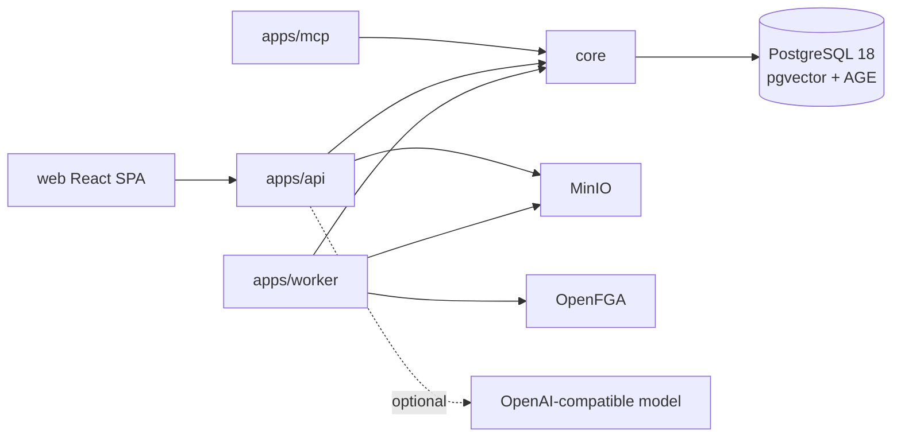

# OrgMemory Architecture

This document records behavior and structure that exist in the repository on
2026-07-23. Intended changes belong in [docs/vision.md](docs/vision.md) and the
[active increments](docs/increments/active/README.md).

## System Shape



The Gradle build contains `core`, `apps:api`, `apps:mcp`, `apps:worker`,
the framework-neutral `components:graph-rag-core` and
`components:graph-rag-testkit`, `integrations:graph-rag-spring-ai`,
`integrations:graph-rag-postgres`, `integrations:authorization-openfga`,
`integrations:object-storage-minio`, and `integrations:connectors` (one module,
a package per source adapter). The web client is a separate Vite
workspace. API owns Flyway execution and the worker validates the existing
schema with Flyway disabled in normal runtime.

Current baseline: Java 25, Gradle 9.6.1, Spring Boot 4.1.0, Spring Modulith
2.1.0, Spring AI 2.0.0, springdoc 3.0.3, PostgreSQL 18 with pgvector 0.8.2
and Apache AGE 1.7.0, React 19.2.7,
TypeScript 7.0.2, Vite 8.1.5, Tailwind CSS 4.3.3, and pnpm 11.9.0.

Dependency direction is currently `apps/* -> core`. The intended adapter rule is
`apps -> core + selected integrations`, `integrations -> core ports` (or the
framework-neutral graph core), and never `core -> apps/integrations`.

## Current Runtime Responsibilities

- `core`: organization, permission, assistant, AI, and knowledge domain packages;
  JPA repositories; application services; Flyway migrations.
- `apps/api`: REST endpoints, OIDC bearer-token boundary, server-derived actor,
  optional Spring AI normalization/chat, OpenAPI, health, and an `/api/admin/**`
  administration surface over the identity ledger and the source connections,
  gated on OpenFGA `can_manage_members`. A source credential is write-only across
  that surface: it is submitted, stored encrypted, and never returned in any form.
- `apps/worker`: leased background validation, parse/normalize, chunk/embed,
  fail-closed authorization projection, publication, external
  permission-workbook validation, and a connector driver that ingests a versioned
  crawl-batch contract into the governed ledger, checkpointing progress per
  connection so a restart resumes rather than replays. Which connections it crawls
  and what it authenticates with come from the ledger on every poll, so an
  administrator's change takes effect on the next one without a restart.
- `apps/mcp`: a reserved delivery module with no runtime implementation; the
  legacy scaffold was removed so secure agent tools can be rebuilt on the
  permission-aware retrieval contract.
- `web`: a Vite SPA with TanStack Router file routes, an authenticated shadcn
  sidebar shell, generated Hey API clients for ordinary REST contracts, and an
  AI Elements assistant workspace. The protected route layout owns session
  restoration and passes the verified identity into the shell; feature code
  does not repeat authentication gates. A separate `/admin` area reuses the same
  shell with a Permissions sidebar and is hidden from non-administrators by the
  session role, which is a rendering hint over the server-side gate.

`core` uses Spring Modulith package boundaries and a verification test. Leased
database jobs carry ingestion work across processes. A specific Knowledge Asset
publication outbox records direct-upload authorization projection attempts and
the pinned OpenFGA model; no generic event framework has been introduced.

## Persisted Model

The identity ledger persists organizations, departments, users, and external
identities. The knowledge slice persists Knowledge Spaces and the canonical
source ledger (`SourceObject`, immutable `SourceRevision`, and `EvidenceBlob`
metadata), leased ingestion jobs, source-shaped raw and normalized records,
stable `KnowledgeAsset` roots, immutable `KnowledgeAssetVersion` records,
append-only evidence links, versioned chunks and embedding profiles, sealed ACL snapshots and entries,
mutable ACL heads, an observed external source-principal registry with verified
principal mappings and sealed per-generation group membership, per-connection
identity trust decisions consumed by the crawl matcher, durable per-connection
crawl checkpoints, a per-batch record of what each crawl did
(`connector_crawl_attempts`), publication outbox evidence, and append-only
permission audit events. Immutable evidence bytes live
in MinIO; chunks, embeddings, graph data, and OpenFGA relationships are
rebuildable projections. A connector crawl produces the same governed ledger as
uploads, with source ACL evidence resolved through the principal mappings. Each
object records `source_system` (which system it came from, governed by the
connector registry rather than a check constraint) separately from `acl_authority`
(`SOURCE` or `ORGMEMORY`, which of the two [ADR 0009](docs/decisions/0009-dynamic-source-acl-ceiling.md)
rules applies), so adding a connector needs no migration — Slack and Google Drive
are both adapters contributing a profile, a batch source and a credential probe,
with no source named in `core` or in the API. An adapter that cannot establish an
object's source ACL leaves that object out of its payload rather than sending an
empty grant list, because the ledger seals an empty list as the source stating
that nobody may read it. Source connection rows
carry the configuration every source shares as columns and whatever only one
source understands as an opaque `source_config` document, plus an encrypted
credential in `source_connection_credentials`; the ciphertext is
AES-256-GCM and a row that fails its authentication tag is refused rather than
decrypted, so a tampered credential cannot be used.

## Current Permission-Aware Retrieval

The implemented service/test-backed one-leaf path is:

```text
SourceObject -> SourceRevision -> NormalizedRecord
             -> KnowledgeAsset -> KnowledgeAssetVersion -> chunks
```

Secure knowledge search first resolves authorized Knowledge Asset IDs with
OpenFGA `ListObjects`. SQL then filters organization, lifecycle, immutable and
current ACL, the stable asset's current-version pointer,
publication/model/profile state, and classification before ranking PostgreSQL
FTS and pgvector candidates. OpenFGA `BatchCheck` and a canonical SQL recheck
guard every returned citation. Missing, unknown, stale, unsupported, or denied
decisions fail closed.

ACL evidence is sealed and append-only. ACL rotation appends a new generation
and compare-and-set advances the current head. The current head has a 24-hour
freshness requirement; the ingestion snapshot remains a historical ceiling.
The retrieval audit stores decision context and ACL snapshot IDs without raw
query text.

OIDC identities are mapped only by an explicit `(issuer, subject)` binding to an
active internal user. Email claims and identity-provider roles are never used to
bootstrap identity or grant application permissions. External source principals
are mapped into that identity model only through the verified mapping ledger, and
an administrator governs that ledger from `/api/admin/**`.

Source ACL evidence accepts namespaced OrgMemory user, department, and
organization principals plus external `SOURCE_USER` and `SOURCE_GROUP`
principals, the latter resolved through sealed per-generation membership.
Multi-source derivation and permission-aware MCP delivery are not implemented.

The provider-neutral authorization contract (`PermissionKey`, `PrincipalRef`,
`ResourceRef`, and `RelationshipAuthorizationPort`) and the official OpenFGA
Java SDK adapter are runtime dependencies. OpenFGA enforces organization
control-plane entry, Knowledge Space administration/upload, and stable
Knowledge Asset view decisions. Organization membership and role assignments
are persistent OpenFGA tuples. The versioned model has executable allow/deny
and list-object tests.
Direct upload lists only Knowledge Spaces authorized by OpenFGA
`can_create_asset`, rechecks the selected parent before any object-store write,
and carries that Space identity through the immutable source ledger. Publication
writes the Space and uploader-owner tuples together and keeps the asset/chunks
inactive and the version `PENDING` until OpenFGA confirms them. PostgreSQL
prepare commits before the external write; an independent completion
transaction activates the new version/chunks, retires the previous active
version, advances stable asset/source heads, and records the applied outbox
state. The model id, attempts, and failure reason are recorded in the publication
outbox; the existing ingestion job provides durable retry. A worker convergence
sweep republishes applied rows pinned to an obsolete model and deletes only
managed direct owner/Space tuples for assets that no longer exist. Source ACL
remains an independent permission ceiling: internal upload ACLs grant the
organization and confidential upload ACLs grant the selected Space's department.
External source principals are resolved in that ceiling by the SQL enforcement
path through their verified mappings; they are not projected into OpenFGA
tuples.

## Current AI And Graph Behavior

API directly wires the Spring AI OpenAI starter. The application can boot without
a model key and uses local fallback behavior for prototype normalization/chat.
There is no provider-neutral runtime AI gateway or persistent agent conversation
model yet.

The pure-Java GraphRAG core defines canonical entity/relation identity,
evidence-level contributions and provenance, structured extraction contracts,
authorization-scoped graph read ports, atomic revision replacement, one internal
retrieval-plan contract with chunk-only, entity-only, relation-only,
secure-hybrid, and secure-mix strategies, deterministic ranking and round-robin
merge, and LightRAG-compatible context-budget invariants. `SECURE_MIX` is the
default plan; strategy selection is not exposed as a public request option. Its
testkit provides a permission-scoped in-memory reference projection and proves
that restricted contribution text, seeds, neighbors, degrees, and weights do
not affect visible results. Neither module has Spring on its runtime classpath.

The replaceable `graph-rag-spring-ai` integration implements the graph-core
entity/relation extraction port with Spring AI structured output. It requires
the configured provider, request model, and registered prompt version to match
the immutable extraction profile; malformed output and unresolved relation
endpoints fail closed. Source text is user-scoped untrusted evidence rather than
a system instruction. Deterministic adapter tests use a fake `ChatModel`, so no
provider credentials or network calls are required.

The `graph-rag-postgres` integration implements the graph read/write, lexical
seed, contribution-vector, and topology-candidate ports. PostgreSQL owns
canonical identities, immutable evidence contributions, published revision
heads, and entity/relation vectors. Apache AGE mirrors tenant-separated topology
identity for bounded candidate traversal; it never owns descriptions, ACL, or
provenance. AGE candidates are edge-filtered by authorized Knowledge Asset and
relationally rechecked. A globally bounded breadth-first relational traversal
supplies the same candidate port when AGE is disabled.

Vector indexes are rebuildable and operator-selectable: exact, HNSW,
half-vector HNSW, IVFFlat, or VChordRQ. VChordRQ requires the separately
installed `vchord` extension and is unavailable in the pinned local image;
selecting it without that extension fails startup instead of silently falling
back. Index provisioning runs after database initialization with concurrent
PostgreSQL DDL. Writes use advisory revision locks, atomic generation replacement,
monotonic generation checks, and record/payload-bounded JDBC batches. Spring Boot
auto-configuration binds these mechanics under `orgmemory.graph-rag.postgres`;
production defaults require AGE rather than silently dropping topology.
Large-table upgrades pre-stage the graph prerequisite unique indexes through the
deployment pipeline before Flyway attaches them as constraints; fresh and small
installations can let Flyway create them directly.

The local runtime uses one PostgreSQL server and volume. OrgMemory owns the
`orgmemory` database; OpenFGA owns a separate `openfga` database and login on
that server. An idempotent bootstrap handles both fresh and existing volumes.
OpenFGA tables remain isolated from the OrgMemory schema and are not queried by
application SQL.

The extractor and PostgreSQL adapter are not wired into the worker yet. There is
no worker graph indexing, Assistant graph retrieval, or graph UI wiring.

The Sources UI exposes a disabled Knowledge Graph navigation target until worker
indexing and permission-scoped graph retrieval are wired. There is no legacy
relational capability graph endpoint.

## Current Security And Operations

The API exposes two Spring Security 7 boundaries. Browser requests use the API
as a confidential OIDC BFF: Keycloak completes Authorization Code + PKCE login,
Spring Session JDBC stores the durable session, and the browser receives only an
HttpOnly `ORGMEMORY_SESSION` cookie. Browser mutations require SPA CSRF. Bearer
requests under `/api/**` use a higher-priority stateless resource-server chain
for CLI, MCP, and integration clients.

Both paths resolve only an explicit `(issuer, subject)` binding to the canonical
internal actor. Keycloak owns authentication and can broker other identity
providers, but it does not own OrgMemory resource permissions. Unlinked or
inactive identities fail closed. There is no no-auth/local bypass. Request
payloads do not choose the current tenant, creator, reviewer, or usage actor.

Configuration is environment/YAML driven. Provider keys remain server-side. API
is the interactive delivery and migration owner; worker/MCP share and validate
the schema. OpenAPI JSON and Swagger UI are disabled by default and exposed only
under the `dev` profile; non-development security chains deny their paths. The
`prod` profile requires explicit database, OIDC, OpenFGA, object-storage, and AI
configuration, and the API rejects known local secrets or invalid production
identity/AI routes during startup. OIDC logout uses the exact registered
`/login` redirect. The committed OpenAPI contract generates Fetch, Zod, SDK, and
TanStack Query artifacts through Hey API. A small legacy feature helper remains
while the prototype pages are replaced; streaming and browser-navigation logout
retain thin handwritten transports. There is no durable streaming conversation
store.

The repository is a prototype, not an approved production deployment. Backup and
restore, malware/DLP upload scanning, live Slack credentials/rate-limit handling,
full source-principal tuple convergence, full retrieval-surface audit coverage,
load testing, and an enterprise security review remain absent.

OpenFGA SDK `0.9.9` is pinned in the dependency catalog. The official CLI is
installed reproducibly by `scripts/install-openfga-cli.ps1` and ignored from
git. `scripts/bootstrap-openfga.ps1` creates a development store/model, imports
demo relationships, and writes non-secret local identifiers after the compose
service is available.

## Build And Run

```powershell
docker compose up -d
.\scripts\bootstrap-openfga.ps1
.\gradlew.bat --no-daemon compileJava
.\gradlew.bat --no-daemon clean test
.\gradlew.bat :apps:api:bootRun --args='--spring.profiles.active=dev'
corepack pnpm -C web typecheck
corepack pnpm -C web build
```
