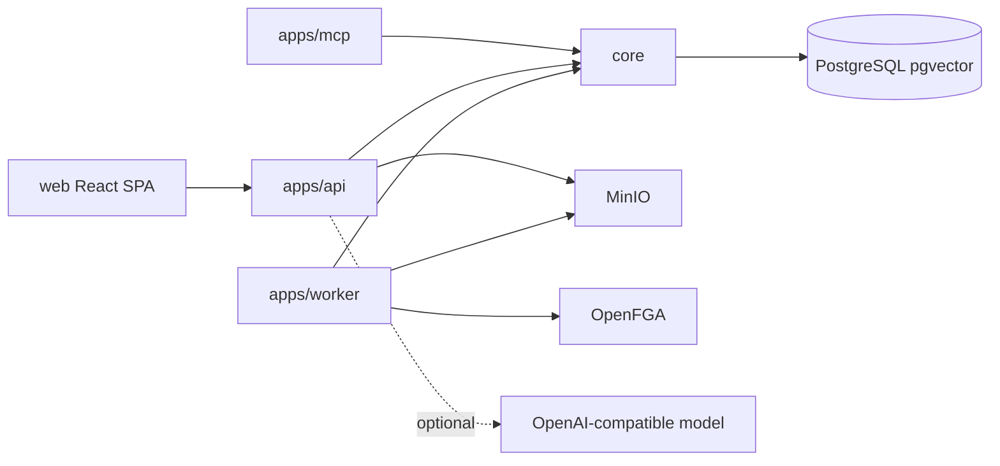

# OrgMemory Architecture

This document records behavior and structure that exist in the repository on
2026-07-22. Intended changes belong in [docs/vision.md](docs/vision.md) and the
[active increment](docs/increments/active/2026-07-20-secure-knowledge-vertical-slice/design.md).

## System Shape



The Gradle build contains `core`, `apps:api`, `apps:mcp`, `apps:worker`,
`integrations:authorization-openfga`, and `integrations:object-storage-minio`.
The web client is a separate Vite workspace. API owns Flyway execution and the
worker validates the existing schema with Flyway disabled in normal runtime.

Current baseline: Java 25, Gradle 9.6.1, Spring Boot 4.1.0, Spring Modulith
2.1.0, Spring AI 2.0.0, springdoc 3.0.3, PostgreSQL/pgvector, React 19.2.7,
TypeScript 7.0.2, Vite 8.1.5, Tailwind CSS 4.3.3, and pnpm 11.9.0.

Dependency direction is currently `apps/* -> core`. The intended adapter rule is
`apps -> core + selected integrations`, `integrations -> core ports` (or the
framework-neutral graph core), and never `core -> apps/integrations`.

## Current Runtime Responsibilities

- `core`: organization, capability, permission, and knowledge domain packages;
  JPA repositories; application services; Flyway migrations.
- `apps/api`: REST endpoints, OIDC bearer-token boundary, server-derived actor,
  optional Spring AI normalization/chat, OpenAPI, and health.
- `apps/worker`: leased background validation, parse/normalize, chunk/embed,
  fail-closed authorization projection, publication, and external
  permission-workbook validation.
- `apps/mcp`: a reserved delivery module with no runtime implementation; the
  legacy scaffold was removed so secure agent tools can be rebuilt on the
  permission-aware retrieval contract.
- `web`: a Vite SPA with TanStack Router file routes, an authenticated shadcn
  sidebar shell, generated Hey API clients for ordinary REST contracts, and an
  AI Elements assistant workspace. The protected route layout owns session
  restoration and passes the verified identity into the shell; feature code
  does not repeat authentication gates.

`core` uses Spring Modulith package boundaries and a verification test. Leased
database jobs carry ingestion work across processes. A specific Knowledge Asset
publication outbox records direct-upload authorization projection attempts and
the pinned OpenFGA model; no generic event framework has been introduced.

## Persisted Model

The capability registry persists organizations, departments, users, external
identities, capability assets, versions, usage, approval events, tags, and
embeddings. The knowledge slice persists the canonical upload ledger
(`SourceObject`, immutable `SourceRevision`, and `EvidenceBlob` metadata), leased
ingestion jobs, source-shaped raw and normalized records, Knowledge Assets,
versioned chunks and embedding profiles, sealed ACL snapshots and entries,
mutable ACL heads, publication outbox evidence, and append-only permission audit
events. Immutable evidence bytes live in MinIO; chunks, embeddings, future graph
data, and OpenFGA relationships are rebuildable projections.

## Current Permission-Aware Retrieval

The implemented service/test-backed one-leaf path is:

```text
RawSourceObject -> NormalizedRecord -> KnowledgeAsset
```

For knowledge list/detail reads, SQL filters organization, lifecycle, immutable
ingestion ACL, current ACL head, OrgMemory policy, and classification before
keyword matching and `LIMIT`. Java verifies returned rows again. A missing,
unknown, stale, unsupported, or denied decision fails closed. Denied detail and
missing detail both return a generic `404`.

ACL evidence is sealed and append-only. ACL rotation appends a new generation
and compare-and-set advances the current head. The current head has a 24-hour
freshness requirement; the ingestion snapshot remains a historical ceiling.
The retrieval audit stores decision context and ACL snapshot IDs without raw
query text.

OIDC identities are mapped only by an explicit `(issuer, subject)` binding to an
active internal user. Email claims and identity-provider roles are never used to
bootstrap identity or grant application permissions. External source principals
and groups are not mapped into that identity model yet.

Only explicitly namespaced OrgMemory user, department, and organization
principals are supported. The one-leaf promotion is not a public ingestion API.
External source groups, connector staging, vector/hybrid knowledge search,
multi-source derivation, and permission-aware agent/MCP wiring are not
implemented.

The provider-neutral authorization contract (`PermissionKey`, `PrincipalRef`,
`ResourceRef`, and `RelationshipAuthorizationPort`) and the official OpenFGA
Java SDK adapter are runtime dependencies. OpenFGA now enforces organization
control-plane entry and Capability Asset create/view/edit/review decisions.
Transactional asset ownership and visibility facts are passed as contextual
tuples; organization membership and role assignments are persistent OpenFGA
tuples. The versioned model has executable allow/deny and list-object tests.
Direct-upload publication writes the uploader's persistent `owner` tuple
idempotently and keeps the asset/chunks `PENDING` until OpenFGA confirms it. The
model id, attempts, and failure reason are recorded in the publication outbox;
the existing ingestion job provides durable retry. Knowledge Asset retrieval
still uses the prior relational policy and is the next cutover; source ACL
remains the immutable permission ceiling. External source-principal and
knowledge-space tuple projection are not implemented yet.

## Current AI And Graph Behavior

API directly wires the Spring AI OpenAI starter. The application can boot without
a model key and uses local fallback behavior for prototype normalization/chat.
There is no provider-neutral runtime AI gateway or persistent agent conversation
model yet.

The graph endpoint visualizes relational capability metadata such as assets,
owners, departments, types, tags, and processes. It is not a semantic knowledge
graph and does not use Neo4j or LightRAG.

## Current Security And Operations

The API exposes two Spring Security 7 boundaries. Browser requests use the API
as a confidential OIDC BFF: Keycloak completes Authorization Code + PKCE login,
Spring Session JDBC stores the durable session, and the browser receives only an
HttpOnly `ORGMEMORY_SESSION` cookie. Browser mutations require SPA CSRF. Bearer
requests under `/api/**` use a higher-priority stateless resource-server chain
for CLI, MCP, and integration clients.

Both paths resolve only an explicit `(issuer, subject)` binding to the canonical
internal actor. Keycloak owns authentication and can broker other identity
providers, but it does not own OrgMemory resource permissions. Unlinked or
inactive identities fail closed. There is no no-auth/local bypass. Request
payloads do not choose the current tenant, creator, reviewer, or usage actor.

Configuration is environment/YAML driven. Provider keys remain server-side. API
is the interactive delivery and migration owner; worker/MCP share and validate
the schema. The committed OpenAPI contract generates Fetch, Zod, SDK, and
TanStack Query artifacts through Hey API. A small legacy feature helper remains
while the prototype pages are replaced; streaming and browser-navigation logout
retain thin handwritten transports. There is no durable streaming conversation
store.

The repository is a prototype, not an approved production deployment. Backup and
restore, connector reconciliation, malware/DLP upload scanning, external
principal/knowledge-space tuple convergence, full retrieval-surface audit
coverage, load testing, and an enterprise security review remain absent.

OpenFGA SDK `0.9.9` is pinned in the dependency catalog. The official CLI is
installed reproducibly by `scripts/install-openfga-cli.ps1` and ignored from
git. `scripts/bootstrap-openfga.ps1` creates a development store/model, imports
demo relationships, and writes non-secret local identifiers after the compose
service is available.

## Build And Run

```powershell
docker compose up -d
.\scripts\bootstrap-openfga.ps1
.\gradlew.bat --no-daemon compileJava
.\gradlew.bat --no-daemon clean test
.\gradlew.bat :apps:api:bootRun
corepack pnpm -C web typecheck
corepack pnpm -C web build
```
