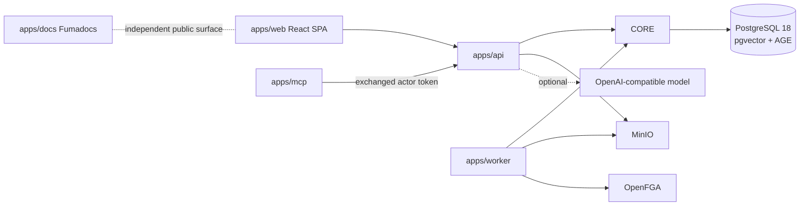

# OrgMemory Architecture

This document records behavior and structure verified in the repository.
Reconciled through Google Drive ingestion hardening `9d7112d0` on 2026-08-14.
Intended changes belong in [docs/vision.md](docs/vision.md) and the
[active increments](docs/increments/active/README.md).

## System Shape


```mermaid
flowchart LR
    WEB[apps/web React SPA] --> API[apps/api]
    MCP[apps/mcp] -->|exchanged actor token| API
    DOCS[apps/docs Fumadocs] -. independent public surface .- WEB
    API --> CORE
    WORKER[apps/worker] --> CORE
    CORE --> PG[(PostgreSQL 18<br/>pgvector + AGE)]
    API --> BLOB[MinIO]
    WORKER --> BLOB
    WORKER --> FGA[OpenFGA]
    API -. optional .-> LLM[OpenAI-compatible model]
```

The Gradle build contains `core`; the deployable `apps:api`, `apps:mcp`, and
`apps:worker`; the framework-neutral `components:graph-rag-core`,
`components:graph-rag-testkit`, and `components:scim-protocol-conformance`;
and replaceable integrations for OpenFGA authorization, connectors,
OpenAI-compatible AI, MinIO object storage, Spring AI GraphRAG, PostgreSQL,
OpenSearch, Neo4j, GraphRAG observability, the telemetry payload boundary, and
sidecar JSON. `integrations:document-parsing-spring-ai` is the reusable
Spring AI/Tika document adapter behind the framework-neutral parser and typed
block contracts in `components:graph-rag-core`; product admission remains in
the consuming domain.

All runnable product surfaces live under `apps/`. The React client in
`apps/web`, Fumadocs portal in `apps/docs`, and command-line client in
`apps/cli` are packages in the root pnpm workspace; they are not Gradle
subprojects. `apps/api`, `apps/worker`, and `apps/mcp` remain Gradle
subprojects. API owns Flyway execution; worker and MCP validate the existing
schema with Flyway disabled in normal runtime.

Current baseline: Java 25, Gradle 9.6.1, Spring Boot 4.1.0, Spring Modulith
2.1.0, Spring AI 2.0.0, springdoc 3.0.3, PostgreSQL 18 with pgvector 0.8.4
and Apache AGE commit `e43dc1a12b78fba4acef9835b2b10379b8d243b4`,
React 19.2.7, TypeScript 7.0.2, Vite 8.1.5, Tailwind CSS 4.3.3, Node 24 in
CI, pnpm 11.9.0, Next.js 16.2.11, Fumadocs UI 16.13.0, and Fumadocs MDX
15.2.0. Tegami 1.2.7 manages one synthetic whole-product release unit backed
by `release/product.json`; that product release does not publish Gradle or pnpm
workspaces. `@orgmemory/cli` has a separate package-owned SemVer and a dedicated
manual npm Trusted Publishing workflow. Public consumer version `0.1.0` has
verified registry integrity and SLSA provenance. Source version `0.1.1` is the
selected activation release and product handoffs pin that exact version; it is
considered available only after the registry release, provenance, signature,
and exact-version execution gates pass.

Green `main` commits remain the executable delivery identity. Production and
docs workflows publish immutable SHA-addressed images and manifests. Tegami
collects reviewed `.tegami` entries into a Version Packages pull request and,
after that exact commit passes CI, creates a `v<version>` tag and GitHub Release
with a consolidated immutable artifact manifest. Release-only commits carry
forward verified digests and do not rebuild or deploy images. Writable release
automation rejects stale main SHAs and tag collisions; pull-request preview
runs untrusted code read-only and a separate trusted workflow posts its result.

Dependency direction is `apps/* -> core`. The adapter rule in force is
`apps -> core + selected integrations`, `integrations -> core ports` (or the
framework-neutral graph core), and never `core -> apps/integrations`.

`integrations/observability` is a deliberate exception to that adapter rule: it
implements no core port and depends on no OrgMemory module. It holds the
telemetry payload boundary — the span sanitizer and the two startup verifiers —
and the absence of a `project(...)` dependency is what keeps that boundary
adoptable by a deployable with no domain dependency. It arrives through
`orgmemory.spring-boot-app-conventions` rather than through each application's
build file, so taking the convention is taking the boundary. See
[decision 0019](docs/decisions/0019-the-payload-boundary-is-its-own-module.md).

## Current Runtime Responsibilities

- `core`: organization, permission, assistant, AI, knowledge, and Asset Registry
  domain packages; JPA repositories; application services; Flyway migrations.
- `apps/api`: REST endpoints, OIDC bearer-token boundary, server-derived actor,
  optional Spring AI normalization/chat, OpenAPI, health, and an `/api/admin/**`
  administration surface over the identity ledger and the source connections,
  gated on OpenFGA `can_manage_members`. A source credential is write-only across
  that surface: it is submitted, stored encrypted, and never returned in any form.
- `apps/worker`: leased background validation, parse/normalize through the
  reusable document adapter, block-aware chunk/embed under an atomically pinned
  named processing policy and per-format limits,
  fail-closed authorization projection, publication, external
  permission-workbook validation, and a connector driver that ingests a versioned
  crawl-batch contract into the governed ledger, checkpointing progress per
  connection so a restart resumes rather than replays. Which connections it crawls
  and what it authenticates with come from the ledger on every poll. The live
  connector adapters share a polling lifecycle that retains only derived provider
  clients between polls, replaces them when credentials or client-bound settings
  change, and retires client and cadence state when a connection disappears.
- `apps/mcp`: a stateless, bearer-authenticated Spring AI MCP server. Its
  read-only Knowledge and Asset tools, Asset resources, and released Prompt
  adapter exchange the inbound resource token for a short-lived actor token
  scoped to canonical API contracts. Completion suggests only Prompt-argument
  and Asset resource-template values the current identity may already read, and
  a downstream failure crosses the boundary as a cause-free tool error so the
  runtime cannot append internal transport detail. A separate `assets:write` HTTP companion
  accepts one bounded Skill Draft publication from the CLI; it is not an MCP
  mutation tool and delegates package validation, authorization, and lifecycle
  to the canonical API. Agents therefore use the same GraphRAG, OpenFGA, live
  object authorization, and audit paths as the product without bearer
  passthrough, repositories, database migrations, or a second lifecycle
  implementation.
- `apps/cli`: an OAuth PKCE command-line client for MCP connection, exact Skill
  package installation, and bounded Skill Draft publication through the HTTP
  companion. Project-local or current-user Skill receipts remain token-free.
  Schema v2 records the exact regular-file set for offline verification;
  schema-v1 receipts remain readable but unverifiable. Exact same-coordinate
  updates and verified-only removal serialize through a per-scope filesystem
  lock and durable recovery journal. The CLI refuses target ownership
  collisions, local drift, mutable `latest`, and destructive force removal. It
  consumes public contracts and owns no domain persistence.
- `apps/web`: a Vite SPA with TanStack Router file routes, an authenticated shadcn
  sidebar shell, generated Hey API clients for ordinary REST contracts, an AI
  Elements assistant workspace, and generic Asset catalog, detail/use, Pack
  journey, governance, and MCP connection surfaces. The protected route layout owns session
  restoration and passes the verified identity into the shell; feature code
  does not repeat authentication gates. A separate `/admin` area reuses the same
  shell with a Permissions sidebar and is hidden from non-administrators by the
  session role, which is a rendering hint over the server-side gate.
- `apps/docs`: an independent Next.js/Fumadocs public documentation portal. It
  loads only curated MDX under its own content tree, validates an explicit
  publication manifest and source references, excludes drafts by default, and
  has no runtime dependency on the product services. Turbopack is its default
  Next.js bundler, not a repository task runner.

`core` uses Spring Modulith package boundaries and a verification test.
The closed `core.knowledge.space`, `core.knowledge.sourceledger`,
`core.knowledge.acl`, and `core.knowledge.graph` nested modules expose
owner-defined root-package APIs with exact outgoing dependency allowlists.
Source Ledger owns the canonical source and revision ledger, evidence blobs,
raw/normalized processing records, upload and query services, durable ingestion
jobs, and the inventory query used by Connector read views. ACL owns source ACL
snapshots and heads, external-principal mappings, and group-membership evidence.
Connector source lookup, vanished-object diffing, and retirement cross Source
Ledger-owned inventory and lifecycle APIs rather than its persistence model.
Connector revision lookup, staging, completion, and atomic graph scheduling
cross a Source Ledger-owned `REQUIRES_NEW` service and outbound graph port;
Connector consumes neither Source Ledger persistence nor Graph queue types.
Connector is closed with an exact dependency allowlist after those seams were
replaced. Asset promotion receives validated normalized facts through a Source
Ledger-owned request, and Asset publication advances the current source
revision through a Source Ledger-owned `MANDATORY` service inside the existing
publication transaction; Asset consumes no Source Ledger entity or repository.
Asset owns its catalog persistence projection, normalized chunk values, and the
pgvector encoding used by its chunk store. Retrieval maps that projection to
the parent-owned `knowledge::catalog` interface consumed by Asset Registry and
the API; version-only reads resolve the canonical actor scope before querying a
current active version. Asset also owns the compact embedding-profile reference
required for publication and the projection namespace identity; callers
translate Retrieval's richer profile at the boundary. Retrieval resolves Asset
existence, active authorization scopes, and current catalog projections through
the Asset-owned `KnowledgeAssetRetrievalQuery`; it does not import Asset
repositories. Organization-owned queries reload persisted active department and
Executive facts and resolve organization/department existence without exposing
Organization persistence or roles. Source Ledger resolves tenant-scoped ready
revision plus validated blob state through `SourceCitationEvidenceQuery`, so
citation opening consumes immutable evidence rather than revision/blob
persistence. Parent Knowledge also exposes the exact `knowledge::evidence`
named interface for governed byte registration and exact Source/revision state.
Source Ledger implements it through the canonical upload and query services;
Assistant consumes it without importing Source Ledger persistence, parsing, or
processing types. Asset has no direct dependency on Retrieval and is a closed
nested module with an exact outgoing dependency allowlist. Parent Knowledge
exposes the stable permission-aware
search contract, immutable evidence, secure result, and verified grounding as
the exact `knowledge::search` named interface. Assistant and Asset Registry
consume that parent interface without importing Retrieval implementation types.
Graph exploration, export, and curation obtain their immutable authorized
evidence snapshot and exact current governing-evidence decision through the
Retrieval-owned `GraphEvidenceVerifier`; Graph does not import Retrieval scope
resolution, candidate, or store implementation types. Verified snapshots reject
unknown Knowledge Spaces, and canonical evidence rechecks carry only the assets
authorized for the requested Space. API and Worker inject interfaces for the
canonical/GraphRAG engines, citation/source opening, authorization inspection,
and embedding-profile resolution; full evidence-scope resolution plus the
default and JDBC implementations are package-private. Retrieval is a closed
nested module with an exact outgoing dependency allowlist. Its embedding
entity/repository, canonical store, resolved scope, candidate, catalog
implementation, and scope-unavailable exception are non-public root types. The
provider-neutral object-storage port is exposed as the
`knowledge::storage` named interface. Leased database jobs carry ingestion work
across processes. A specific Knowledge Asset
publication outbox records direct-upload authorization projection attempts and
the pinned OpenFGA model; no generic event framework has been introduced.

## Governed Asset Registry

The side-by-side `core.assetregistry` module owns stable Asset identity,
accountable roles, mutable drafts, immutable digest-pinned revisions, distinct
review decisions, immutable releases, append-only availability history, and
actor-scoped consumption evidence. Prompt Template, Work Instruction,
Capability Pack, and Skill Package are code-owned profiles over this common
kernel. Every new Asset has one canonical human owner and starts as a private
working copy. The owner may publish every enabled profile directly into an
immutable Revision and Release; the first Viewer share publishes version
`1.0.0` when no Release exists. Editors may change only the working Draft, and
Viewers receive only released content. Company-wide sharing is Viewer-only.
Existing reviewed Releases and review records remain compatible history, and
the optional reviewed API path remains available; every Release records
`DIRECT` or `REVIEWED` provenance.

Ownership transfer is one locked canonical-ledger transition that appoints the
new owner and demotes the previous owner to Editor. Administrator recovery is
allowed only for an owner vacancy. Asset-level withdrawal appends `WITHDRAWN`
availability evidence to every non-withdrawn Release and retires the stable
identity. Relationship changes advance a canonical generation, mark
authorization unready, and queue versioned OpenFGA write/delete intents; reads
remain fail-closed until the current generation converges. Transfer currently
relies on the same-organization user foreign key; active-user and parent-Space
eligibility checks remain an open hardening gate.

A Skill import validates one bounded Agent Skills ZIP before its original bytes
enter object storage. Direct and reviewed Skill publication both pin the exact
object key and SHA-256. Existing Knowledge remains in its canonical ledger and
is federated by exact visible version; it is not copied into registry tables.

A mutable Skill Draft may replace its package under live edit authorization,
an expected Draft version, and the Asset lock. The swap deletes and recreates
only the Draft payload reference; immutable Revision and Release references
cannot be updated or deleted. A durable supersession row drives post-commit
cleanup, and object storage bytes are deleted only after an exact
organization/reference query proves that no persisted owner still pins them.

Four exact parent-owned capabilities isolate the Skill artifact lifecycle.
`assetregistry::skill-package` accepts canonical validated uploads;
`assetregistry::skill-delivery` returns authorized release facts and content
without a storage locator; `assetregistry::skill-cleanup` exposes only the
Worker batch trigger and immutable summary; and
`assetregistry::skill-storage` is limited to exact parent persistence,
delivery, cleanup, and MinIO consumers. The parent owns storage writes,
compensation, reference persistence, supersession retry state, cleanup, and
storage opening. Skill package semantics never receive or publish the stored
object key.

The closed `core.assetregistry.skill` nested module owns bounded package
inspection and validation, GitHub acquisition orchestration, API-facing Skill
operations, install-manifest construction, and read-only runtime projection.
Its exact public top-level
surface is `SkillPackageOperations`, `SkillGitHubOperations`,
`SkillDistributionOperations`, `SkillGitHubSourcePort`,
`SkillPackageInspection`, `SkillInstallManifest`, `SkillPackageContent`, and
`SkillRuntimeOperations`;
all implementations and package semantics remain package-private. The child
consumes the parent only through `assetregistry::skill-package` and
`assetregistry::skill-delivery`, while the parent never depends on the child.

The closed `core.assetregistry.workinstruction` nested module owns Work
Instruction payload parsing, follow/acknowledge orchestration, actor-scoped
acknowledgement persistence, and relation traversal. Its implementation,
profile, entity, and repository types are all package-private. Top-level REST,
Assistant, and generic delivery consumers depend only on the parent-owned
`assetregistry::work-instruction` and
`assetregistry::work-instruction-relations` named interfaces. The child resolves
Asset and Knowledge targets through authorized parent/catalog contracts; the
parent never imports the child.

The browser reaches that same lifecycle through Scratch authoring, bounded
`SKILL.md`/ZIP/folder upload, or GitHub import; each path ends at an ordinary
private Draft in the Assets Governance workspace. GitHub preview and eligible
private-connection discovery require Skill-create permission on the selected
Knowledge Space. Import re-fetches the exact previewed 40-character commit,
creates each selected Skill independently, and records server-derived
repository, commit, and source-path provenance without exposing credentials to
the browser.

All REST, Assistant, web, and MCP consumption resolves an exact released
version and live actor authorization. Capability Packs pin exact component
releases and independently authorize every item, so a replacement cannot
silently mutate an assigned journey and a denied component collapses to an
opaque access gap. A visible Skill is disabled for each actor by default;
Assistant discovery and activation require both current release visibility and
that actor's explicit Enabled preference. Governance history still derives the
legacy owner/backup-owner health flags for compatible records without changing
immutable Release bytes.

## Persisted Model

The identity ledger persists organizations, departments, users, and external
identities. Knowledge retrieval reloads an active subject's canonical department
and Executive state through `KnowledgeAccessSubjectQuery`, and resolves
organization/department authorization resources through
`OrganizationResourceQuery`; it does not import Organization entities, roles,
or repositories. The knowledge slice persists Knowledge Spaces and the canonical
source ledger (`SourceObject`, immutable `SourceRevision`, and `EvidenceBlob`
metadata), leased ingestion jobs, source-shaped raw and normalized records,
stable `KnowledgeAsset` roots, immutable `KnowledgeAssetVersion` records,
append-only evidence links, versioned chunks and embedding profiles, sealed ACL snapshots and entries,
mutable ACL heads, an observed external source-principal registry keyed by stable
typed native IDs with verified principal mappings, independently sealed
per-group membership snapshots and atomic active heads, per-connection
identity trust decisions consumed by the crawl matcher, durable per-connection
component checkpoints that separate observed from successfully reconciled
content, permission, and membership cursors, a per-batch record of what each crawl did
(`connector_crawl_attempts`), publication outbox evidence, and append-only
permission audit events. Immutable evidence bytes live
in MinIO; chunks, embeddings, graph data, and OpenFGA relationships are
rebuildable projections. A connector crawl produces the same governed ledger as
uploads, with source ACL evidence resolved through the principal mappings. Each
object records `source_system` (which system it came from, governed by the
connector registry rather than a check constraint) separately from `acl_authority`
(`SOURCE` or `ORGMEMORY`, which of the two [ADR 0009](docs/decisions/0009-dynamic-source-acl-ceiling.md)
rules applies), so adding a connector needs no migration — Slack, Google Drive,
and GitHub are adapters contributing a profile, a batch source and a credential
probe, with no source named in `core` or in the API. Their batch sources delegate
connection enumeration, content cadence, derived-client rotation, mostly-failed
admission, and failure isolation to one integrations-owned polling driver while
retaining provider API, mapping, completeness, and cursor semantics.
Google Drive additionally bounds retained extracted text per crawl: 64 MiB by
default, with a floor equal to the 25 MiB single-response cap. Exhausting that
budget marks CONTENT incomplete with a stable reason while permission
observation continues; complete permission evidence remains eligible for
reconciliation and the policy skip is not counted as a provider failure.
An adapter that cannot establish an object's source ACL leaves that object out of its payload
rather than sending an empty grant list, because the ledger seals an empty list as
the source stating
that nobody may read it. Source connection rows
carry the configuration every source shares as columns and whatever only one
source understands as an opaque `source_config` document, plus an encrypted
credential in `source_connection_credentials`; the ciphertext is
AES-256-GCM and a row that fails its authentication tag is refused rather than
decrypted, so a tampered credential cannot be used. `user_invitations` records an
address an administrator expects and the role it arrives as; a partial unique
index allows one open row per address per organization while accepted and revoked
rows stay as the audit trail.

## Current Permission-Aware Retrieval

The implemented service/test-backed one-leaf path is:

```text
SourceObject -> SourceRevision -> NormalizedRecord
             -> KnowledgeAsset -> KnowledgeAssetVersion -> chunks
```

Secure knowledge search first resolves candidate Knowledge Asset IDs with
OpenFGA `ListObjects`. Canonical SQL then filters organization, lifecycle,
immutable and current ACL, the stable asset's current-version pointer,
publication/model/profile state, and classification before FTS, vector, or graph
ranking and before evidence can enter model context. LightRAG returns structured
entity, relation, and chunk selections with contribution-level provenance. One
global token budget is applied across every authorized Knowledge Space.
OpenFGA `BatchCheck` and a canonical SQL recheck guard the complete selected
evidence closure, including graph contributions that are not direct chunk
seeds. The pure-Java renderer numbers that same verified closure and produces
the final model instruction; the Assistant does not rebuild a second
chunk-only prompt. The verified evidence set is immutable for one Assistant
request, and answer tokens stream without repeating the full authorization
pipeline after generation. Revocation affects the next request;
an in-flight turn may finish under its request snapshot and is bounded by the
configured turn timeout. Missing, unknown, stale, unsupported, changed, or
denied retrieval decisions fail closed.

Assistant governed-file turns add an immutable `KnowledgeEvidenceSelection`
after actor authorization. Canonical retrieval intersects the selected Assets
before ranking; GraphRAG carries the same ceiling through seed, expansion,
closure verification, and citation output. The selection pins exact binding,
Source, revision, and Asset identity, and every selected Source must contribute
usable final evidence before generation. Upload remains the ordinary durable
Source pipeline; the API never parses or embeds the multipart bytes.

Assistant private-file turns use a separate actor-private aggregate, storage
prefix, chunk projection, retrieval query, and ordered turn binding. Upload is
limited to three selected files per turn, 25 MB per file, and the parser-backed
document allowlist; images and declared archives are not admitted. The API
registers immutable object metadata and a fixed non-renewing 30-day expiry,
while Worker remains the only parser caller and reuses the same pinned
`structured-block-v1` document-processing engine as governed ingestion. Private
retrieval requires the exact actor, organization, file, processing generation,
active embedding profile, READY state, and unexpired TTL, and it never enters
the shared Knowledge retrieval/cache path. A turn cannot mix private files with
governed Source bindings. Delete or expiry denies use first, removes the private
chunk projection transactionally, then retries object deletion idempotently;
the file tombstone and citation identity remain so old answers can render an
inert unavailable marker without retaining extracted content.

ACL evidence is sealed and append-only. ACL rotation appends a new generation
and compare-and-set advances the current head. The current head has a 24-hour
freshness requirement; the ingestion snapshot remains a historical ceiling.
The retrieval audit stores decision context and ACL snapshot IDs without raw
query text.

OIDC identities are mapped only by an explicit `(issuer, subject)` binding to an
active internal user. Email claims and identity-provider roles are never used to
bootstrap identity or grant application permissions. External source principals
are mapped into that identity model only through the verified mapping ledger, and
an administrator governs that ledger from `/api/admin/**`.

Source ACL evidence accepts namespaced OrgMemory user, department, and
organization principals plus external `SOURCE_USER` and `SOURCE_GROUP`
principals, the latter resolved through the active independently sealed complete
membership head. A membership change therefore grants or revokes on the next
request without rotating a resource ACL or rebuilding content projections.
Permission-aware MCP search is implemented. Multi-source derivation and
mutation tools are not implemented.

The provider-neutral authorization contract (`PermissionKey`, `PrincipalRef`,
`ResourceRef`, and `RelationshipAuthorizationPort`) and the official OpenFGA
Java SDK adapter are runtime dependencies. OpenFGA enforces organization
control-plane entry, Knowledge Space administration/upload, and stable
Knowledge Asset view decisions. Organization membership and role assignments
are persistent OpenFGA tuples. The versioned model has executable allow/deny
and list-object tests.
An administrator creates a Knowledge Space and authors its grants at runtime.
`AdministrativeTupleScope` admits `organization` and `knowledge_space`
and still refuses `knowledge_asset`: `acl_authority` is a column on
`source_objects`, so a space has no external counterpart to diverge from while an
asset descends from one that may be `SOURCE`-authoritative. Creation derives the
immutable `space_key` from the name, writes the structural `organization` link
that `org_admin` resolves through, and makes the creator the space
`administrator` — which is the accountability record, so no `created_by_user_id`
column exists. The row is flushed before the tuples and an unapplied write rolls
it back. Grants name one of four subject shapes rather than a free-form OpenFGA
reference, and the relation decides which shapes are accepted, mirroring the type
restrictions in `model.fga`; that table is published so a grant form offers only
combinations the store would accept. A space grant satisfies one retrieval gate
and the mirrored source ACL still caps every read behind it. Space lifecycle
(deactivation, retention) and moving assets between spaces are not implemented.

Direct upload lists only Knowledge Spaces authorized by OpenFGA
`can_create_asset`, rechecks the selected parent before any object-store write,
and carries that Space identity through the immutable source ledger. Publication
writes the Space and uploader-owner tuples together and keeps the asset/chunks
inactive and the version `PENDING` until OpenFGA confirms them. PostgreSQL
prepare commits before the external write; an independent completion
transaction activates the new version/chunks, retires the previous active
version, advances stable asset/source heads, and records the applied outbox
state. The model id, attempts, and failure reason are recorded in the publication
outbox; the existing ingestion job provides durable retry. A worker convergence
sweep republishes applied rows pinned to an obsolete model and deletes only
managed direct owner/Space tuples for assets that no longer exist. Source ACL
remains an independent permission ceiling: internal upload ACLs grant the
organization and confidential upload ACLs grant the selected Space's department.
External source principals are resolved in that ceiling by the SQL enforcement
path through their verified mappings; they are not projected into OpenFGA
tuples.

## Current AI And Graph Behavior

API and worker resolve workload-specific gateway/model routes through the
provider-neutral `integrations/ai-model-gateways` runtime. The shared dispatcher
selects protocol factories for Spring AI OpenAI-compatible or native Anthropic
Messages models and fails closed when a protocol implementation is absent.
Assistant answer, keyword planning, graph extraction, and document embedding
have independent configured routes. Answer and Keyword organization overrides
resolve at request time; Graph remains deployment-managed and read-only in the
administration UI. OpenAI-specific reasoning effort is optional and is sent
only through an OpenAI-compatible gateway that explicitly declares support;
native Anthropic and undeclared compatible gateways fail closed. Graph
extraction defaults to `gpt-5.4-mini`; the
`ORGMEMORY_GRAPH_EXTRACTION_MODEL` deployment override is independent from the
Assistant model. New Graph jobs pin reasoning effort in schema-v2 processing
profiles while persisted schema-v1 bytes and hashes remain executable.
The verified ZM production route uses `gpt-5.6-sol` with reasoning `none` for
Answer, `gpt-5.6-luna` with reasoning `none` for Keyword Planning, and
`gpt-5.4-mini` with provider-default reasoning for Graph Extraction.
Immutable Knowledge Asset embedding
profiles still pin the provider/model used by derived indexes. The default
`GRAPH_RAG` runtime requires its configured provider routes and has no implicit
local retrieval fallback. Assistant conversations may select an additional
administrator-activated model on the current organization Answer gateway. The
browser submits only the activation UUID; the server binds it to the active
route identity and version, revalidates it inside the cold generation stream,
and retains the ordinary bounded conversation-memory advisor. Deployment
defaults remain synthetic and read-only, and other AI workloads cannot enter
this Assistant-only exact-route authority path.

On that exact Assistant route, the gateway registers three fixed request-local
Skill tools for actor-scoped search, exact-release activation, and bounded text
resource reads. A bounded Spring AI streaming tool advisor performs progressive
disclosure without a second registry or filesystem mirror. Each operation
re-enters live Asset authorization and immutable package integrity checks;
stored object keys and denied identities never enter model context. Skill
content is untrusted, `allowed-tools` grants no runtime authority, and the API
does not execute scripts, binaries, shell commands, or package code. Empty
authorized retrieval still terminates before model or Skill-tool invocation.
Successful activation may emit one transient, server-sanitized Skill title and
a positive turn-local ordinal for the browser's current-turn receipt. Search,
denial, and failure remain unnamed; resource activity is attributable only to
an exact release activated successfully in that turn. The receipt is never
persisted or reconstructed from conversation history. A browser-owned
visible-output latch keeps the waiting row mounted across transport completion
until answer text is actually visible; a source frame alone does not end it.

The pure-Java GraphRAG core defines canonical entity/relation identity,
evidence-level contributions and provenance, structured extraction contracts,
authorization-scoped graph read ports, atomic revision replacement, and one
non-overridable authorized graph traversal coordinator. The coordinator validates
the exact publication snapshot before every early return, authorizes seeds and
candidate endpoints, drains stable relation-UUID pages for each complete
breadth-first level, normalizes by minimum depth and canonical UUID, and only
then applies one global node limit. PostgreSQL, Neo4j, OpenSearch, and the
in-memory testkit supply the same snapshot-bound entity and incident-relation
page contract; no storage adapter returns final expanded entity identifiers.

The core also defines one internal retrieval-plan contract with chunk-only,
entity-only, relation-only,
secure-hybrid, and secure-mix strategies, deterministic ranking and round-robin
merge, structured grounding, deterministic contribution-level citation
numbering, and LightRAG-compatible context-budget invariants. `SECURE_MIX` is
the default plan; strategy selection is not exposed as a public request option. Its
testkit provides a permission-scoped in-memory reference projection and proves
that restricted contribution text, seeds, neighbors, degrees, and weights do
not affect visible results. Neither module has Spring on its runtime classpath.

The replaceable `graph-rag-spring-ai` integration implements the graph-core
entity/relation extraction port with Spring AI structured output. It requires
the configured provider, request model, and registered prompt version to match
the immutable extraction profile; malformed output and unresolved relation
endpoints fail closed. Source text is user-scoped untrusted evidence rather than
a system instruction. Deterministic adapter tests use a fake `ChatModel`, so no
provider credentials or network calls are required.

The `graph-rag-postgres` integration implements the graph read/write, lexical
seed, contribution-vector, and topology ports. PostgreSQL owns canonical
identities, immutable evidence contributions, published revision heads, and
entity/relation vectors. One exact topology backend is selected through
`orgmemory.graph-rag.postgres.topology-backend=APACHE_AGE|RELATIONAL`;
`APACHE_AGE` is the production default, has no automatic fallback, and fails
startup when its extension, catalog, session preload, or privileges are absent.
The shared-database bootstrap exposes only a SECURITY DEFINER boolean preload
probe to the application role; the role does not receive the broad
`pg_read_all_settings` capability.
AGE stores only tenant- and publication-batch-pinned topology identity plus a
transactional ready marker. Its incident-relation pages filter authorized
Knowledge Assets before paging and remain subject to relational evidence and
core coordinator rechecks. `RELATIONAL` implements the same page contract as an
explicit backend choice; neither adapter owns final traversal results.

The integration also implements the framework-neutral content, lexical,
vector, graph, and publication contracts over one namespace snapshot. Staged
records are keyed by publication batch, all required adapters leave durable
preparation receipts, and a namespace-scoped publication lock exposes exactly
one winning batch. Each physical attempt pins the exact predecessor batch and a
never-reused graph-job claim epoch. PostgreSQL issues one irrevocable exact
commit permit after the current lease, target, cancellation state, and manifest
are rechecked; the selected PostgreSQL or OpenSearch publication adapter binds
that permit before its local head CAS. Ambiguous outcomes retain staging, while
cleanup requires a store-issued discard permit and retires the durable commit
permit before deleting staged records. For the selected AGE backend, relational
graph staging, exact-batch AGE rebuild, and the ready marker commit in one
transaction before the graph preparation receipt becomes durable. Rebuilds
reject unresolved relation identities or endpoints and require exact AGE
entity/edge counts before writing the marker. A production backend cutover uses
the `age-reconcile` operations-profile one-shot from the API image: deployment
stops the previous worker and API, preflights every retained published `GRAPH`
batch against configured batch/entity/relation ceilings, repairs only missing,
duplicate, or mismatched exact-batch topology, and starts normal services only
after success. AGE/catalog unavailability remains fatal, and normal reads or
service startup never repair data. Permit-authorized discard removes the same
AGE and relational staging atomically.
Content, FTS, pgvector, and graph readers
validate the winning batch and prefilter organization plus authorized Knowledge
Asset IDs before scoring or traversal. Published predecessor batches remain
addressable; losing or aborted staged records are never selected by a
generation-only query.

Vector indexes are rebuildable and operator-selectable: exact, HNSW,
half-vector HNSW, IVFFlat, or VChordRQ. VChordRQ requires the separately
installed `vchord` extension and is unavailable in the pinned local image;
selecting it without that extension fails startup instead of silently falling
back. Index provisioning runs after database initialization with concurrent
PostgreSQL DDL. Writes use advisory revision locks, atomic generation replacement,
monotonic generation checks, and record/payload-bounded JDBC batches. Spring Boot
auto-configuration binds these mechanics under `orgmemory.graph-rag.postgres`;
the obsolete three-state AGE mode is rejected rather than silently ignored.
Large-table upgrades pre-stage the graph prerequisite unique indexes through the
deployment pipeline before Flyway attaches them as constraints; fresh and small
installations can let Flyway create them directly.

The local runtime uses one PostgreSQL server and volume. OrgMemory owns the
`orgmemory` database; OpenFGA owns a separate `openfga` database and login on
that server. An idempotent bootstrap handles both fresh and existing volumes.
OpenFGA tables remain isolated from the OrgMemory schema and are not queried by
application SQL.

The worker enqueues a durable graph-index job in the same transaction that makes
a source revision `READY`. Jobs pin the current Knowledge Asset version, source
revision, active chunk generation, ACL snapshot/generation, embedding profile,
and extraction route. Multi-replica workers claim jobs through leased
`FOR UPDATE SKIP LOCKED` work, extract chunks with bounded concurrency, assemble
deterministic evidence contributions, embed them with the immutable document
embedding profile, and prepare every retrieval projection before obtaining the
exact commit permit. Projection publication and graph-job completion are
separate durable convergence steps, not one cross-store transaction: replay
repairs an exact `COMMITTING` marker, invalidates both graph caches, and then
completes the job from the persisted publication proof even after the original
lease expires. A stale version is superseded before permit issuance and a
failed or concurrently lost publish leaves the previous generation intact.

Assistant graph retrieval is the default runtime. The application verifies the
complete entity/relation/chunk evidence closure before asking the core renderer
for the final prompt, then sends that prompt through the existing
provider-neutral `ChatModelPort`. Reranking is an operator policy, defaults off,
fails startup when enabled without an adapter, and records a sanitized fallback
event while preserving the already-authorized retrieval order on transient
provider failure. The Sources UI exposes a
bounded permission-scoped Knowledge Graph explorer backed by the current shared
projection snapshot. Graph curation and export remain curator/admin operations;
the explorer does not create a second ACL or expose globally merged
descriptions.

The API also has a one-shot `retrieval-observation` operations profile for ADR
0020 recall evidence. It is not an HTTP request surface and has no production
request wiring. The runner reuses the governed retrieval service for a
keyword-seeded `MIX` path and a raw-query `NAIVE` bypass, both with context-only
output and normal authorization, snapshot, canonical, final OpenFGA, and audit
checks. It refuses the live `orgmemory` database, requires an exact restored
copy name, and requires Flyway, projection provisioning, and reconciliation to
be disabled. `scripts/capture-retrieval-observations.ps1` supplies the managed
dev connections through loopback tunnels without writing exported secrets.

Assistant citations use API-owned opaque URLs. Completed answers atomically
persist ordered citation identity and evidence kind, and replay hydrates
currently visible citation affordances separately from the actor-owned
transcript. Private citation identity additionally pins the actor-private file
and processing generation. The
API rechecks the canonical evidence boundary for a bounded audited excerpt and
again before streaming original bytes from object storage; it exposes no MinIO
key or presigned storage URL. Private citation hydration repeats the exact
owner, TTL, lifecycle, and generation check; expired or deleted evidence keeps
only a non-clickable marker. The web client shows the excerpt first, uses a
closed server presentation kind, renders Markdown through a restricted profile,
and opens authenticated PDF, image, and text responses as short-lived browser
blobs. Office and unknown formats remain download-only.

## Current Security And Operations

The API exposes two Spring Security 7 boundaries. Browser requests use the API
as a confidential OIDC BFF: Keycloak completes Authorization Code + PKCE login,
Spring Session JDBC stores the durable session, and the browser receives only an
HttpOnly `ORGMEMORY_SESSION` cookie. Browser mutations require SPA CSRF. Bearer
requests under `/api/**` use a higher-priority stateless resource-server chain
for CLI, MCP, and integration clients.

Both paths resolve only an explicit `(issuer, subject)` binding to the canonical
internal actor. Keycloak owns authentication and can broker other identity
providers, but it does not own OrgMemory resource permissions. Inactive
identities fail closed. There is no no-auth/local bypass. Request payloads do not
choose the current tenant, creator, reviewer, or usage actor.

An unlinked identity is refused unless exactly one open `user_invitations` row
matches the token's email, in which case the first sign-in creates the app user
and writes the binding. The binding is still `(issuer, subject)`; the address only
selects which invitation applies and never becomes the identity. Two open
invitations for one address provision nothing rather than choosing a tenant, and
an address that already has an account is linked rather than duplicated.

A separate highest-priority stateless SCIM chain protects `/scim/v2/**`.
Organization-bound connection tokens are hashed at rest, scoped, expiring,
rotatable, immediately revocable, and rejected on browser or ordinary bearer
routes. The provisioning ledger separates local, directory, readiness, and
effective activity, stores append-only redacted events, and keeps new
connections disabled. Authenticated discovery is generated from the implemented
capability registry; User and Group mutation endpoints are not yet exposed.

An administrator reads effective access rather than a stored copy. Organization
`can_*` permissions and a single `(user, permission, resource)` question are
resolved through the check ports when asked, and `RelationshipExpansionPort` over
OpenFGA `Expand` supplies the derivation behind the answer — for explanation only;
enforcement stays with the check ports. A verdict is `ALLOWED`, `DENIED`, or
`UNKNOWN`, because an expired or undated mirrored ACL is not a denial, and it
carries the authority, generation, and capture time it was decided from. The
explanation path reads the relationship port directly so an unanswered check stays
distinguishable from a refusal; `EffectiveAuthorizationService` continues to
collapse the two for enforcement. For `knowledge_asset#can_view`, the admin
inspector additionally runs the one requested asset through the same canonical
retrieval eligibility SQL and reports the OpenFGA relationship, canonical content
policy, and final intersection separately. The endpoint requires `can_view_audit`
before resolving the tenant-owned asset title or Space name; other resource and
permission combinations are explicitly relationship-only. Administrative tuple
writes are confined to `organization` and `knowledge_space` objects: Slack, Drive, and
GitHub own the ACL for connected content, and a second writer would let the two
diverge.

Configuration is environment/YAML driven. Provider keys remain server-side. API
is the interactive delivery and migration owner; worker/MCP share and validate
the schema. OpenAPI JSON and Swagger UI are disabled by default and exposed only
under the `dev` profile; non-development security chains deny their paths. The
`prod` profile requires explicit database, OIDC, OpenFGA, object-storage, and AI
configuration, and the API rejects known local secrets or invalid production
identity/AI routes during startup. OIDC logout uses the exact registered
`/login` redirect. The committed OpenAPI contract generates Fetch, Zod, SDK, and
TanStack Query artifacts through Hey API. Streaming Assistant delivery and
browser-navigation logout retain thin handwritten transports because they are
not ordinary request/response contracts. There is no durable streaming
conversation store.

The repository contains a production Compose topology, immutable six-image
build set, automatic green-main deployment workflow, rollback-aware deploy
script, and mandatory public health/OIDC/MCP smoke. Rollback evidence remains
container-backed for running services; if the retained `postgres-bootstrap`
one-shot container has been pruned, deployment accepts only the exact
production-environment digest whose matching local repository digest is still
available for the existing no-pull rollback. These mechanics do not by
themselves certify pilot readiness. Main commits that change no product-image
input are explicit release no-ops: they neither copy six manifests nor trigger
the product SSH deployment. The independent docs portal has a separate
automatic green-main release train: a successful public-docs CI job publishes
an exact-commit immutable GHCR image, and a successful image build deploys that
same commit through the protected production environment. Runs with no
public-docs work and builds superseded by a newer published docs image are
release no-ops. Manual exact-commit dispatch remains available for redeployment
and rollback. The portal uses a single-service Compose project, 512 MiB limit,
60-second health gate, public allowlist verifier, and docs-only rollback state.
It shares only the existing edge proxy network and cannot recreate product
services. DNS, TLS, and proxy-host configuration remain operator-controlled
infrastructure.
Restore rehearsal, malware/DLP upload
scanning, the live Slack revocation proof, full retrieval-surface audit
coverage, load/latency evidence, and an enterprise security review remain open
gates.

OpenFGA SDK `0.9.9` is pinned in the dependency catalog. The official CLI is
installed reproducibly by `scripts/install-openfga-cli.ps1` and ignored from
git. `scripts/bootstrap-openfga.ps1` creates a development store/model, imports
demo relationships, and writes non-secret local identifiers after the compose
service is available.

Production keeps one durable OpenFGA store and pins every application request
to an immutable authorization model ID. First-store bootstrap records that ID
and the SHA-256 of the repository model. Each product deployment writes and
atomically pins a new model before recreating API and worker containers only
when the repository model digest changes; unchanged models are no-ops. Failed
deployment rollback restores the previous images and previous model pin.

Telemetry leaves each application over OTLP to one collector and nothing else,
so a backend can be replaced without redeploying the product. Applications name
`observability-alloy:4318` over the pre-existing `shared-infra` network through
Spring properties, never `OTEL_*`: production sets
`management.opentelemetry.map-environment-variables: false`, which makes every
`OTEL_*` variable inert. The exporters are opt-in — Micrometer's OTLP registry
defaults to `http://localhost:4318`, which inside a container is the container
itself, and an application exported there for weeks while looking healthy.

Every production, documentation, and observability service joins that external
`shared-infra` network as an additive Docker DNS fabric. Compose-private networks
remain in place for product- and observability-internal routes, and only services
that already join the proxy network are browser-accessible. Shared DNS membership
does not publish a container port to the host; it lets operators and cross-stack
integrations use stable service names instead of container IP addresses.

The collector stack lives in `infrastructure/observability/`, is started and
stopped independently of the product, and runs Grafana, Prometheus, Loki, Tempo,
Alloy, and host, container and database exporters. Alloy fans OTLP traces to
Tempo and metrics to Prometheus by remote write with exemplars on, and tails
container logs from the json-file driver into Loki. Grafana is published through
the edge proxy and authenticates against the product Keycloak realm, gated by an
`observability` role rather than by realm membership. See
[the stack README](infrastructure/observability/README.md) and
[decision 0021](docs/decisions/0021-grafana-authenticates-through-keycloak-gated-by-a-role.md).

Timers that a dashboard charts as a quantile declare
`management.metrics.distribution.percentiles-histogram` with a bounded expected
range. A Micrometer timer publishes one `+Inf` bucket otherwise, which exports a
correct count and sum while every `histogram_quantile` over it returns NaN — a
latency panel that is empty rather than wrong. The bound matters in both
directions: set below the real tail it pins the quantile to itself, so the HTTP
range covers a streamed assistant turn rather than an ordinary request.

## Build And Run

```powershell
docker compose up -d
.\scripts\bootstrap-openfga.ps1
.\gradlew.bat --no-daemon compileJava
.\gradlew.bat --no-daemon clean test
.\gradlew.bat :apps:api:bootRun --args='--spring.profiles.active=dev'
corepack pnpm install --frozen-lockfile
corepack pnpm --filter @orgmemory/web typecheck
corepack pnpm --filter @orgmemory/web build
corepack pnpm --filter @orgmemory/docs check
corepack pnpm --filter @orgmemory/docs build
```

The collector stack is a separate compose project, so it starts and stops
without touching the product:

```bash
cd infrastructure/observability
docker compose -f compose.observability.yaml --env-file observability.env up -d
```

Readiness is not evidence that telemetry arrives. Push a trace through the real
path and read it back; the README carries the exact commands.
