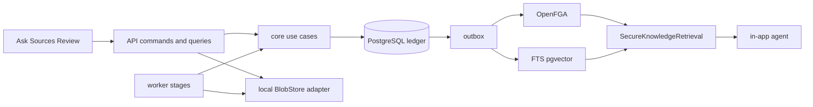

# Secure Knowledge Vertical Slice Design

## Outcome

A user uploads one approved document, the worker produces permission-aware
knowledge, and two users with different source grants receive different grounded
answers through the in-app agent. Revocation closes access. The new minimal web
surface shows Ask, Sources, and Review without depending on old page parity.

## Scope

- Additive source object/revision/blob split and direct-upload contract.
- Local blob adapter first; S3-compatible port remains stable.
- Worker-owned quarantine, validation, parse, normalize, chunk/embed, and publish.
- External source-principal mapping and OpenFGA tuple/index convergence.
- PostgreSQL FTS + pgvector permission-before-limit retrieval.
- Provider-neutral AI task plus OpenAI-compatible adapter.
- Read-only in-app agent with grounded citations.
- Minimal replacement UI for Ask, Sources, and Review in light/dark themes.

MCP publication, secure graph retrieval, connector runtime, mutation tools, and
pilot operations are explicitly outside this increment.

## Boundary

Each external adapter module is added only with its first real contract,
implementation, and contract test. No empty future modules are created.

## Exit Criteria

- Upload and processing are idempotent and observable.
- ACL ledger, OpenFGA tuple, and search-index versions converge before search.
- Permission filtering occurs before ranking/limit/model context.
- Missing/denied resource metadata does not leak and citations are rechecked.
- Two-user allow/deny and revocation E2E tests pass.
- The new UI completes the flow in both themes and old routes are not extended.
