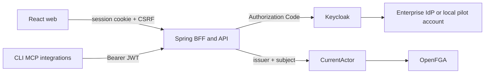

# Browser Authentication Foundation Design

## Outcome

OrgMemory has one production-oriented browser authentication boundary. The web
app redirects to Keycloak, Spring Security 7 completes Authorization Code login,
and the browser receives only a durable server session cookie. External clients
may still call the API with bearer tokens. Both paths resolve the same explicit
OIDC issuer/subject binding before OpenFGA authorization.

## Decisions

- Spring Boot is the browser BFF and OIDC confidential client.
- Keycloak owns password, MFA, passkey, federation, and enterprise SSO screens.
- React never handles a password, client secret, access token, or refresh token.
- Browser sessions are stored with Spring Session JDBC in PostgreSQL.
- Browser mutations use Spring Security 7 SPA CSRF protection.
- Bearer API calls use a stateless, higher-priority filter chain.
- The login surface starts from the official shadcn `login-01` block but removes
  its credential and social-login forms in favor of one Keycloak redirect.
- Ordinary REST clients are generated from the committed OpenAPI contract with
  Hey API; product workflows remain handwritten feature code.

## Boundary

## Exit Criteria

- Login, session restoration, CSRF, logout, and unauthenticated states work.
- The browser contains no OAuth access or refresh token storage.
- Unlinked and inactive identities fail closed for both session and JWT calls.
- The login and authenticated shell render in light and dark themes.
- Backend tests, web typecheck/build, and a real Keycloak browser flow pass.
