# Assistant AI Gateway Design

## Outcome

Deliver the first in-app Assistant turn over a provider-neutral AI gateway and
AI SDK UI Message Stream. Permission-verified retrieval remains the only path
from enterprise knowledge into the model or citations.

## POC Scope

- One application instance; gateway configuration is immutable until restart.
- One `OPENAI_COMPATIBLE` protocol adapter backed by Spring AI.
- One Assistant chat route and one shared embedding route. Query and document
  embedding remain distinct workloads for metrics, but cannot select different
  models because both sides must use the same immutable embedding profile.
- Assistant chat streams text and verified sources over AI SDK UI Message
  Stream v1.
- Provider credentials remain in server configuration and are never returned,
  logged, or persisted by the application.

Runtime gateway CRUD, organization BYOK, provider failover, catalog discovery,
multi-instance cache invalidation, resumable streams, and non-chat capabilities
are deferred.

## Boundaries

`core.ai` owns provider-neutral workloads, routes, chat requests, and the model
port. `integrations:ai-openai-compatible` owns Spring AI and OpenAI-compatible
connection details. `core.assistant` owns the grounded Assistant use case.
`apps:api.assistant` owns HTTP/SSE framing.

The downstream UI protocol and upstream provider protocol stay separate:

```mermaid
flowchart LR
    USER[Authenticated user] --> ASSISTANT[AssistantService]
    ASSISTANT --> RETRIEVAL[SecureKnowledgeRetrievalService]
    RETRIEVAL --> FGA[OpenFGA plus canonical SQL recheck]
    FGA --> EVIDENCE[Verified evidence]
    EVIDENCE --> MODEL[ChatModelPort]
    MODEL --> ADAPTER[Spring AI OpenAI-compatible adapter]
    ADAPTER --> TOKENS[Provider token Flux]
    TOKENS --> STREAM[AI SDK UI Message Stream]
```

The model receives only verified evidence. Source frames are built from that
same evidence set; model-generated source identifiers are ignored. Empty
evidence produces a deterministic safe answer without a provider call.

## Streaming Contract

Normal turns emit `start`, `start-step`, verified source parts, `text-start`,
zero or more `text-delta` parts, `text-end`, `finish-step`, `finish`, and
`[DONE]`. SSE comment heartbeats keep quiet connections alive. A turn timeout
emits `abort` and `[DONE]`; unexpected provider failures emit an opaque `error`
and `[DONE]`.

This read-only POC does not execute mutating tools, so durable Assistant-turn
idempotency and conversation persistence are deferred to the agent increment.

## Embedding Invariant

Gateway routes select connections, not embedding generations. Query and
document embedding must continue to match the immutable, organization-scoped
`EmbeddingProfile`; changing provider, model, dimensions, or distance metric
creates a new profile/generation rather than mutating existing vectors.
