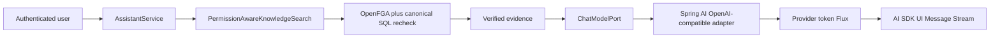

# Assistant AI Gateway Design

## Outcome

Deliver the first in-app Assistant turn over a provider-neutral AI gateway and
AI SDK UI Message Stream. Permission-verified retrieval remains the only path
from enterprise knowledge into the model or citations.

## POC Scope

- One application instance; gateway configuration is immutable until restart.
- One `OPENAI_COMPATIBLE` protocol adapter backed by Spring AI.
- One Assistant chat route and one shared embedding route. Query and document
  embedding remain distinct workloads for metrics, but cannot select different
  models because both sides must use the same immutable embedding profile.
- Assistant chat streams text and verified sources over AI SDK UI Message
  Stream v1.
- Provider credentials remain in server configuration and are never returned,
  logged, or persisted by the application.

Runtime gateway CRUD, organization BYOK, provider failover, catalog discovery,
multi-instance cache invalidation, resumable streams, and non-chat capabilities
are deferred.

## Boundaries

`core.ai` owns provider-neutral workloads, routes, chat requests, and the model
port. `integrations:ai-openai-compatible` owns Spring AI and OpenAI-compatible
connection details. `core.assistant` owns the grounded Assistant use case.
`apps:api.assistant` owns HTTP/SSE framing.

The downstream UI protocol and upstream provider protocol stay separate:

```mermaid
flowchart LR
    USER[Authenticated user] --> ASSISTANT[AssistantService]
    ASSISTANT --> RETRIEVAL[PermissionAwareKnowledgeSearch]
    RETRIEVAL --> FGA[OpenFGA plus canonical SQL recheck]
    FGA --> EVIDENCE[Verified evidence]
    EVIDENCE --> MODEL[ChatModelPort]
    MODEL --> ADAPTER[Spring AI OpenAI-compatible adapter]
    ADAPTER --> TOKENS[Provider token Flux]
    TOKENS --> STREAM[AI SDK UI Message Stream]
```

The model receives only verified evidence. Source frames are built from that
same evidence set; model-generated source identifiers are ignored. Empty
evidence produces a deterministic safe answer without a provider call.

## Streaming Contract

Normal turns emit `start`, `start-step`, verified source parts, `text-start`,
zero or more `text-delta` parts, `text-end`, `finish-step`, `finish`, and
`[DONE]`. SSE comment heartbeats keep quiet connections alive. A turn timeout
emits `abort` and `[DONE]`; unexpected provider failures emit an opaque `error`
and `[DONE]`.

This read-only POC does not execute mutating tools, so durable Assistant-turn
idempotency and conversation persistence are deferred to the agent increment.

## Assistant UX Reference Audit

The reference boundary is behavior, not source-code ownership. Onyx uses its
Opal design system and a packet/message-tree model; Northstar uses AI Elements
and AI SDK UI message parts. OrgMemory therefore reuses compatible primitives
and ports the proven interaction contracts without importing either
application's domain model.

### Adopt in the secure-retrieval slice

- Keep source-panel state tied to the assistant turn that produced the sources.
  A source action selects that turn and opens a desktop right rail or a mobile
  sheet, matching Onyx's `selectedNodeIdForDocDisplay` behavior.
- Preserve citation order, deduplicate by canonical source id, and show the
  exact permission-verified evidence emitted by the server. Never parse
  model-authored URLs into trusted citations.
- Fetch previews through an authenticated OrgMemory endpoint. A permission
  change returns not-found, MinIO URLs remain private, requests are abortable,
  and object URLs are revoked.
- Use AI Elements for conversation, streaming messages, source affordances,
  composer state, stop generation, and scroll-to-bottom behavior, following
  Northstar's UI-message-part integration.
- Keep copy, retry, loading, empty-evidence, provider-failure, and revoked-source
  states local to the affected turn instead of replacing the whole page.
- Memoize expensive message/source renderers only after profiling; keep
  per-turn callbacks and source arrays stable during token streaming.
- Keep AI Elements responsible for the inline source disclosure. Its trigger
  expands the turn-local source list; selecting one source opens the
  authenticated preview instead of coupling disclosure and navigation.
- Map Onyx's source-sidebar anatomy onto the existing shadcn/Radix primitives:
  one narrow cited-source rail with source icon, title, origin, and selection;
  the document body belongs in a separate MIME-aware preview dialog.
- Map Onyx's agent-timeline waiting state onto an OrgMemory-branded status row:
  a stable 24 px agent mark, shimmer activity text, reduced-motion fallback,
  and a 500 ms minimum display interval to avoid flashing.

### Add after retrieval correctness

- Durable conversation history with URL-addressable sessions and restored
  per-session UI state.
- Regenerate/edit branching, response feedback, and audit-safe quality signals.
- Inline citation anchors and hover cards once the answer contract carries
  server-owned citation spans.
- Expand the current MIME-driven PDF, image, text/code, and unsupported
  download-only preview variants to CSV, XLSX, and DOCX. Office formats require
  server-side parsing or a vetted sanitizer before rendering.
- Source groups for cited evidence, additional retrieved evidence, and
  user-uploaded files when the retrieval contract exposes those groups.
- Tool progress cards, approval states, and resumable streams when the
  Assistant becomes an agent.

### Do not copy into the current product

- Multi-model comparison, model selection, deep-research toggles, TTS, and
  search/chat mode classification are not part of the current OrgMemory
  contract.
- Onyx packet types, message-tree state, Opal-only components, and its broad
  `/api/chat/file/{id}` authorization path must not cross into OrgMemory.
- Chain-of-thought presentation is not a user-facing feature.

## Embedding Invariant

Gateway routes select connections, not embedding generations. Query and
document embedding must continue to match the immutable, organization-scoped
`EmbeddingProfile`; changing provider, model, dimensions, or distance metric
creates a new profile/generation rather than mutating existing vectors.
