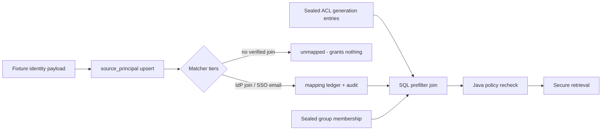

# External Principal Mapping Design

## Outcome

External source users and groups resolve to verified OrgMemory principals
through an explicit, audited mapping ledger. An ACL generation entry that
references an unmapped principal grants nothing. Creating or revoking a
verified mapping changes retrieval outcomes without re-ingestion, following the
[ADR 0009](../../../decisions/0009-dynamic-source-acl-ceiling.md) per-generation
ceiling. This executes the remaining external-principal scope of the
[secure knowledge vertical slice](../2026-07-20-secure-knowledge-vertical-slice/plan.md)
against a fixture-simulated Slack-shaped source; no network connector exists in
this increment.

## Scope

- `source_principal` registry: observed external identities per organization,
  source type, and external key (workspace + user/channel id), kind
  `SOURCE_USER` or `SOURCE_GROUP`, with observed email/display metadata and
  `last_seen_at`. Observation is not authorization.
- `source_principal_mapping` ledger: a verified link from one source principal
  to one active internal user with `method`
  (`IDP_JOIN`, `SSO_EMAIL_JOIN`, `SELF_CLAIM`, `ADMIN_CONFIRMED`), evidence,
  `verified_at`, and status. Mapping mutations append permission audit events;
  at most one active mapping per source principal.
- Sealed group membership per ACL generation: which source users a
  `SOURCE_GROUP` contained when that generation was sealed, reusing the
  append-only sealing conventions.
- Retrieval enforcement: `SOURCE_GROUP` and `SOURCE_USER` ACL entries resolve
  through active mappings (and the enforced generation's membership) inside the
  SQL prefilter and are rechecked in Java. Missing or revoked mapping resolves
  to deny.
- Matcher tiers: `IDP_JOIN` (issuer/subject join evidence) and
  `SSO_EMAIL_JOIN` (email join, only when the fixture marks the source identity
  as SSO-verified) run automatically over fixture data. `SELF_CLAIM` and
  `ADMIN_CONFIRMED` exist as explicit service commands with audit; no UI or
  OAuth flow in this increment.
- Slack-shaped demo fixture: workspace users, one public channel, one private
  channel with membership, and identity payloads driving the matcher.

Out of scope: real Slack API adapter, crawl scheduling, webhooks, pruning,
admin mapping-queue UI, SCIM, and Capability Asset changes.

## Boundary

## Exit Criteria

- An ACL entry referencing an unmapped principal grants no access on list,
  detail, or search; the fixture proves it end to end.
- Creating a verified mapping grants access to existing documents whose
  enforced generation includes that principal; revoking the mapping closes
  access; both happen without re-ingestion.
- A sealed generation and a sealed membership snapshot cannot be edited;
  mapping mutations always append audit events; an administrator cannot widen
  effective access except by producing a verified mapping, which is audited.
- An inactive internal user is denied regardless of mappings.
- Email join never fires for a source identity the fixture does not mark
  SSO-verified.
- Existing retrieval, ingestion, and Modulith verification tests stay green.
