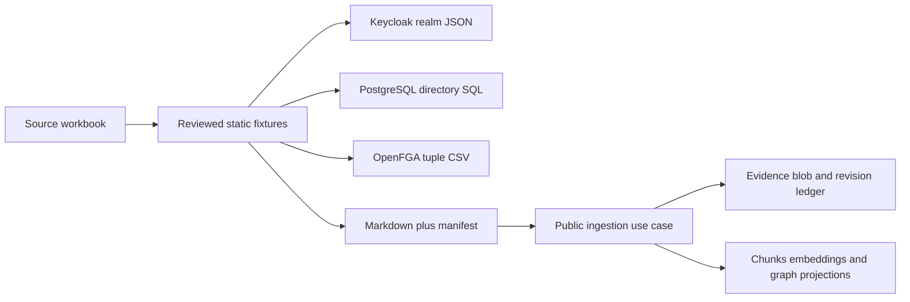

# Reproducible Demo Bootstrap Design

## Outcome

A fresh clone can recreate the synthetic POC directory and authorization state
using each system's native fixture format. The application runtime has no XLSX
parser, dataset validator, or branch keyed to a supplied evaluation workbook.

## System ownership

- Keycloak owns credentials, OIDC sessions, MFA, and account recovery.
- PostgreSQL owns the internal organization directory and the explicit
  `(issuer, subject) -> app_user` binding.
- OpenFGA owns relationship authorization tuples evaluated against the committed model.
- MinIO owns source evidence after upload; PostgreSQL owns its immutable ledger.
- Chunks, embeddings, and graph structures are rebuildable projections, never seed shortcuts.

The deterministic Keycloak user ID is also its OIDC `sub` and the seeded
`external_identities.subject`. Business roles are not duplicated into Keycloak.

## Lifecycle

Gradle exposes orchestration tasks only. `demoBootstrap` starts Docker services,
forces a local Keycloak realm re-import, creates an OpenFGA store/model, imports
relationship tuples, and seeds PostgreSQL when the Flyway schema already exists.
`demoSeed` is an idempotent explicit retry after the API migration owner has run.
Neither task is wired into `build` or `check`.

## Safety

- Fixtures contain synthetic data and local-only passwords.
- Scripts never delete PostgreSQL, MinIO, or OpenFGA volumes.
- OpenFGA bootstrap rotates the active local store configuration rather than
  mutating an unknown store.
- The original workbook is retained with a SHA-256 checksum for provenance.
- Known source-data contradictions are documented, not encoded as policy exceptions.
