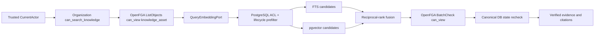

# Secure Hybrid Retrieval Design

## Outcome

Replace the prototype relational Knowledge Asset search with one fail-closed
retrieval boundary shared by the future in-app agent and MCP delivery surfaces.
Unauthorized evidence must never enter lexical/vector ranking, model context, or
citations.

## Request Flow

OpenFGA is the relationship authorization decision point. PostgreSQL remains
the canonical source/ACL/lifecycle ledger and the retrieval projection store.
Both gates must allow the evidence. ListObjects creates the authorization-bounded
candidate set before SQL ranking; BatchCheck detects relationship revocation
before evidence leaves the use case.

## Spring AI Boundary

- Core owns a provider-neutral `QueryEmbeddingPort` and typed retrieval result.
- The API adapter uses Spring AI `EmbeddingModel` with the same immutable,
  organization-scoped embedding profile as ingestion.
- The future Ask surface adapts verified evidence to Spring AI `Document` and a
  custom `DocumentRetriever`; the built-in vector-only retriever is not the
  security boundary.
- `ChatClient` and `RetrievalAugmentationAdvisor` may compose the future answer,
  but only after this use case returns verified evidence.

## LightRAG Boundary

This increment borrows LightRAG's separation of candidate generation, bounded
context assembly, and later local/global/hybrid/mix retrieval modes. It does not
port LightRAG storage adapters, workspace isolation, or graph aggregation. The
first implementation is the safe chunk path: PostgreSQL FTS plus pgvector with
RRF. Future graph candidates must carry the same evidence identity and pass the
same authorization and canonical recheck.

## Fail-Closed Rules

- OpenFGA unavailable, interrupted, malformed, or model mismatch: return no
  evidence and append a deny audit event.
- SQL accepts only the authenticated organization, active asset/current source
  revision, active current projection generation, matching embedding profile,
  sealed ingestion/current ACL snapshots, and fresh current ACL.
- Ingestion ACL is a historical permission ceiling; a wider current ACL cannot
  broaden it.
- A denied BatchCheck result is removed and audited. An indeterminate batch or
  incomplete response aborts the whole retrieval.
- Citation handles and source metadata are created only from canonically
  rechecked rows. The model cannot supply its own source identifiers.

## Deliberate Cleanup

Delete the prototype `KnowledgeRetrievalService`, Java `KnowledgeRole` decision
path, and legacy knowledge list/detail HTTP contract when their consumers are
removed. Keep `SourceObject -> SourceRevision -> EvidenceBlob`, Knowledge Asset
publication state, and versioned chunks: they are the canonical ledger and the
OpenFGA/retrieval resource identity, not compatibility scaffolding.
