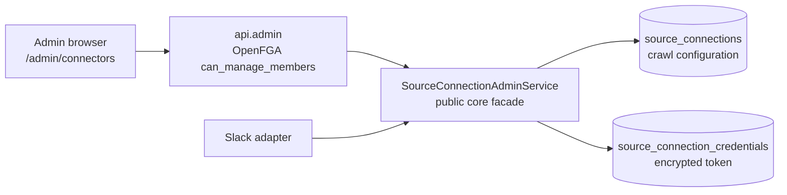

# Slack Connection Admin Design

## Outcome

An administrator configures the Slack connection in the browser — which workspace,
with which token, into which Knowledge Space, on what cadence — instead of editing
environment variables and restarting the worker. The token is entered once, stored
encrypted, and never comes back out: not to the browser, not to a log, not to a
failure message.

This is the smallest useful piece of what Onyx puts on its Add Connector page. The
catalog and the source abstraction behind it are deliberately not here; with one
connector a catalog is a page with one tile, and `core` still names Slack in nine
places, so a registry designed against a single example would be guesswork.

## Boundary

## Scope

### Ledger

- **`source_connections` gains the crawl configuration** — enabled, target Space,
  actor, channel filter, cadence, thread bound. The row already *is* the connection:
  it is keyed by `(organization, source_system, source_connection_key)` and already
  carries the identity-trust decision. A parallel table would leave two records of
  one thing.
- **`source_connection_credentials` is separate on purpose.** The connection row is
  read on every crawl and rendered in the admin list; keeping the secret in another
  table means no query that builds that view can reach it by accident. It carries the
  ciphertext, the key version, and who set it when.

### Encryption

AES-256-GCM through `Encryptors.stronger`, keyed from the environment beside the
database password. Vetted implementation rather than hand-rolled: this is the one
place in the repository where getting IV handling subtly wrong would be both easy
and silent.

A managed KMS is the right answer for production and the wrong amount of machinery
for a POC. The key version column exists so a rotation can re-encrypt rather than
guess, and the port is narrow enough that KMS replaces one component.

Without a configured key the credential store refuses to encrypt rather than storing
anything weaker.

### API

`/api/admin/connectors/slack`, gated like the rest of `/api/admin/**` on OpenFGA
`can_manage_members`. Named for Slack rather than parameterized, because one
connector is what exists and a generic route would be a promise the code cannot keep.

- `GET` — the configuration, plus whether a credential is set and who set it when.
  Never the token, not even masked.
- `PUT` — the configuration. Cannot carry a token.
- `PUT /credential` — the token, write-only.
- `DELETE /credential` — forget it.
- `POST /test` — calls Slack `auth.test` and reports what came back. This is also
  where the workspace id comes from, so an administrator does not have to go and
  find it.

### Adapter

The adapter resolves its connection from the ledger on each poll rather than from
properties. Configuration then takes effect without a restart, which is the point of
putting it on a screen. `SlackConnectorProperties` stops being a configuration
source: two places to set the same thing is a bug waiting for someone to change the
wrong one.

### Web

One page under the existing `/admin` area. The connection form, the credential as a
write-only field with its own state, and a test button that reports what Slack said.

## What this does not do

- No connector catalog, no add/remove of connectors, no second source.
- No crawl-run history yet, so the page shows configuration rather than status. That
  is the next thing worth building and it needs a run record the ledger does not keep.
- No credential rotation flow beyond replacing the token.

## Exit Criteria

- An administrator sets the workspace, token, and target Space in the browser, tests
  it, enables it, and the next poll crawls — with no restart and nothing in a file.
- The token never appears in a response body, a log line, or a properties dump, and
  a wrong key fails closed rather than returning plaintext.
- A non-admin receives 403 from every endpoint, and every mutation appends a
  permission audit event.
- `ddl-auto=validate` passes, and the existing suites stay green.
