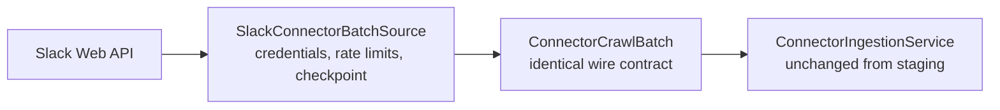

# Slack Connector Live Design

## Outcome

The staging connector's `ConnectorBatchSource` port gains a real implementation
that crawls a Slack workspace through the Slack Web API and produces the exact
same versioned crawl batches the fixtures do. Everything downstream —
`ConnectorIngestionService`, the governed ledger, retrieval — is unchanged;
this increment replaces the batch producer, adds the operational concerns a real
source needs, and closes the identity-trust loop the admin surface left open. A
run against a free Slack workspace proves a real channel becomes a governed,
permission-aware source with identity mapping through the local Keycloak.

## Boundary

The staging increment deliberately locked the contract so the live adapter is a
drop-in producer. This increment adds nothing to the permission/convergence
semantics; it earns its keep on reliability and credentials.

## Scope

- **Identity trust consumption**: `source_connections.identity_trust` is recorded
  by the admin surface but read by nothing. Automatic email matching learns it, so
  the V20 ledger stops being dead configuration.
- **Slack Web API adapter** implementing `ConnectorBatchSource`: three-crawl
  separation (content via `conversations.history`/`replies`, identity via
  `users.list` + `conversations.members`, permissions from channel visibility),
  rendering messages to text and channels/members to identity + permission
  payloads on the `content/v1`, `identity/v1`, `permissions/v1` shapes.
- **Credential storage**: an encrypted bot/OAuth token provider with a refresh
  lock (Onyx pattern), never logged, resolved per connection.
- **Rate limiting**: honor `Retry-After`, bounded backoff, and a slim ID+ACL
  pull (`SlimConnector` analog) for cheap permission-only re-crawls.
- **Checkpoint/resume**: a persisted per-connection crawl cursor so a large or
  interrupted crawl resumes; bounded per-batch retry replacing the staging
  in-process cursor.
- **Content-edit re-materialization**: a changed content revision on an existing
  object produces a new source revision (currently deferred; staging only rotates
  the ACL and flags the deferral).
- **Deletion detection (pruning)**: diff the indexed set against the crawled set
  to emit tombstones for removed channels/messages. A batch must declare that its
  crawl was complete before anything is pruned: pruning after a partial,
  interrupted, or permissions-only crawl would retire the entire connection.
- **Sandbox run**: a documented run against a free Slack workspace with login
  through the local Keycloak, proving identity mapping end to end.

Out of scope: incremental webhooks/Events API (a later increment), non-Slack
sources, OCR/DLP.

## Onyx anchors

`SlimConnector` for cheap ID+ACL pulls, `ConnectorFailure` per-item isolation with
a threshold abort, checkpoint/resume, pruning as deletion detection, an encrypted
credential provider with a refresh lock, and `Retry-After` rate limiting.

Onyx resolves external identity by raw email string equality: a Slack member's
email becomes a `user_email:` ACL entry (`access/models.py`) and the signed-in
user contributes the same prefixed string (`access/access.py`). There is no
mapping ledger and no trust tier. Its only verification is on the Onyx account
side — `REQUIRE_EMAIL_VERIFICATION`, off by default — which answers "does this
person own the address they signed in with", not "does this source account
belong to that person". OrgMemory keeps its mapping ledger; the tiers are the
differentiator, not a copy.

## Decisions

**Identity trust widens; it does not gate.** `SSO_EMAIL_JOIN` fires when the
source vouches for the principal's email *or* an administrator has attested the
connection. Slack confirms address ownership with an emailed code before an
account can exist or join a workspace, so its adapter may set `ssoVerified` on
observed users with a stated reason rather than a guess. Requiring the admin
decision on top would add a manual step that buys nothing for a source that
already verifies. `identity_trust` earns its keep on the sources that do not
verify — where an administrator, not an adapter, is the right party to vouch.

**One connectors module, one package per source.** The adapter lands in a new
`integrations:connectors` module with `com.orgmemory.connectors.slack` inside it,
not a module per connector. Source SDKs stay out of `core` and `apps/worker`,
which is what the adapter rule asks for, without a Gradle module per source.
Splitting later is mechanical because each source is already a package behind
the same port.

The constraint that will actually bind at connector two is neither of these:
`core` names Slack in nine places (`ConnectorIngestionService`,
`ConnectorReconciler`) for source type, media type, classification, and declared
access. That becomes a `ConnectorSourceProfile` registry when a second source
arrives, and designing it against one example now would be guesswork.

**Core work precedes the adapter.** Identity trust, content-edit
re-materialization, durable checkpoints, and pruning are all core-side and prove
out through the existing fixture batch source. None of them needs a Slack
credential, so they ship first and the adapter lands against a stable core.

## Exit Criteria

- An administrator's `SSO_VERIFIED` decision makes email matching fire for a
  connection whose crawl does not vouch for its own principals, and `UNTRUSTED`
  leaves such a principal unmapped and therefore denied.
- A changed content revision re-materializes instead of reporting a deferral.
- A crawl resumes from a persisted checkpoint after interruption, and pruning
  retires nothing when the crawl did not declare itself complete.
- The live adapter produces batches that ingest through the unchanged
  `ConnectorIngestionService`, proven against recorded Slack API fixtures.
- Credentials are never logged; rate limits are honored.
- A real workspace channel becomes retrievable only by its mapped members, and
  removing a member closes access on the next crawl.
- Existing suites stay green.
