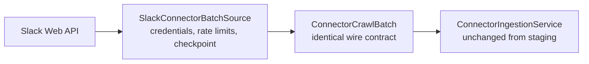

# Slack Connector Live Design

## Outcome

The staging connector's `ConnectorBatchSource` port gains a real implementation
that crawls a Slack workspace through the Slack Web API and produces the exact
same versioned crawl batches the fixtures do. Everything downstream —
`ConnectorIngestionService`, the governed ledger, retrieval — is unchanged;
this increment only replaces the batch producer and adds the operational
concerns a real source needs. A run against a free Slack Developer sandbox
(Enterprise Grid) proves a real channel becomes a governed, permission-aware
source with identity mapping through the local Keycloak.

## Boundary

The staging increment deliberately locked the contract so the live adapter is a
drop-in producer. This increment adds nothing to the permission/convergence
semantics; it earns its keep on reliability and credentials.

## Scope

- **Slack Web API adapter** implementing `ConnectorBatchSource`: three-crawl
  separation (content via `conversations.history`/`replies`, identity via
  `users.list` + `conversations.members`, permissions from channel visibility),
  rendering messages to text and channels/members to identity + permission
  payloads on the `content/v1`, `identity/v1`, `permissions/v1` shapes.
- **Credential storage**: an encrypted bot/OAuth token provider with a refresh
  lock (Onyx pattern), never logged, resolved per connection.
- **Rate limiting**: honor `Retry-After`, bounded backoff, and a slim ID+ACL
  pull (`SlimConnector` analog) for cheap permission-only re-crawls.
- **Checkpoint/resume**: a persisted per-connection crawl cursor so a large or
  interrupted crawl resumes; bounded per-batch retry replacing the staging
  in-process cursor.
- **Content-edit re-materialization**: a changed content revision on an existing
  object produces a new source revision (currently deferred; staging only rotates
  the ACL and flags the deferral).
- **Deletion detection (pruning)**: diff the indexed set against the crawled set
  to emit tombstones for removed channels/messages.
- **Sandbox run**: a documented run against a free Slack Developer sandbox with
  SSO to the local Keycloak, proving identity mapping end to end.

Out of scope: incremental webhooks/Events API (a later increment), non-Slack
sources, OCR/DLP.

## Onyx anchors

`SlimConnector` for cheap ID+ACL pulls, `ConnectorFailure` per-item isolation with
a threshold abort, checkpoint/resume, pruning as deletion detection, an encrypted
credential provider with a refresh lock, and `Retry-After` rate limiting.

## Exit Criteria

- The live adapter produces batches that ingest through the unchanged
  `ConnectorIngestionService`, proven against recorded Slack API fixtures.
- Credentials are stored encrypted and never logged; rate limits are honored.
- A crawl resumes from a persisted checkpoint after interruption.
- A Developer-sandbox channel becomes retrievable only by its mapped members,
  and removing a member closes access on the next crawl.
- Existing suites stay green.
