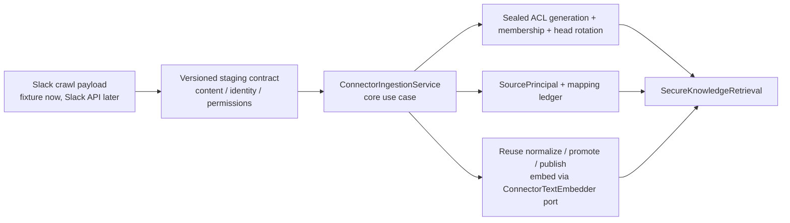

# Slack Connector Staging Design

## Outcome

A Slack workspace becomes a governed source. A crawl of one channel produces
`SourceObject`s with `source_type = SLACK`, sealed ACL generations carrying
`SOURCE_GROUP`/`SOURCE_USER` evidence and channel membership, and resolved
principal mappings — the exact ledger shape
`ExternalPrincipalRetrievalIntegrationTests` already proves retrievable. A
re-crawl that changes membership appends a new sealed generation and rotates the
head, so grants and revocations converge without re-ingesting content, under the
[ADR 0009](../../../decisions/0009-dynamic-source-acl-ceiling.md) live-source
ceiling. Two users with different channel membership get different grounded
answers; removing a user from the channel closes their access on the next crawl.

This increment is **fixture-driven**: the crawl payload comes from a committed
Slack-shaped fixture, not the live Slack API. The real Slack SDK adapter and a
Developer sandbox run are a deliberate follow-up increment
(`slack-connector-live`), because they need external credentials and add nothing
to the permission/convergence contract this slice locks down.

## Boundary

Rules carried from vision and ADRs:

- Connectors never write domain memory tables directly. A narrow adapter
  consumes a **versioned staging contract** and calls existing core use cases.
- The staging contract has three separately-versioned payload kinds, mirroring
  Glean/Onyx: **content** (documents/messages), **identity** (users, groups,
  membership), and **permissions** (per-object ACL). Permissions and identity
  re-crawl on their own cadence, independent of content.
- Effective access stays the intersection of tenant, current sealed source-ACL
  generation, OpenFGA policy, classification, and lifecycle. The connector only
  supplies source ACL evidence; it can never broaden beyond what the payload
  states, and unmapped principals grant nothing.

## Key Decision — How The Connector Creates External-Principal ACLs

`KnowledgeIngestionService` deliberately refuses to seal a `COMPLETE` ACL that
carries external principals (the Phase-1 guard), because a raw upload has no
verified identity behind `SOURCE_USER`/`SOURCE_GROUP`. The connector is exactly
the trusted path that *does* carry that evidence. Rather than relax that guard on
the public upload contract, this increment keeps `registerRawSource` /
`rotateSourceAcl` strict and adds **package-private connector-aware seal methods**
to `KnowledgeIngestionService` (`registerConnectorSource` / `rotateConnectorAcl`)
that share the same generation/seal/head machinery but (a) accept external
principals and (b) record sealed group membership between entry insert and seal.
A dedicated **`ConnectorIngestionService`** orchestrates the use case:

1. validates the staging batch (tenant, source system, target Knowledge Space,
   payload versions — unknown version fails closed),
2. upserts observed `SourcePrincipal`s and runs the matcher
   (`SourcePrincipalMappingService`) to resolve them,
3. seals an ACL generation whose entries and sealed group membership come from
   the permissions payload, via the connector-aware seal methods,
4. rotates the source ACL head to the new generation (compare-and-set),
5. materializes content by reusing the existing `normalize` → `promote` →
   `publish` core use cases; chunk embeddings come from a pluggable
   `ConnectorTextEmbedder` port (deterministic in tests, model-backed in the
   worker runtime).

Re-crawl repeats steps 1–4 for a new generation; the content path (step 5) runs
only for a new object or a changed content revision. A membership-only re-crawl
appends a sealed generation and rotates the head **without** re-materializing
content — the reconciliation loop, under the ADR 0009 live-source ceiling.

**Refinement discovered in implementation:** the content path reuses the core
`normalize`/`promote`/`publish` use cases directly and embeds through a port,
rather than routing through the upload worker's `SourceIngestionProcessor`. This
leaves the proven upload pipeline untouched, keeps the connector self-contained,
and makes the convergence proof a core-level Testcontainers test. Content
embedding is synchronous for staging; moving it off the ingest transaction for
large crawls is deferred to `slack-connector-live`.

## Scope

- `contracts/connector/` versioned JSON schema for the three payload kinds plus
  a batch envelope (tenant, source system, connection key, crawl cursor,
  payload versions). Not a Gradle module.
- Core connector ingestion use case + a `SLACK` source-system profile that maps
  payload shapes (channel = `SOURCE_GROUP`, member = `SOURCE_USER`, public
  channel = workspace group) to ACL entries and membership.
- A `ConnectorBatchSource` port (fixture implementation now) plus worker wiring
  that reads a staging batch and runs the use case, with per-object failure
  isolation, an idempotent crawl cursor, and tombstone handling for objects
  removed at the source.
- A committed Slack-shaped fixture batch and an integration proof: first crawl
  grants a member, a membership-change re-crawl grants a new member and revokes
  a removed one without re-ingesting content, and an unmapped principal is
  denied throughout.

Out of scope (next increment `slack-connector-live`): the real Slack Web API
adapter, OAuth/bot-token credential storage, rate-limit/Retry-After handling,
checkpoint/resume across large crawls, incremental webhooks, and the Developer
sandbox run. The staging contract is designed so that adapter is a drop-in
producer of the same batches.

## Exit Criteria

- A fixture crawl produces a searchable SLACK `SourceObject` whose access is
  governed solely by resolved channel membership; two members-vs-non-member
  users get different retrieval results.
- A re-crawl with changed membership converges grants and revocations by
  appending a sealed generation and rotating the head — content is not
  re-ingested (same content revision hash is a no-op on the content path).
- Removed-at-source objects are tombstoned out of retrieval.
- Unmapped or admin-injected principals never broaden access; every crawl
  decision is auditable.
- Staging payloads are versioned; an unknown payload version fails closed.
- `:core:test`, `:apps:worker:test`, and existing suites stay green.
