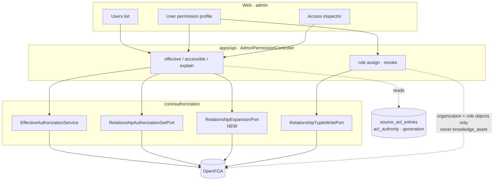

# Admin Permission Surface Design

## Outcome

An organization administrator can see what a user is actually allowed to do,
understand why, and change the part OrgMemory owns. Today the admin surface shows
`role`, `active`, `signInLinked`, and a mapped-principal count — none of which
reflect an authorization decision. `AdminUserController.update` changes
`app_users.role`, but every guard asks OpenFGA, so that control grants nothing.

This increment closes that gap along three lines. Reads gain an effective-permission
view backed by the same `Check`/`BatchCheck` the application already uses, plus a
new `Expand` port that renders the decisive derivation path. Writes gain role
assignment — the only permission OrgMemory owns — through `RelationshipTupleWritePort`.
Presentation gains a fixed vocabulary for a mirrored ACL: a verdict is `ALLOWED`,
`DENIED`, or `UNKNOWN`, and it always carries its authority, generation, and sync age.

## Boundary

`Expand` is the only new port. Everything else already exists and is reused.

## Scope

- **`RelationshipExpansionPort` + OpenFGA adapter**: wraps the `Expand` API for a
  `(object, relation)` pair and returns the userset tree. Core translates that tree
  plus the actor's tuples into one decisive path.
- **`GET /api/admin/users/{id}/permissions`**: the seven organization-level `can_*`
  permissions from `model.fga`. These are separate checks rather than one batch: a batch
  fixes a single relation across many objects, and this asks many relations of a single
  object — the inverse shape. The set is small and fixed by the model, so the cost is
  bounded.
- **`GET /api/admin/users/{id}/containers`**: **deferred, not built.** Reaching
  `acl_authority`, generation, and validity for a container means joining
  `knowledge_assets` through `source_objects` and `raw_source_objects` to
  `source_acl_snapshots`, and that join cannot be honestly verified without a live
  database. The seam is in place — `AclProvenance` is already a parameter of `explain`
  and every response carries it — so this is wiring rather than redesign. Until it
  lands, provenance is `ORGMEMORY` and no surface claims a mirrored verdict it has not
  actually read.
- **`POST /api/admin/access/explain`**: `(user, permission, resource)` returns
  `ALLOWED` with its decisive path, `DENIED` with the branches evaluated and the
  blocking reason, or `UNKNOWN` when the governing ACL is past TTL.
- **Role assignment**: `GET /api/admin/roles`, `POST /api/admin/roles/{role}/members`,
  `DELETE /api/admin/roles/{role}/members/{userId}` writing `role#assignee` tuples.
  Scoped to `organization` and `role` objects only.
- **Model addition**: one computed permission,
  `can_curate_graph: knowledge_curator or administrator`, plus the assignable
  `knowledge_curator` noun. Additive; no existing tuple changes meaning.
- **Web**: the users list links each name to a permission profile at
  `/admin/users/$userId` holding the organization permissions, the roles block, and a
  scoped resource check. Three shared components — `AccessVerdict`, `AccessPath`,
  `AccessDenied`.
- **Relabelling `app_users.role`**: the existing PATCH stays, but the control is
  presented as a business attribute, not a grant, because it is not one.

Out of scope: the curator knowledge-graph canvas (its own increment), asset-level
tuple editing, model editing from the UI, the reverse "who can reach this resource"
tree, and any user-creation or identity-linking endpoint.

## Enterprise references

Confluence *Inspect permissions* takes a user plus explicitly named spaces and
reports at which level of the content/space/product hierarchy access is allowed or
denied. Notably, an administrator may inspect a space they cannot themselves view —
permission facts are not content.

SharePoint *Check Permissions* is per-item and explicitly offers no tenant-wide
inventory. Listing what a principal can reach requires SharePoint Advanced Management,
and that report enumerates **sites**, not documents, marking each grant direct or
inherited through a group.

Both converge on the same primitive: `(subject, resource) -> verdict + provenance`.
Neither offers a subject-wide document inventory natively. OrgMemory follows them,
and adds the state they do not need — `UNKNOWN` — because OrgMemory mirrors an ACL
it does not own.

## Decisions

**1. Graph nodes carry no permission of their own.** `graph_entities` and
`graph_relations` hold identity; `graph_entity_contributions` and
`graph_relation_contributions` hold evidence and carry `knowledge_asset_id`. Node
visibility is the result of a join against the actor's authorized asset set, not a
check. This is why `model.fga` has no `graph_entity` type and must not gain one.
Reuse the `authorizedAssetIds` set that `SecureKnowledgeRetrievalService` already
computes.

**2. `can_curate_graph` is `knowledge_curator or administrator`.** For the POC no
principal holds `knowledge_curator`; the administrator satisfies the permission
through the `or` branch. Splitting the roles later is deleting `or administrator`
from the model — no Java change, no migration, no tuple rewrite. This follows the
existing shape of `can_manage_sources` and `can_search_knowledge`. `knowledge_curator`
is an assignable capability noun in the same family as `knowledge_reader`,
`knowledge_contributor`, and `knowledge_reviewer`; it is not a business role, so it
does not violate the "business roles are tuple data" convention.

**3. A permission gates the verb, never the visibility.** `can_curate_graph` decides
whether an actor may reach the curation surface and issue merge/split/remove. What
that actor *sees* is still resolved through `AuthorizedGraphScope` exactly as it is
for everyone else. There must be no unfiltered graph read path; creating one
reintroduces at the role layer the second permission system Decision 1 avoids.

**4. Writable and derived render differently.** A relation declared with `[...]` in
`model.fga` is written directly and is presented as a control. A relation without
`[...]` is computed and is presented as text with an explanation affordance. A
`can_*` permission is never a toggle, because no tuple can be written for it.

**5. Access is never presented as a subject-wide document inventory.** A count such
as "47 of 120" draws its numerator from OpenFGA and its denominator from the document
tables — two systems, two snapshots — and reads as an authoritative security fact.
Inverse enumeration also makes absence ambiguous: a document missing from the list may
be denied, unevaluated, stale, or unreachable, and those are not distinguishable.
Document titles are content, and an administrator holds `can_manage_members`, not
content authority. Therefore: the profile lists **containers**, which are bounded,
stable, and where permission actually lives; document-level answers come only from
the inspector, inside a scope the administrator names, reported as
"N allowed of M evaluated in this container" with the snapshot stated.

**6. A verdict has three states.** `ALLOWED`, `DENIED`, `UNKNOWN`. Two states are a
falsehood under a 23-hour TTL: an expired mirrored ACL is not a denial. Every verdict
carries `acl_authority`, generation, and sync age, and a `SOURCE` verdict is labelled
a mirror, not the current state at Slack or Drive.

Keeping the third state costs a departure from the enforcement path.
`EffectiveAuthorizationService` collapses an unanswered check into a denial, which is
correct for enforcement and wrong here: "no relationship grants this" and "the engine
did not answer" need different actions, and only one is a permission problem. The
explanation service therefore checks `RelationshipAuthorizationPort` directly and keeps
that service's organization guard. Nothing on this path grants access, so preserving the
outcome costs no safety — but any future caller reusing it for enforcement must not.

**7. OrgMemory never writes a tuple for content whose `acl_authority` is `SOURCE`.**
Drive and Slack own those. A second writer guarantees divergence, and afterwards no
one can answer who may read a document. Administrative writes are confined to
`organization` and `role` objects, which OrgMemory does own.

**8. The authorization model is a deploy artifact.** The model view is read-only.
Model changes ship with code and mint a new `authorization_model_id`; the API pins
that id, so an unpinned deployment would silently re-evaluate every existing tuple.

**9. Explaining an allow is a path, not a tree.** OpenFGA short-circuits `union`, so
exactly one derivation grants access; rendering a tree implies branching that the
answer does not contain. A denial is a flat list of the branches evaluated. The
reverse question — who can reach a resource — is genuinely a tree and is out of scope.

**10. No new frontend dependency.** The access path is a stepper, not a graph: its
layout is fixed, so a graph library would solve a problem that does not exist.
`table`, `card`, `tabs`, `badge`, `collapsible`, `command`, `dialog`, `alert`,
`tooltip`, and `hover-card` are already installed. Mermaid is already present through
`@streamdown/mermaid` and is used only for a "copy as diagram" export, never for the
primary render.

## What this does not do

It does not create users or link external identities; onboarding remains a database
concern, and `V13` already links the three demo principals. It does not reconcile
`app_users.role` with OpenFGA — the two axes stay separate, and the UI stops implying
otherwise. It does not touch `KnowledgeAuthorizationConvergenceService`; that service
prunes only OrgMemory-owned UUID asset tuples, so administrative `role#assignee`
writes are outside its reach and need no coordination.

## Exit Criteria

- An administrator opens a user and sees the six organization permissions resolved
  live, each with a derivation path, and no cached copy is persisted.
- The inspector returns `ALLOWED` with a path, `DENIED` naming the blocking branch
  and distinguishing an explicit `DENY` from a missing relation, and `UNKNOWN` when
  the governing ACL is past TTL.
- Assigning a role writes a tuple, and the affected user's permissions change on the
  next read without a restart.
- No endpoint in this increment can write a `knowledge_asset` tuple; a test asserts
  the refusal for `acl_authority = SOURCE`.
- `fga model test` passes against the amended model, and `can_curate_graph` resolves
  for the administrator with no `knowledge_curator` tuple present.
- `corepack pnpm -C web typecheck` and `build` pass with no dependency added.
- A browser run shows a mirrored verdict labelled with its source, generation, and
  sync age.
