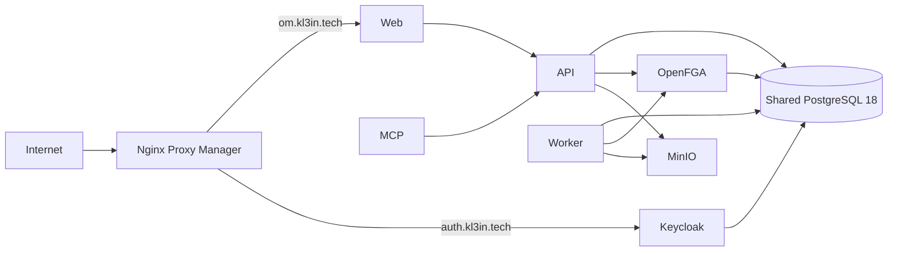

# Production CI/CD And ZM Runtime

## Outcome

Ship reproducible OrgMemory production images and a first single-VPS deployment
profile for the ZM host.

- Web: `https://om.kl3in.tech`
- OIDC issuer: `https://auth.kl3in.tech/realms/orgmemory`
- Images: GitHub-hosted BuildKit builds published to GHCR by immutable commit
  SHA.
- Runtime: Docker Compose on the ZM host pulls the exact tested image set.
- PostgreSQL: one shared PostgreSQL 18 instance with separate databases and
  logins for OrgMemory, OpenFGA, Keycloak, Northstar, and the other retained
  products.

The increment prepares deployment automation and safe migration mechanics. It
does not cut over the shared database or publish the two public hostnames until
DNS, TLS, secrets, backup, restore, and smoke gates pass.

## Current Evidence

- The ZM host has 4 vCPU, 15.6 GiB RAM, Docker 29, and Compose 5.
- Northstar, the shared AI router, Nginx Proxy Manager, and one PostgreSQL 18.4
  container remain active.
- The shared PostgreSQL image already provides pgvector `0.8.4` but not Apache
  AGE. It also preloads `pg_stat_statements`.
- OrgMemory needs PostgreSQL, pgvector, Apache AGE, OpenFGA, Keycloak, MinIO,
  API, worker, MCP, and web runtimes. OpenSearch and Neo4j are replaceable
  projections and are not needed in this first VPS profile.
- The current repository has a local development Compose file and only the
  PostgreSQL GraphRAG image. It does not yet have application images or
  production deployment workflows.
- Keycloak `26.7.0` is the accepted image baseline. The local development realm
  contains demo users and localhost redirects and therefore cannot be the
  production realm import.
- `om.kl3in.tech` and `auth.kl3in.tech` resolve to the ZM host. TLS and Nginx
  Proxy Manager routes are not configured yet.

## Deployment Boundaries

### Artifact Boundary

CI and deployment are separate authorities:

1. Pull-request CI proves source, contracts, tests, and browser behavior.
2. A build workflow creates API, worker, MCP, web, Keycloak, and PostgreSQL
   images only from a green main commit.
3. Every image has an immutable `sha-<commit>` tag. Moving convenience tags are
   not deployment inputs.
4. BuildKit registry caches reduce repeated Gradle, pnpm, and image-layer work.
5. Published images include provenance and SBOM attestations and pass a
   vulnerability scan before deployment.
6. The VPS pulls the exact commit tag and never compiles application source.

Spring Boot applications use one parameterized multi-stage image definition.
The build stage may see the whole multi-project source tree because a module's
dependency graph crosses repository directories. The runtime stage receives
only the extracted Spring Boot layers and runs as a fixed non-root user.

The web image uses a frozen pnpm install, a production Vite build, and an
unprivileged Nginx runtime. Nginx serves the SPA and forwards `/api` plus OIDC
browser entry points to the API on the internal network.

### Runtime Boundary

Only web and Keycloak join the proxy network. API, worker, MCP, OpenFGA, and
MinIO stay on OrgMemory's private network. Components needing PostgreSQL also
join a narrow external shared-infrastructure network. No application database
port, MinIO console, OpenFGA playground, actuator, or MCP endpoint is published
to the host by default.

Nginx Proxy Manager terminates TLS. Keycloak receives trusted
`X-Forwarded-*` headers, uses internal HTTP, and pins its public hostname to
`https://auth.kl3in.tech`. The API pins browser redirects to
`https://om.kl3in.tech`.

### Shared PostgreSQL Boundary

Sharing one PostgreSQL process is accepted for the resource-constrained POC
host, not as an ownership shortcut:

- each product/database has a distinct login and database;
- OrgMemory SQL never queries Keycloak or OpenFGA tables;
- roles receive no superuser, createdb, createrole, or cross-database grants;
- canonical evidence, OpenFGA authorization data, and Keycloak identity data
  remain separate failure and backup domains even though they share a process;
- connection pools are bounded so one service cannot consume the global
  `max_connections`;
- database-level backup, restore, health, and ownership checks are explicit.

The custom shared image preserves PostgreSQL 18, pgvector `0.8.4`, and
`pg_stat_statements`, then adds the pinned Apache AGE `PG18/v1.8.0-rc0`
source tag. Both `age` and `pg_stat_statements` remain preloaded. AGE is
enabled only in the OrgMemory database; pgvector is enabled only where
required.

Existing PostgreSQL entrypoint initialization scripts do not run against an
existing volume. An idempotent operator bootstrap therefore creates or rotates
the three new logins/databases and installs database-local extensions after the
container is healthy. The OrgMemory role is not a superuser: the bootstrap
configures AGE as a per-session preload for that role, grants schema usage and
read-only access to the `ag_graph` catalog needed for graph-existence checks,
and leaves every other AGE catalog and cross-database privilege closed.

The ZM machine is a development server, so a short maintenance window is
acceptable. The shared image is replaced only after capturing the current image
and Compose configuration, taking full and per-database logical backups, and
stopping writers. Recreate only the PostgreSQL container against the existing
volume, verify all retained products and extensions, and restore the previous
image immediately if a gate fails. An HA or zero-downtime database cutover is
outside this POC.

### Keycloak 26.7 Boundary

The production Keycloak image is built from
`quay.io/keycloak/keycloak:26.7.0` and runs `kc.sh build` with PostgreSQL,
health, and metrics enabled. Runtime uses `start --optimized --import-realm`;
`start-dev` is prohibited.

The single instance keeps Keycloak's supported production Infinispan mode.
`cache=local` is not used because Keycloak documents it as development/test
only. A 768 MiB container limit and `MaxRAMPercentage=65` bound the heap while
leaving native memory. Health and metrics use Keycloak's management port on the
private network.

The production realm:

- has no demo users or committed passwords;
- disables public registration;
- contains one confidential BFF client with Authorization Code and PKCE;
- accepts only the production API callback and web logout URLs;
- receives the client secret from the deployment secret file;
- uses the fixed issuer `https://auth.kl3in.tech/realms/orgmemory`.

Keycloak authenticates users. OrgMemory's internal identity ledger and OpenFGA
remain the resource-authorization authorities.

### Production Profiles

`dev` remains convenient and explicit: local ports, realm seed users, Swagger,
and local defaults are allowed only there.

`prod` is fail-fast:

- no default database, OIDC, OpenFGA, object-storage, AI, or cryptographic
  secret;
- secure session cookies and public base URLs are mandatory;
- prompt/completion content logging stays off;
- application packages log at `DEBUG` for the POC while framework and security
  logs remain `INFO`; every level is environment-overridable and the final
  production baseline returns application logs to `INFO`;
- schema migration is enabled only in API;
- worker and MCP validate but never migrate the schema;
- connection pools, executor concurrency, upload size, timeouts, graceful
  shutdown, and JVM memory are bounded by the deployment profile;
- API CPU and database capacity are prioritized over background graph
  extraction so 20-30 concurrent POC users do not compete equally with worker
  jobs during an interactive turn;
- health endpoints are private; detailed actuator surfaces are not exposed.

The Compose secret file is created on the server with mode `0600`, is never
committed, and is checked for required variables before pull or migration.

## CI Strategy

The stable `CI Gate` remains the branch-protection target. A change detector
allows independent jobs to skip work while the aggregate gate still completes:

- backend: Java/Gradle/build logic/JVM application changes;
- web: Vite/TypeScript/OpenAPI contract changes;
- OpenFGA: model, adapter, or authorization contract changes;
- evaluation: evaluation code or retrieval contract changes;
- PostgreSQL GraphRAG: custom image, migration, or PostgreSQL adapter changes.

Unknown root-level changes run all gates. Testcontainers remain the default
isolation mechanism; PostgreSQL/AGE, OpenSearch, and Neo4j integration suites
run independently and only when their adapter or shared GraphRAG contracts
change.

The delivery workflow uses a protected GitHub `production` environment,
concurrency of one, exact commit input, SSH host-key verification, pre-deploy
backup, Compose validation, OpenFGA migration, API-owned Flyway startup, health
checks, browser/OIDC smoke, and rollback to the previous image set.

## Independent Challenge

Strongest argument for the design: it reuses the VPS's largest fixed-cost
service while preserving database/login isolation and immutable application
delivery, so OrgMemory can run beside Northstar without four PostgreSQL
processes.

Strongest argument against it: the shared PostgreSQL process becomes a common
failure and maintenance domain for identity, authorization, canonical evidence,
and Northstar. A bad extension image, exhausted connection budget, or failed
restart has a larger blast radius than dedicated databases.

Accepted decision: use the shared instance for this POC only with pinned
extension versions, bounded pools, restore rehearsal, explicit rollback, and no
automatic shared-image replacement from application CI. A later dedicated
database or managed PostgreSQL migration remains possible because application
contracts use separate URLs/databases and no cross-database queries.

Rejected alternative: retain three dedicated OrgMemory PostgreSQL containers.
It simplifies blast-radius reasoning but wastes memory on this host and does
not improve application-level isolation enough to justify the cost during the
POC.

The independent Fable 5 review found three pre-PR blockers:

- MCP had no public route and depended on public-issuer discovery from an
  internal-only network. The web container now proxies only exact `/mcp`, while
  API and MCP validate the public issuer using Keycloak's private JWKS URI.
- Apache AGE was invoked with `LOAD 'age'` by a non-superuser role. AGE is now
  preloaded by PostgreSQL and registered for the OrgMemory role through
  `session_preload_libraries`; bootstrap grants `USAGE` on `ag_catalog` plus
  `SELECT` only on `ag_graph`, and the adapter integration test runs as a
  non-superuser.
- Deployment-only changes could skip every meaningful CI job. A dedicated
  deployment-contract gate now validates workflows, shell, Compose
  interpolation, and all production Dockerfiles; manual deploy also requires a
  successful production-image workflow for a commit already on `main`.

The same review challenged the shared-image cutover. Live evidence showed both
the retained and replacement PostgreSQL images use Debian bookworm and every
current database has matching stored/actual collation version `2.36`. The
runbook still requires checking those facts again at cutover and documents the
conditional reindex procedure.

## Non-goals

- Multi-node Keycloak or application replicas.
- Automatic DNS or Nginx Proxy Manager mutation.
- Production OpenSearch or Neo4j.
- A managed secret store, managed PostgreSQL, or Kubernetes.
- Renaming the retained Zero Mail containers during this increment.
- Deleting existing Zero Mail volumes or databases.
