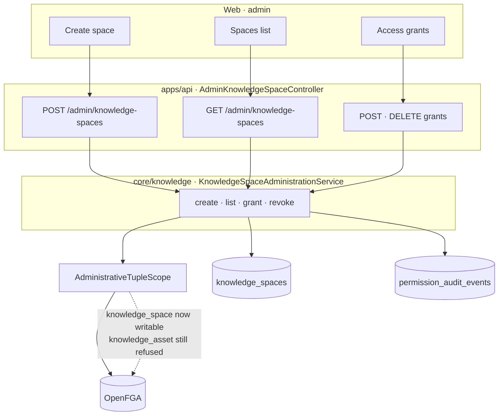

# Runtime Knowledge Space Management Design

## Outcome

An administrator can create a Knowledge Space and decide who reads it, without a
deploy. Today they cannot do either.

Every Knowledge Space in the system was `INSERT`ed by
`V18__knowledge_space_upload_authorization.sql`, and every grant on one comes from
`local-demo-tuples.csv` at bootstrap. `KnowledgeSpaceController` exposes one read
endpoint, and every `KnowledgeSpaceService` method is `@Transactional(readOnly = true)`.
`can_create_knowledge_space` has been in `model.fga` since the model was written and
has never had a Java caller.

That makes the central concept of the product the one thing the product cannot
administer. A Knowledge Space is where OrgMemory records who a body of knowledge
serves and who is accountable for it; if that answer can only be changed by editing
SQL, then the accountability story is a diagram rather than a feature.

## Boundary



No new port and no schema change. `knowledge_spaces` already exists with every
column this needs, and `RelationshipTupleWritePort` already writes tuples for roles.

## Scope

- **`AdministrativeTupleScope` admits `knowledge_space`.** `knowledge_asset` stays
  refused. The Javadoc rationale is rewritten, because the current one is imprecise
  about which objects the argument covers.
- **`KnowledgeSpaceAdministrationService`** in `core.knowledge`: create, list,
  grant, revoke. It lives beside `KnowledgeSpaceService` because `KnowledgeSpace`
  and its repository are package-private, and `core.knowledge → core.authorization`
  is an existing one-way dependency.
- **`RelationshipTupleReconciliationPort.readObject`**: reads the tuples on one
  object. The OpenFGA SDK's `ClientReadRequest._object(String)` supports this
  directly, so a space's grants cost one filtered read.
- **`AdminKnowledgeSpaceController`**: create, list, grant, revoke, each recording a
  permission audit event.
- **Web**: an admin Spaces page — create a space, see every space with its grants,
  add and remove a grant — plus a sidebar entry under Permissions.

## Decisions

### 1. A space is writable because OrgMemory always owns it

`AdministrativeTupleScope` refuses everything except `organization` and `role`
today, and its stated reason is `acl_authority`: for content whose authority is
`SOURCE`, Slack or Drive decides and OrgMemory mirrors, so a second writer would
let the two diverge.

That argument is sound, and it does not reach a Knowledge Space. `acl_authority` is
a column on `source_objects`. `knowledge_spaces` has no such column and no external
counterpart — no connector creates one, no crawl updates one. A space grant has
exactly one writer, and after this increment that writer has a UI.

`knowledge_asset` keeps the refusal, and for the original reason: an asset descends
from a source object that may well be `SOURCE`-authoritative.

This is a narrowing of an over-broad guard, not a relaxation of the invariant. The
five-gate retrieval chain is untouched: a space grant is still only gate 1, and the
source ACL still caps every read behind it. Creating a space cannot widen access to
any existing document.

### 2. The key is derived from the name, not typed

`space_key` is `updatable = false` and unique per organization. Asking an
administrator for both a name and a key offers two fields where one carries meaning,
and invites a rename that silently leaves the key describing the old purpose.

The key is slugified from the name at creation and never changes afterwards. A
collision is a `409` naming the existing space rather than a silent suffix, because
two spaces whose names slugify identically is usually a duplicate, not a coincidence.

### 3. The creator becomes the space administrator

Creation writes three tuples, one of which is not obvious:

```
organization:<org>          organization    knowledge_space:<id>
user:<creator>              administrator   knowledge_space:<id>
organizational_unit:<dept>  organizational_unit  knowledge_space:<id>   (when scoped)
```

The first is structural: `define org_admin: administrator from organization` cannot
resolve without it, so without this tuple a fresh space is unreachable even to an
organization administrator.

The second is accountability. `administrator` implies `can_manage_acl` implies
`can_view`, so the person who created the space can immediately see and grant it.
It is also the record of who is answerable for the space — which is why no
`created_by_user_id` column is added. The tuple is that fact; a column would be a
second copy that drifts.

### 4. Row first, tuples second, fail closed

The row is inserted and flushed, then the tuples are written. A tuple write that is
not `APPLIED` throws, so the transaction rolls back and no space row survives without
its grants.

The residual window is a tuple write that succeeds and a commit that then fails,
leaving tuples for a space with no row. Those tuples are inert: every read path
resolves ids against `knowledge_spaces`, and `KnowledgeSpaceService.listUploadTargets`
already returns only the rows it finds. The alternative ordering — tuples first —
trades this for orphan grants on an id that was never issued, which is strictly worse
because nothing would ever clean it.

### 5. Grants are read per object, not by scanning

`RoleAdministrationService.roles()` pages the entire tuple store and caps at 5,000,
because OpenFGA has no "list every role" call. A space is a single object, so the
same shape is not required: `ClientReadRequest._object("knowledge_space:<id>")`
returns exactly that space's tuples. The port gains `readObject` rather than
reusing the unfiltered scan.

### 6. `can_create_knowledge_space` gets its first caller

Creation checks `can_create_knowledge_space` on the organization; grant and revoke
check `can_manage_acl` on the space. Neither reuses `AdminAccessGuard`'s
`can_manage_members`, even though today both resolve to `administrator` — the model
already distinguishes them, and collapsing them here would mean the distinction
could never be used without changing this code.

## Out of scope

- **Deactivating or archiving a space.** The lifecycle question — what happens to
  assets when a space is retired — deserves its own increment. `active` stays true
  for every space this creates.
- **Moving assets between spaces.** `knowledge_space_id` is set at ingestion from
  the source connection and stays there.
- **Per-asset grants.** `knowledge_asset` remains unwritable.
- **The graph's authorization gap.** `PostgresGraphProjectionStore` filters by
  authorized asset id but applies neither the source ACL nor the classification
  lattice. That is a real gap, contained today because graph export requires
  `can_export_graph`, and it is a separate increment.

## Verification

- `AdministrativeTupleScope` admits `knowledge_space` and still refuses
  `knowledge_asset`.
- Creating a space writes exactly the expected tuple set, including the structural
  organization tuple, and the creator can immediately read the space back.
- A tuple write that reports `INDETERMINATE` leaves no space row behind.
- Slug collision answers `409` and creates nothing.
- A user with no grant cannot see the space; after a viewer grant they can; after
  revocation they cannot.
- A non-administrator is refused creation, grant, and revoke.
- Frontend: oxlint, TypeScript typecheck, production build, and a browser pass over
  create → grant → revoke.
