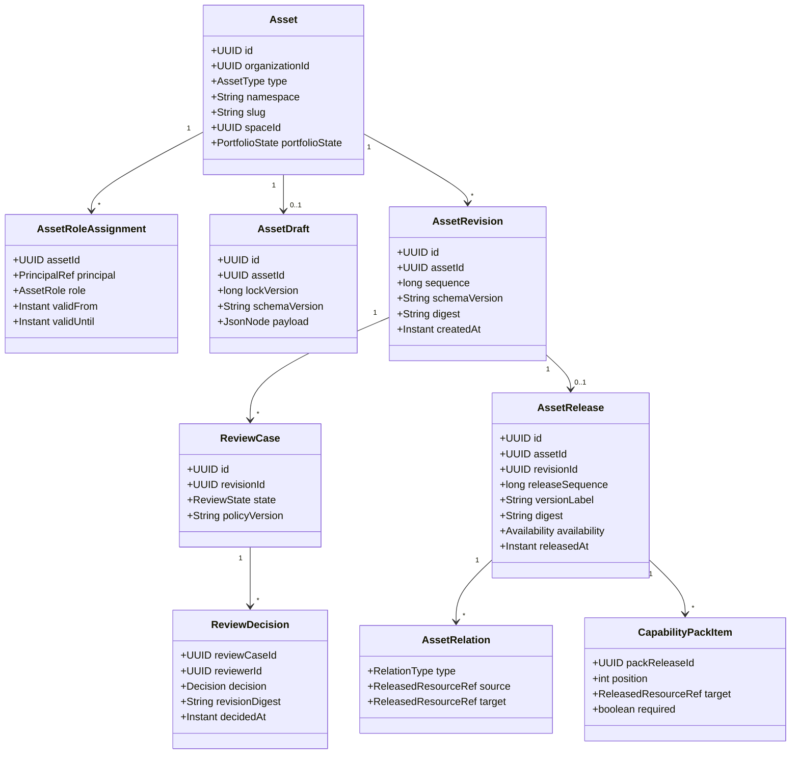

# Prompt-First Unified Asset Registry POC

## Goal

Prove that OrgMemory can govern and transfer an AI-assisted organizational
capability without Screenpipe, a public marketplace, or an executable package
runtime.

The POC implements a generic Asset Registry and proves it through:

- existing permission-aware `KNOWLEDGE`;
- `PROMPT_TEMPLATE`;
- `WORK_INSTRUCTION`;
- `CAPABILITY_PACK`.

The golden flow is:

```text
senior user authors reusable Assets
-> reviewer approves immutable revisions
-> owner releases a role Pack with exact component pins
-> second user discovers the Pack
-> reads Knowledge, follows a Work Instruction, and runs a Prompt
-> output is evaluated and usage is traceable
-> ownership, update, withdrawal, and permission behavior are proven
```

`SKILL` is the next installable profile after this browser-native reuse flow.
Controlled `SOP`, Screenpipe evidence learning, executable `WORKFLOW`, `AGENT`,
and `TOOL_PACKAGE` are later increments.

## Research Basis

The current decision is grounded in:

- [the original startup/product research](../../../research/orgmemory_research_report_2026-07-06.md),
  which identifies prompts, workflows, playbooks, onboarding, handover, and
  governed reuse as the product wedge;
- [the initial unified registry research](../../../research/unified-organizational-asset-registry-2026-07-25.md),
  retained as research history;
- [the independent lifecycle, Prompt Registry, onboarding, Assistant, MCP, and
  repository audit](../../../research/asset-registry-prompt-first-onboarding-poc-2026-07-25.md).
- [the source-level UI reference audit](ui-reference-audit.md), which maps
  Backstage, Langfuse, assistant-ui, Open edX, shadcn/ui, and Cognee components
  to the four POC screens without importing their product identity.

The product is not a Prompt library. Prompt Template is the first low-friction
Asset profile; Capability Pack and permission-aware Knowledge turn it into a
role-transfer experience.

## Product Decisions

1. `Asset` is the stable catalog identity for a deliberately registered,
   reusable organizational item.
2. Asset types share one catalog/revision/review/release kernel, not one
   operational state machine.
3. Review binds an immutable `AssetRevision` and digest. Review never targets a
   mutable draft or a not-yet-created release.
4. `PROMPT_TEMPLATE`, not every chat message, is a first-class Asset type.
5. `CAPABILITY_PACK` is an ordered, version-pinned user journey. Onboarding and
   handover are Pack purposes, not Asset types.
6. `WORK_INSTRUCTION` describes one bounded task. It is not silently promoted
   to a controlled SOP.
7. Existing `KnowledgeAsset` tables, OpenFGA identity, publication outbox,
   source lineage, and retrieval behavior remain untouched.
8. The Asset catalog federates current Knowledge through an adapter; it does
   not create a second Knowledge identity.
9. In-app Assistant proves the consumption path before external MCP mutations.
10. Public MCP means authenticated protocol access, not anonymous Assets or a
    marketplace.
11. Screenpipe is explicitly out of this POC.

## Admission Rule

An item becomes an Asset only when it has:

- deliberate registration;
- intended reuse;
- stable identity and type;
- accountable owner;
- bounded purpose and audience;
- permission/classification context;
- provenance;
- revision, review, release, and retirement semantics.

Manual authoring creates an Asset and draft. Passive discovery would create a
private `AssetProposal`, but no proposal aggregate is implemented while
Screenpipe and passive detection are deferred.

## Target Domain

### Shared kernel



`ReviewCase`, relations, Pack items, execution records, and future installations
are separate aggregates/tables. They are not mutable children loaded and saved
with `AssetRelease`.

### Lifecycle axes

Mutable authoring and immutable review:

```text
AssetDraft
  -> submit immutable AssetRevision
  -> ReviewCase: IN_REVIEW
       -> CHANGES_REQUESTED -> edit/resubmit a new revision
       -> REJECTED
       -> CANCELLED
       -> APPROVED
```

Publication:

```text
approved AssetRevision -> immutable AssetRelease
```

Portfolio state:

```text
DRAFT_ONLY -> ACTIVE -> SUNSETTING -> RETIRED
```

Release availability:

```text
AVAILABLE -> DEPRECATED | WITHDRAWN
```

Portfolio state may be derived. It never decides which SOP is effective or
which Skill is installable. Those later profiles add their own lifecycle axes.

### Invariants

- A review decision pins `revisionId`, revision digest, reviewer, decision,
  policy version, and time.
- A changed draft cannot publish using approval for an older digest.
- One Asset revision creates at most one immutable release.
- A used release coordinate cannot be reused for different bytes.
- Released payload, schema version, dependency pins, classification snapshot,
  and digest never mutate.
- Withdrawal prevents new consumption but retains authorized audit evidence.
- A Pack pins exact component releases and never follows a moving latest value
  silently.
- A Pack cannot widen access to a component.
- Denied component metadata is opaque.

### Metadata placement

Stable root:

- organization;
- type;
- namespace and slug;
- immutable Space placement for the POC;
- portfolio state.

Role assignment history:

- owner;
- backup owner;
- steward;
- editor;
- reviewer;
- publisher.

Revision/release snapshot:

- title and summary;
- classification and visibility;
- schema version and payload;
- change note;
- dependency/provenance pins;
- release label and digest.

The catalog projects current display metadata from a selected released view. It
does not make mutable title/classification fields the audit source of truth.

## Asset Type Profiles

`AssetTypeProfile` is a code-owned extension point:

```text
AssetTypeProfile
├── type
├── payloadSchema
├── validator
├── renderer
├── consumptionActions
├── dependencyExtractor
├── reviewPolicy
├── evaluationPolicy
└── optional adapters
```

The common backend does not use a Prompt-specific Asset table or a broad
`if (type == PROMPT)` orchestration. The web renders the shared Asset page and
type-specific panels/actions from an explicit profile registry.

### `PROMPT_TEMPLATE`

The canonical release contains:

- objective, audience, `useWhen`, and `doNotUseWhen`;
- system/user messages or text template;
- typed variables, defaults, validation, and sensitivity;
- output contract;
- model/runtime compatibility and inference recommendation;
- Knowledge/tool requirements;
- data handling and safety constraints;
- examples or bounded evaluation cases;
- known limitations.

Primary actions:

- view;
- fill variables;
- deterministic render;
- in-app run;
- copy;
- fork into a draft.

`PromptRun` is an execution record, not an Asset. It pins release/digest, actor,
model route, authorized Knowledge/citations, tool versions, timing, and
sanitized outcome. Raw sensitive variables and output are retained only under
an explicit policy.

### `WORK_INSTRUCTION`

The canonical release contains:

- purpose, audience, prerequisites, and completion outcome;
- ordered steps;
- responsible role;
- inputs, systems, expected results, and checks;
- branches, escalation, and prohibited actions;
- related Knowledge/Prompt references.

Primary actions:

- read;
- follow;
- acknowledge;
- start within a Pack.

### `CAPABILITY_PACK`

The canonical release contains:

- purpose: `ROLE_ONBOARDING`, `HANDOVER`, or `ROLE_ENABLEMENT`;
- target role/audience;
- prerequisites and expected outcome;
- ordered required/optional component pins;
- completion criteria;
- review date and owner.

Primary actions:

- start;
- resume;
- inspect access gaps;
- complete an item;
- request component access;
- view update/withdrawal impact.

Checklist items may remain components of the Pack release for the POC.
`PackAssignment` and `PackProgress` are operational records.

### Existing `KNOWLEDGE`

`KnowledgeAsset` remains a separate shipped aggregate. A read-only catalog
adapter supplies permitted Knowledge entries and exact
`KnowledgeAssetVersion` references.

The POC does not:

- create an `assets` row for Knowledge;
- copy Knowledge OpenFGA tuples;
- bypass `SecureKnowledgeRetrieval`;
- expose restricted Knowledge metadata through a Pack;
- change the Knowledge publication pipeline.

## Authorization

Add an OpenFGA `asset` type for new registry Assets. Initial relations and
computed permissions cover:

- owner and backup owner;
- steward;
- viewer;
- editor;
- reviewer;
- publisher;
- `can_view`;
- `can_edit`;
- `can_submit_review`;
- `can_review`;
- `can_publish`;
- `can_withdraw`;
- `can_use`.

Business separation-of-duty rules remain application policy. OpenFGA answers
relationship authorization; it does not decide that an author may self-approve
a high-risk revision.

Asset authorization convergence uses a narrow Asset-specific outbox. It does
not reuse the Knowledge publication outbox because that outbox also controls
source heads, chunks, embeddings, and retrieval projections.

Every list, detail, release, relation, Pack, Prompt render/run, Assistant tool,
and MCP path authorizes the actor. Search returns no pending Asset until
required tuples converge.

## Assistant Boundary

The in-app Assistant consumes the same application use cases as REST and MCP.
It may:

- search and recommend authorized Assets/Packs;
- resolve exact released content;
- read/ask/cite Knowledge;
- collect Prompt variables, render, and run;
- guide Work Instruction and Pack steps;
- record PromptRun and PackProgress;
- fork a released Asset into a new draft when asked;
- submit feedback and report stale dependencies.

It may prepare diffs, evaluation summaries, release notes, and review requests.
It may not approve, publish, withdraw, change permissions, silently update Pack
pins, install executable code, or execute arbitrary Tool packages.

Conversation history follows the same practical split used by mature assistant
products: a tenant/user-owned full transcript for product history and a bounded
recent window for model context. Each new turn retrieves with current
authorization. The current system message carries freshly authorized evidence
and response-personalization context, so the memory window retains the raw user
question and assistant answer instead of replaying copied evidence. Historical
answers remain a user-owned snapshot; citation content is still opened through
the current authorization check. Purge-on-revocation is deferred unless an
explicit compliance retention policy requires it.

## MCP Boundary

The public POC MCP remains a stateless delivery adapter over API/application use
cases. It does not access the database or become more privileged than the
Assistant.

Initial tools:

- `search_assets`;
- `get_asset`;
- `get_asset_release`;
- `get_capability_pack`;
- `resolve_asset_relations`;
- `render_prompt`.

Initial Resources may expose authorized Asset metadata and immutable release
content through `orgmemory://assets/...`. MCP Prompts may adapt authorized,
released Prompt Templates for compatible clients. Registry identity and release
semantics remain independent of MCP client support.

The public remote endpoint requires OAuth protected-resource metadata, audience
validation, scopes plus object authorization, input validation, rate limiting,
sanitized output, generic denial, and audit. If MCP and API do not share one
protected-resource audience, the gateway must use an explicit on-behalf-of or
token-exchange contract rather than bearer passthrough.

The POC uses a dual-audience bearer: the MCP server validates the configured
canonical MCP resource URI, while the API continues to validate
`orgmemory-web`. The authorization server must issue both audiences and the
requested `assets:read` or `assets:use` scope. These scopes only enter the
delivery API; `CAN_USE` is still resolved for each Asset and each Pack item.
MCP capability listing contains no Asset instances, so denied metadata cannot
leak before a tool, resource, or prompt invocation.

`run_prompt`, Pack progress, draft fork, and feedback remain in-app/API actions
until identity, consent, idempotency, retention, and audit are proven. Approval,
publication, withdrawal, permissions, Skill installation, and Tool execution
are not public MCP tools.

## Generic Web Surfaces

1. **For you / Asset catalog** — authorized Packs and Assets filtered by role,
   use case, type, owner, lifecycle, and permission.
2. **Asset detail / use** — shared identity/release/provenance header plus a
   type-owned renderer and actions.
3. **Pack journey** — ordered items, required/optional state, exact pins,
   progress, access gaps, and update impact.
4. **Governance workspace** — revision diff, comments, evaluation/validation,
   review decisions, release history, deprecation, and withdrawal.

The POC does not create a standalone Prompt application or hard-coded Prompt
navigation hierarchy.

## Golden Demo

The fixture is **L1 Customer Support Capability Onboarding Pack**:

- permission-aware SLA and escalation Knowledge;
- `Classify and respond to a support ticket` Work Instruction;
- `Triage customer ticket` Prompt Template;
- embedded quality checklist;
- five to ten mock ticket evaluation cases.

An operations lead releases the components and Pack. A second authorized user
discovers it through **For your role**, completes a realistic mock ticket, and
produces a result that passes the rubric. The demo then proves one update or
withdrawal and an owner/backup-owner handover.

## Architecture Debate Record And Gate

The product owner explicitly waived the repository's independent Claude Fable
5 debate for this increment on 2026-07-25. No independent review is claimed.
The proposal, strongest counterargument, evidence, decision, and rejected
alternatives remain below as the durable decision record. Accepted transition,
permission, separation-of-duty, retention, OAuth, and frozen-fixture details
are recorded in [gate-decisions.md](gate-decisions.md).

Proposal:

- side-by-side `core.assetregistry` Modulith package;
- generic revision/review/release kernel;
- Prompt/Work Instruction/Pack profiles;
- federated read-only Knowledge catalog adapter;
- new OpenFGA `asset` type and dedicated authorization outbox;
- Assistant-first consumption and read-only public MCP.

Strongest counterargument:

> A generic Asset kernel, dynamic profiles, Pack composition, Assistant tools,
> and remote MCP create platform infrastructure before one customer workflow
> has proved value. A Prompt-specific feature over existing Knowledge would ship
> faster and might satisfy the pilot without a new registry aggregate.

Repository evidence supporting the proposal:

- the original research requires ownership, version, approval, permission,
  usage, handover, and multiple capability types;
- current Knowledge identity/publication is too specialized to become the
  editorial/package registry without high migration risk;
- current Assistant and MCP already share a safe permission-aware use-case
  pattern;
- the four-profile POC proves generic extension without implementing executable
  Agent/Tool complexity.

Current decision:

- accept the side-by-side kernel, but keep the type set and UI bounded;
- require at least Prompt Template, Work Instruction, Pack, and federated
  Knowledge to prove the kernel is not Prompt-hard-coded;
- exclude Screenpipe, Skill installation, SOP effectivity, workflow execution,
  and MCP mutation from the POC.

Rejected alternatives:

- migrate/rename current Knowledge tables first;
- build a Prompt-only CRUD application;
- build Screenpipe-to-SOP before manual consumption is proven;
- expose every application action as an MCP tool;
- implement a generic BPM or Agent runtime.

The named independent debate did not occur. Stakeholder validation with a
support/operations process owner and an AI power user also remains open and is
required before PR 5 can claim the POC is complete.

## POC Success Gate

- second user finds the correct Pack without an Asset ID;
- Prompt Template, Work Instruction, Pack, and Knowledge use the generic catalog
  and shared release header;
- submitted bytes cannot change under an existing approval;
- every released payload and Pack component is digest/version pinned;
- the second user completes one realistic task and passes the rubric;
- execution trace pins Prompt, Knowledge, model route, actor, and citations;
- denied Pack components leak no metadata;
- a withdrawn release cannot be newly consumed;
- Pack pins do not silently follow a replacement release;
- owner transfer preserves use and missing backup ownership is visible;
- Assistant, REST, and MCP use the same authorization/audit boundary.

Primary metrics:

- time-to-first-correct-task;
- first-time-right rate;
- second-user reuse;
- view-to-use conversion;
- evaluation pass rate;
- reviewer correction rate;
- owner/backup-owner coverage;
- unauthorized metadata leakage.

## Non-Goals

- Screenpipe capture or passive monitoring;
- public/paid marketplace, ratings, or social feed;
- HRIS, recruiting, payroll, benefits, LMS, or device provisioning;
- full controlled SOP effectivity/training/deviation lifecycle;
- Skill installer, generic Agent runtime, Tool execution, or BPM engine;
- anonymous MCP or mutation-first MCP;
- refactoring/migrating the shipped Knowledge Asset runtime;
- company-wide rollout.
