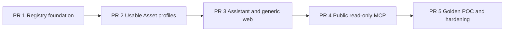

# Prompt-First Unified Asset Registry POC Plan

This increment is an implementation program split into five reviewable pull
requests. Each PR must land on current `origin/main`, keep unrelated changes
out, satisfy its listed gates, and leave the next PR buildable.

Sizing policy:

- soft target: 30-70 changed files;
- hard cap: fewer than 100 changed files;
- generated OpenAPI clients and fixtures count toward the cap;
- split only when a PR crosses the cap or contains changes that cannot be
  reviewed, tested, or rolled back as one coherent capability.

Do not collapse all five PRs into one branch. Do not split migrations, domain
invariants, and their integration tests merely to reduce the file count.

## Completed Research And Definition

- [x] Reconcile the original AI capability-memory thesis with the Asset-root
  ontology.
- [x] Audit controlled SOP and Work Instruction business practice.
- [x] Audit Skill/package registry lifecycle and security behavior.
- [x] Audit Prompt Registry versioning, variables, model configuration, aliases,
  and evaluation practice.
- [x] Audit the current Knowledge Asset, OpenFGA, Assistant, MCP, and web
  boundaries in the repository.
- [x] Correct the common lifecycle into Draft, immutable Revision, Review, and
  immutable Release aggregates plus separate portfolio/availability axes.
- [x] Replace Screenpipe-first sequencing with Prompt-first role capability
  onboarding.
- [x] Define the generic POC profiles: `PROMPT_TEMPLATE`,
  `WORK_INSTRUCTION`, `CAPABILITY_PACK`, and federated `KNOWLEDGE`.
- [x] Define Assistant actions, public MCP boundary, generic web surfaces, and
  POC success metrics.
- [x] Merge current `origin/main` into the planning worktree before writing the
  implementation program.

## Gate Before Implementation

- [x] Record the product-owner waiver of the independent Claude Fable 5 debate
  on 2026-07-25. This is an explicit exception, not a claim that the review ran.
- [ ] Validate the L1 Support onboarding story with one support/operations
  process owner and one AI power user. Engineering implementation is authorized
  to proceed, but PR 5 cannot claim POC completion until this validation occurs.
- [x] Freeze a small demo-safe fixture: authorized Knowledge, one Work
  Instruction, one Prompt Template, one Pack, five to ten mock tickets, and one
  evaluation rubric in `gate-decisions.md`.
- [x] Record the accepted transition table, permission matrix, separation-of-duty
  matrix, retention defaults, and OAuth protected-resource/audience decision in
  `gate-decisions.md`.

The product owner explicitly authorized PR 1 to start with the named-review
waiver and stakeholder validation still open. That validation remains a hard
completion gate for PR 5.

## PR Dependency Graph

## PR 1 — Registry Foundation, Authorization, And REST

Purpose: land the complete generic domain and security foundation as one
reviewable backend capability. A caller can author, submit, review, release,
search, read, deprecate, and withdraw a generic Asset, but no POC profile is
consumable yet.

Expected size: 50-85 files.

Scope:

- [x] Add the `core.assetregistry` Spring Modulith package.
- [x] Add Flyway tables for Assets, role-assignment history, mutable drafts,
  immutable revisions, review cases/decisions, immutable releases, release
  availability, relations, payload/blob references, and append-only audit.
- [x] Implement optimistic draft concurrency and canonical payload digests.
- [x] Implement submit, request changes, approve/reject/cancel, publish,
  deprecate, and withdraw transitions bound to exact revision digests.
- [x] Implement portfolio and release-availability invariants.
- [x] Add `AssetTypeProfile` registration and reject unknown/unavailable profiles.
- [x] Enable only `PROMPT_TEMPLATE`, `WORK_INSTRUCTION`, and
  `CAPABILITY_PACK`; do not add type-specific columns to the shared tables.
- [x] Add the OpenFGA `asset` type, assignable relations, and computed `can_*`
  permissions.
- [x] Add executable allow/deny/list-object model tests.
- [x] Add the narrow Asset authorization outbox and convergence worker path.
- [x] Add actor-derived application use cases and REST endpoints.
- [x] Add owner, backup owner, steward, viewer, editor, reviewer, and publisher
  role assignments.
- [x] Enforce separation of duties outside OpenFGA.
- [x] Publish OpenAPI and regenerate web clients/Zod/query options.
- [x] Return opaque denial for unauthorized IDs and list/search metadata.

Required gates:

- [x] Spring Modulith boundary verification.
- [x] Flyway clean-install and existing-schema validation.
- [x] Draft optimistic-lock conflict.
- [x] One-byte change after submission cannot use the old approval.
- [x] One revision cannot create two releases.
- [x] Same release coordinate cannot accept a different digest.
- [x] Released payload and pins remain immutable.
- [x] OpenFGA model validate and model tests.
- [x] PostgreSQL/Testcontainers outbox retry and convergence.
- [x] Two-user and cross-tenant list/detail/payload/review denial tests.
- [x] Author cannot self-approve when policy forbids it.
- [x] Generated OpenAPI drift gate.

Verification evidence on 2026-07-25:

- `.\gradlew.bat --no-daemon test` — passed all 81 tasks after building the
  repository's CI-defined local PostgreSQL/AGE image prerequisite.
- targeted Asset Registry PostgreSQL/Testcontainers, context-load, canonical
  digest, lifecycle, immutable-table, outbox-convergence, and Modulith tests —
  passed.
- `fga model validate` plus `fga model test` — valid model, 8/8 tests, 56/56
  checks, and 12/12 ListObjects assertions.
- live OpenAPI drift test plus Hey API client regeneration — passed.
- `pnpm -C web lint`, `typecheck`, and production `build` — passed.

Explicitly excluded:

- Knowledge table changes;
- Prompt rendering/model calls;
- Work Instruction/Pack consumption;
- Assistant/web/MCP.

Split trigger:

- split authorization/REST into PR 1B only if the combined diff reaches 100
  files; PR 1A must still include migrations, domain transitions, and their
  integration tests together.

## PR 2 — Prompt, Work Instruction, Pack, And Knowledge Federation

Purpose: make the registry useful in the browser/API through the complete
Prompt-first onboarding domain, without Assistant orchestration or final UI.

Depends on: PR 1.

Expected size: 55-90 files.

Scope:

- [ ] Implement the `PROMPT_TEMPLATE` schema and validator.
- [ ] Support structured messages/text, typed variables, sensitivity, output
  contract, data policy, compatibility, examples, and bounded evaluation cases.
- [ ] Add deterministic rendering from an exact Prompt release.
- [ ] Add in-app execution through the provider-neutral AI gateway.
- [ ] Add `PromptRun` records that pin release/digest, actor, model route,
  authorized Knowledge/citations, timing, and sanitized outcome.
- [ ] Default to not retaining raw sensitive variables/output.
- [ ] Add bounded evaluation execution and release comparison.
- [ ] Add fork-release-to-draft without copying review decisions.
- [ ] Implement the `WORK_INSTRUCTION` schema, validation, rendering,
  follow, and acknowledgement behavior.
- [ ] Implement `CAPABILITY_PACK` with purpose, audience, prerequisites,
  outcome, ordered required/optional pins, and completion criteria.
- [ ] Add `PackAssignment` and idempotent `PackProgress` records.
- [ ] Add the read-only Knowledge catalog adapter without creating registry
  Asset rows or copying Knowledge OpenFGA tuples.
- [ ] Allow Pack items to pin exact registry releases or exact
  `KnowledgeAssetVersion` references.
- [ ] Recheck every Pack component independently and expose denied gaps opaquely.
- [ ] Detect replacement/withdrawal impact without silently changing Pack pins.

Required gates:

- [ ] Variable validation and deterministic Prompt rendering fixtures.
- [ ] Prompt injection content remains untrusted input.
- [ ] Output schema/evaluation pass and failure cases.
- [ ] Exact release/digest/model route recorded.
- [ ] Sensitive values absent from logs and default run persistence.
- [ ] Withdrawn Prompt cannot be newly run.
- [ ] Network-free model adapter tests.
- [ ] Pack order and exact pins are immutable per release.
- [ ] Pack access is the intersection of component permissions.
- [ ] Denied component title/type/count does not leak.
- [ ] Knowledge citations still use canonical secure retrieval.
- [ ] Pack progress is actor-derived and idempotent.
- [ ] Replacement release leaves an existing Pack unchanged.

Explicitly excluded:

- Knowledge migration;
- reusable Eval Suite Asset;
- controlled SOP effectivity;
- standalone Checklist/Template profiles;
- Skill package/install;
- generic workflow engine.

Split trigger:

- if the diff reaches 100 files, split after Prompt Template is fully usable and
  tested; Work Instruction, Pack, and Knowledge federation become PR 2B.

## PR 3 — In-App Assistant And Generic Web Experience

Purpose: prove the end-user capability transfer path through the Assistant and
the four generic Asset surfaces.

Depends on: PR 2.

Expected size: 55-90 files.

Assistant scope:

- [ ] Add permission-aware tools for Asset/Pack search, exact release
  resolution, Knowledge ask/cite, Prompt render/run, Work Instruction guidance,
  and Pack progress.
- [ ] Recommend Assets by role/task without leaking denied candidates.
- [ ] Record traces pinning Asset releases, Knowledge/citations, model route,
  tool calls, authorization decision context, and sanitized outcome.
- [ ] Ask for missing Prompt variables and confirm external-provider or state
  changing actions.
- [ ] Allow explicit draft fork and feedback submission.
- [ ] Prevent Assistant approval, publication, withdrawal, permission changes,
  silent Pack updates, and arbitrary code/tool execution.

Web scope:

- [ ] Add **For you / Asset catalog** with role/use-case/type discovery.
- [ ] Add the generic **Asset detail / use** route with shared
  identity/release/provenance and type-profile panels/actions.
- [ ] Add **Pack journey** with order, required/optional state, exact pins,
  progress, access gaps, and update impact.
- [ ] Add **Governance workspace** with revision diff, evaluation/validation,
  review decisions, release history, deprecation, and withdrawal.
- [ ] Use generated clients, TanStack Query, TanStack Router, and only
  justified local Zustand state.
- [ ] Preserve themes, keyboard access, narrow layouts, and explicit
  loading/error/denial states.

Required gates:

- [ ] Tool descriptions do not grant authority.
- [ ] Retrieved Asset content cannot override system/policy instructions.
- [ ] Two-user tests cover recommendation, Pack, Prompt, Knowledge, and
  citations.
- [ ] Every trace contains exact releases without raw secrets.
- [ ] Assistant has no hidden governance tool path.
- [ ] Oxlint, TypeScript typecheck, generated-client drift, and production build.
- [ ] Generic detail renders every POC profile without Prompt-specific routing.
- [ ] Role/permission switch shows no stale cached metadata.
- [ ] Real-browser author -> review -> release -> second-user Pack journey.

Explicitly excluded:

- marketplace/rating/social feed;
- HRIS/LMS;
- Skill install/invoke;
- Screenpipe UI;
- persistent general conversation history;
- external MCP mutations.

Split trigger:

- if the diff reaches 100 files, keep Assistant application tools and traces in
  PR 3A and generic web surfaces in PR 3B.

## PR 4 — Authenticated Public Read-Only MCP

Purpose: expose the proven application use cases to authorized external agents
without making MCP a privileged bypass.

Depends on: PR 3.

Expected size: 25-55 files.

Scope:

- [ ] Add tools: `search_assets`, `get_asset`, `get_asset_release`,
  `get_capability_pack`, `resolve_asset_relations`, and `render_prompt`.
- [ ] Add authorized MCP Resources for stable metadata and immutable release
  content.
- [ ] Add an MCP Prompts adapter for released, authorized Prompt Templates where
  client compatibility permits.
- [ ] Reuse API/application use cases; never access the database from MCP.
- [ ] Preserve bearer actor, object authorization, opaque denial, rate limit,
  output sanitization, and audit.
- [ ] Publish explicit read-only/destructive/idempotent/open-world annotations.
- [ ] Implement OAuth protected-resource metadata and audience validation.
- [ ] Resolve shared MCP/API audience versus token exchange/on-behalf-of.
- [ ] Define coarse `assets:read`/`assets:use` scopes without treating them as
  object authorization.

Required gates:

- [ ] MCP contract/schema tests.
- [ ] Missing, wrong-audience, expired, and insufficient-scope tokens fail.
- [ ] Two-user metadata/payload/Pack/Prompt negative tests.
- [ ] Tool/resource/prompt listing returns only authorized released content.
- [ ] MCP and REST produce the same authorization/audit decision.
- [ ] MCP owns no migration or direct repository dependency.

Explicitly excluded:

- anonymous/public Assets;
- `run_prompt`;
- Pack progress;
- draft/review/publication/withdrawal;
- Skill install or Tool execution.

## PR 5 — Golden POC, Handover, Hardening, And Documentation

Purpose: prove the business outcome and consolidate only verified facts.

Depends on: PR 4.

Expected size: 20-50 files.

Scope:

- [ ] Add demo-safe L1 Support Knowledge, Work Instruction, Prompt, checklist,
  mock tickets, rubric, and Pack fixtures.
- [ ] Prove author -> review -> release -> second-user discovery -> Prompt run
  -> Work Instruction/Pack completion.
- [ ] Prove one Prompt replacement without silent Pack mutation.
- [ ] Prove withdrawal blocks new use and remains auditable.
- [ ] Prove owner/backup-owner handover and flag orphaned Assets.
- [ ] Capture time-to-first-correct-task, first-time-right, second-user reuse,
  view-to-use, evaluation pass, reviewer correction, and owner coverage.
- [ ] Run static, domain, integration, OpenFGA, frontend, browser, MCP, and
  two-user security gates.
- [ ] Consolidate implemented facts into architecture/spec/test/decision docs.
- [ ] Move this increment to `completed` only when every required POC gate has
  evidence.

Required gates:

- [ ] `.\gradlew.bat --no-daemon clean test`
- [ ] OpenFGA model validate and model test
- [ ] generated OpenAPI drift check
- [ ] `corepack pnpm -C web typecheck`
- [ ] `corepack pnpm -C web build`
- [ ] real-browser two-user POC
- [ ] generic denied-resource behavior across REST, Assistant, and MCP
- [ ] terminating context-load test

## Follow-On Increments, Not Hidden PRs

After the POC is complete, create separate increments for:

1. `SKILL` package profile, supply-chain validation, one runtime installer, pin,
   drift, deprecation/yank/revocation, and installed inventory.
2. Controlled `SOP` lifecycle: approval, issue, effectivity, supersession,
   discontinuation, emergency withdrawal, review, training, and deviation.
3. Screenpipe edge evidence, redaction, proposal acceptance, and grounded Work
   Instruction/SOP drafting.
4. Public MCP controlled mutations: Prompt run, Pack progress, draft fork, and
   feedback after consent/idempotency/retention/audit evidence.
5. Executable Workflow, Agent, Tool Package, Guardrail, and reusable Eval Suite
   profiles only when measured customer need justifies them.
