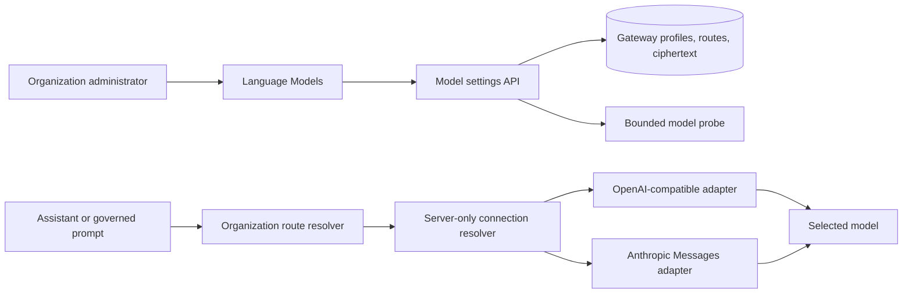

# Multi-provider Model Control Plane

## Outcome

Let an organization administrator connect chat-model providers, verify the
connection, discover or enter a model, and select the organization's default
Assistant model without editing deployment configuration or restarting the
application.

This increment turns the provider-neutral boundary from ADR 0006 into a
runtime control plane. It does not make embedding geometry mutable.

## Scope

### Included

- Organization-scoped gateway profiles with encrypted write-only credentials.
- Native chat protocols:
  - `OPENAI_COMPATIBLE` for OpenAI, 9Router, OpenRouter, LiteLLM, Ollama, and
    custom OpenAI-compatible endpoints;
  - `ANTHROPIC_MESSAGES` for direct Anthropic.
- Presentation categories independent from protocol:
  - direct providers;
  - gateways and routers;
  - self-hosted and custom endpoints.
- Deployment-configured gateways remain read-only defaults. Organization
  overrides win explicitly; provider failure never silently falls back.
- Organization-scoped route resolution at call time for Assistant chat and
  governed prompt execution.
- Bounded connection tests and model discovery.
- A Language Models administration page based on Onyx's information hierarchy,
  using OrgMemory components and authorization.
- A separate Index Settings page that reports the active immutable embedding
  profile and explains why a geometry change requires a new generation.
- Spring AI and Micrometer observations for dynamically constructed chat
  models.

### Not included

- Per-user provider access or model selection.
- Automatic provider failover, load balancing, budget routing, or model
  comparison.
- Mutating the embedding provider, model, dimensions, or distance metric.
- Reindex orchestration.
- Web search, image generation, voice, code interpreter, or provider-specific
  tools.
- Gemini, Vertex AI, Bedrock, or Azure cards before their native adapters exist.
- A generic plugin framework or one Gradle module per provider.

## Product Shape

Provider cards describe how a connection is presented; protocols describe how
it is called. 9Router, OpenRouter, LiteLLM, Ollama, and a custom endpoint share
the OpenAI-compatible adapter but retain distinct presets, defaults, help text,
and icons. Anthropic uses its native Messages adapter.



The UI groups the first implemented presets as follows:

| Category | Presets |
| --- | --- |
| Direct providers | OpenAI, Anthropic |
| Gateways and routers | 9Router, OpenRouter, LiteLLM |
| Self-hosted and custom | Ollama, OpenAI-Compatible |

Cards for unsupported protocols are not rendered. The product must not imply
support that the runtime cannot prove.

## Runtime Boundary

`core.ai` owns provider-neutral profiles, workload routes, encrypted credential
lifecycle, and the organization-scoped resolver contract.

`integrations:ai-openai-compatible` remains the single AI integration module in
this increment because all adapters share one deployment unit, cache,
observability policy, and control-plane contract. Its package structure
separates OpenAI-compatible, Anthropic, and management code. A module rename is
deferred until it can be done without mixing product delivery with mechanical
build churn.

Every model call carries `organizationId`. `AiRouteResolver` therefore resolves
`(organizationId, workload)` rather than a process-wide workload. Existing
deployment routes are the explicit fallback only when that organization has no
override.

The cache key is:

```text
organization id + workload + gateway key + runtime revision + protocol + model id
```

It contains no credential. Updating a profile or rotating a credential advances
the runtime revision, so new requests construct a new client while in-flight
requests finish on the old immutable client. Superseded cache entries are
evicted after the new revision is observed.

The first editable workloads are `ASSISTANT_CHAT` and `PROMPT_EXECUTION`.
`KEYWORD_PLANNING`, `GRAPH_EXTRACTION`, and embedding routes remain visible as
deployment-managed settings until the query-engine and indexing lifecycles are
made organization-scoped in their owning increments.

## Persistence

Three small tables are sufficient:

```text
ai_gateway_profile
- id
- organization_id
- gateway_key
- display_name
- preset
- category
- protocol
- base_url
- request_timeout_seconds
- enabled
- runtime_revision
- created_by_user_id
- updated_by_user_id
- created_at
- updated_at

ai_gateway_credential
- id
- organization_id
- gateway_profile_id
- cipher_text
- key_version
- set_by_user_id
- set_at

ai_route_override
- id
- organization_id
- workload
- gateway_profile_id
- model_id
- version
- set_by_user_id
- set_at
```

Constraints enforce tenant ownership, unique gateway keys per organization,
one credential per profile, and one route per organization/workload. The route
references a profile in the same organization. A profile cannot be disabled
while an active route references it.

Credentials use the existing AES-GCM `SecretCipher`. They are accepted only by
sensitive request records whose `toString()` is redacted. API responses expose
only `credentialSet`, setter, and timestamp.

## Authorization and Audit

Only the organization `administrator` relation receives the new
`can_manage_ai` permission. Source managers do not inherit it merely because
both features make outbound calls.

Every create/update, credential rotation, route change, test, and disable
operation records a permission audit event without secret, prompt, or response
content. Tenant ownership is rechecked in the service even after the API gate.

## Probe and Outbound HTTP Security

Provider endpoints are an SSRF boundary.

- Direct-provider presets have fixed HTTPS origins.
- Gateway and self-hosted/custom presets may use only origins allowed by
  deployment policy.
- URLs reject user-info, fragments, non-HTTP schemes, and non-origin paths
  except the normalized API prefix.
- Probe/model discovery uses a Spring Boot 4.1-managed `RestClient` request
  factory with bounded connect/read timeouts, `redirects=dont-follow`, and an
  `InetAddressFilter`.
- Response size, page count, and model count are bounded.
- Provider errors are converted to stable reason codes; response bodies and
  credentials never reach logs or API responses.
- Spring AI 2.0.0 constructs OpenAI and Anthropic chat clients on its own
  OkHttp layer. Boot's `InetAddressFilter` does not automatically apply there.
  Runtime profiles therefore require an allowed origin, provider SDK redirects
  are treated as configuration errors where observable, and production egress
  policy remains the final DNS-rebinding control.

For a private Ollama or 9Router deployment, an operator must explicitly allow
its origin. Organization administrators cannot turn arbitrary intranet URLs
into model endpoints.

## Failure Semantics

- No route or missing credential: fail closed with a stable unavailable error.
- Selected provider unavailable: fail closed; do not invoke a deployment
  default behind the administrator's back.
- Model discovery unsupported: keep the connection test result and allow a
  bounded manual model id.
- Credential rotation: the new ciphertext is committed only after validation;
  the old credential is not returned.
- A disabled profile cannot be selected.

## Index Settings Boundary

The Index Settings page reports:

- embedding provider and model;
- vector dimensions and distance metric;
- active profile id/generation status;
- deployment-managed status.

It does not offer an edit control. Query and document embeddings must match the
same immutable profile. A later increment must create a new profile, reindex,
validate coverage, atomically switch publication, and retain rollback evidence.

## Research Evidence

Research was performed against the versions and commits below rather than
recalled APIs:

- OrgMemory base `d7ca979937e95657aa0af0821f858128640ddd94`.
- Spring AI `2.0.0` local runtime/source JARs:
  `OpenAiChatModel`, `AnthropicChatModel`, their option builders, observation
  and meter hooks, HTTP customizers, and the Anthropic SDK Models API.
- Spring Boot `4.1.0` release notes and reference documentation for global HTTP
  client settings, no-redirect behavior, SSL bundles, HTTP Service clients, and
  `InetAddressFilter`.
- Northstar `ca58e5d200085d8eb103f953469f7dae9ebae0e9` for the proven route override,
  encrypted secret, typed capability, and 9Router/OpenAI-compatible patterns.
- Onyx `4fa56f5ec3d7e70999c65410e6d0b95beb8f6e61` for provider grouping and the
  separate Language Models / Index Settings information architecture.
- 9Router `79918c7830695bbca4a45c9fea4a42c3e9fd73d1` for its OpenAI-compatible
  `/v1/chat/completions` and `/v1/models` contract.

Context7 was attempted first but its monthly quota was exhausted. Official
documentation, exact dependency JARs, and pinned source revisions were used
instead.

## Architecture Challenge

The strongest alternative is to keep deployment-only configuration and add a
read-only UI. It avoids tenant-aware routing, secret rotation, SSRF policy,
cache invalidation, and dynamic-client observability.

That alternative does not meet the requirement: an administrator still cannot
connect or change a model without a restart. The narrower design above accepts
the control-plane cost while limiting protocols to two, keeping embedding
immutable, prohibiting silent fallback, and avoiding a plugin framework.

The repository's preferred independent Claude architecture challenge was
unavailable because the reviewer quota was exhausted. On 2026-07-29 the project
owner explicitly directed implementation to proceed with sourced research and
the normal review/CI loop; this limitation is recorded rather than silently
claiming the challenge occurred.

## Exit Gates

- API tests prove admin-only and cross-tenant refusal.
- Persistence tests prove tenant constraints, route uniqueness, and ciphertext
  at rest.
- Adapter tests prove protocol selection, model propagation, model discovery,
  fail-closed routing, and versioned cache invalidation.
- OpenAPI and generated client are synchronized.
- Browser tests cover connection, credential redaction, default model
  selection, and read-only Index Settings.
- Backend static analysis, focused tests, full affected builds, frontend
  lint/typecheck/tests/build, CodeRabbit, and GitHub CI are green.
