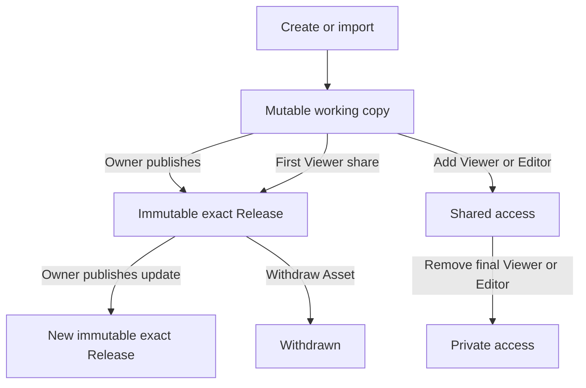

# Asset Library Sharing Lifecycle — Design

## Intent

The current Asset Registry exposes the machinery of a governance system before
the organization has the people needed to operate one. Authors encounter Draft,
Changes, Review, Releases, reviewer and publisher roles, backup ownership,
deprecation, and withdrawal even when the immediate job is only: create a useful
Asset, let colleagues find it, and improve it.

This increment adopts Onyx's contribution model as the POC product baseline:
one accountable owner creates or imports an Asset privately, shares it directly
with people, groups, or the organization, and transfers ownership when needed.
It deliberately keeps OrgMemory's immutable Release boundary underneath that
simpler experience. A user should experience a library, not a release board;
an installed Skill, Pack pin, Prompt run, or Work Instruction acknowledgement
must still resolve to exact bytes and cannot change retroactively.

## Architecture challenge

The independent one-round challenge accepted the common direct POC lifecycle
with must-fix constraints. Fable 5 was attempted first but the fresh terminal
reported `Not logged in · Run /login`; the configured fallback was a fresh
read-only Codex `gpt-5.6-sol` session with `ultra` reasoning. Full record:
[challenge verdict](challenge-verdict.md).

The committed boundary is binding:

1. All four enabled profiles may use direct contribution, but only the sole
   active owner may create the current live Release or change sharing. Editors
   edit the working Draft only.
2. Organization administration grants vacancy-only ownership recovery and a
   separately named emergency-withdraw operation; it grants no standing edit,
   publish, or ordinary sharing authority.
3. Consumption/detail DTOs must be separated from governance/history DTOs
   before any Viewer audience is widened. `can_view` must never disclose Drafts,
   review comments, or role principals.
4. PostgreSQL owns one active human owner and typed share intent. OpenFGA
   projection needs explicit write/delete operations and generation rechecks so
   stale tuples can only over-deny, never grant.
5. Existing owner conflicts and open reviews are migration state to quarantine
   or drain, not data to convert silently.

## Prioritized product backlog

### P0 — make contribution usable without a governance team

1. Replace the primary Catalog/Governance vocabulary with **Available to me**,
   **Created by me**, **Private**, **Shared**, **Share**, **Save update**, and
   **Withdraw**.
2. Show the accountable owner on cards, list rows, and detail. A missing owner
   is an explicit administrator-recovery state.
3. Use one direct path for every enabled Asset profile: create/import a private
   working copy, then share it. Sharing the first time creates the first exact
   immutable Release; saving a later shared update creates another.
4. Remove Review from the active POC journey. Do not create new review cases,
   reviewer assignments, publisher assignments, or reviewed Releases. Preserve
   existing review evidence as read-only history.
5. Replace backup ownership with ownership transfer. There is exactly one
   active human owner; users and groups may be Editors or Viewers. An
   organization administrator may recover an Asset only when its canonical
   valid-owner count is zero.
6. Organization-wide sharing is Viewer-only. It makes an Asset available to
   authorized colleagues; it never gives the entire organization edit rights.

### P1 — make Skills behave like a personal tool library

1. Add a per-user **Enabled** preference for Skills visible to that user.
2. When enabling a Skill conflicts with another visible Skill of the same
   canonical namespace, require an explicit replacement choice; never silently
   enable both.
3. Keep activation separate from sharing. Sharing controls who may discover
   and use a Skill; enabling controls whether one user's Assistant may select
   it.

### P2 — retire safely and simplify secondary surfaces

1. **Withdraw Asset** removes every currently available Release from new
   discovery and consumption, retires the Asset identity, and keeps exact
   historical Releases and audit evidence readable to authorized governors.
2. Do not surface manual **Deprecated** in the POC. Superseded Releases remain
   exact, usable pins until withdrawn; a later policy can add staged migration
   warnings when there is evidence that users need them.
3. Continue treating Space as authorization context, not a primary Catalog
   taxonomy; the current Catalog already has no Space filter. Keep the parent
   Knowledge Space as the authorization ceiling and creation target; default it
   in authoring when only one valid target exists.

## Reference study

The source pins are part of the evidence, not runtime dependencies:

- Onyx `5200dade0709f926f15309dbe48b1e43e680c202`, checked out at
  `tmp/onyx-skills-reference`.
- Langfuse `ac6020bb4f5e903a2dc3cf57c9eaf373a3e03e2a`, checked out at
  `tmp/langfuse-reference`.

| System | Observed behavior | Decision for OrgMemory |
| --- | --- | --- |
| Onyx | A Skill has one `author_user_id` and optional organization-wide permission (`backend/onyx/db/models.py:4695-4750`). Visibility is the union of owner, direct user/group shares, and organization sharing; edit authority includes owner and Editor grants (`backend/onyx/db/skill.py:145-175`). | Copy the one-owner and direct user/group/organization sharing model. |
| Onyx | Create/import assigns the current user as author (`backend/onyx/server/features/skill/api.py:241-282`). Sharing mutates visibility directly, without submit/review/publish (`api.py:760-824`). | Remove Review from the active POC workflow. |
| Onyx | Each user independently enables a visible Skill (`backend/onyx/db/skill.py:497-598`). Ownership transfer makes the former owner an Editor (`db/skill.py:600-649`). | Copy per-user Skill activation and explicit ownership transfer. |
| Onyx | Replacing a bundle mutates the live Skill in place (`backend/onyx/db/skill.py:395-430`); deletion is hard (`db/skill.py:652-657`); organization sharing may grant Editor. | Do not copy mutable replacement, hard delete, or organization-wide Editor. They conflict with exact installation pins, Pack composition, auditability, and least privilege. |
| Langfuse | Prompt content is append-versioned under a unique `(projectId, name, version)` key; creating content increments the version and moves the mutable `latest` label in one transaction (`packages/shared/prisma/schema.prisma:711-737`; `web/src/features/prompts/server/actions/createPrompt.ts:93-224`). Versions can still be deleted and prior labels/tags mutate. | Use Langfuse only as evidence that direct contribution and versioned content can coexist. OrgMemory's immutable Release rows and no-coordinate-reuse rules remain stronger local invariants. |
| Langfuse | Ordinary Prompt create/update/delete uses the project `prompts:CUD` capability; protected labels add a policy gate rather than forcing every change through review (`web/src/features/prompts/server/routers/promptRouter.ts:300-330,590-700,820-880`). | Direct contribution is compatible with optional future policy controls; a mandatory reviewer is not a prerequisite for version safety. |
| Current OrgMemory | Generic Assets retain Draft, review, Release and availability machinery; Skills alone have direct publication (`docs/specs/domains/asset-registry.md:20-52,130-159`). OpenFGA currently makes backup owner, reviewer, and publisher first-class and exposes separate submit/review/publish/withdraw permissions (`integrations/authorization-openfga/src/main/openfga/model.fga:76-92`). | Simplify new behavior in stages; preserve legacy records and exact delivery contracts while removing these concepts from new POC writes. |

## Product model

### Catalog scopes

- **Available to me** is the default and contains the latest non-withdrawn
  Release of every Asset the actor may view. Built-in and contributed Assets
  share one collection.
- **Created by me** contains Assets currently owned by the actor, including
  private working copies.
- Search and type remain primary filters. Space is not a marketplace category;
  it remains server-side authorization context and may appear as secondary
  metadata when it explains access.
- Each result exposes owner, Asset type, sharing state, updated time, current
  version, and—only for Skills—the actor's Enabled state.

### Sharing and roles

One active human user is the `OWNER`. The owner may edit, publish a direct
Release, share, transfer ownership, and withdraw. An `EDITOR` user or group may
edit the working Draft but may not publish, change sharing, transfer ownership,
or withdraw. A `VIEWER` user or group may discover and consume released data
only. An organization administrator has vacancy-only recovery authority and a
separate audited emergency-withdraw authority, not standing editorial,
publication, or sharing authority.

Sharing states are:

- **Private** — no active Viewer or Editor audience.
- **Shared with people or groups** — at least one explicit user or group Viewer
  or Editor audience.
- **Organization** — every actor already admitted by the parent Space's
  `can_view` ceiling receives Viewer access.

The server derives these labels from live relationships; the browser never
infers authorization from them. No state means public Internet exposure.

Ownership transfer is one locked canonical-ledger transition: appoint the new
owner, demote the previous owner to Editor, advance the relationship generation,
and emit idempotent OpenFGA write/delete intents. Cross-store projection is not
atomic; until convergence the UI reports transfer pending or failed. Every
sensitive authorization check rechecks the canonical generation so stale tuples
cannot continue to grant authority. The target must be an active standard human
in the same organization who passes both Space `can_view` and
`can_create_asset`. Recovery appoints a new owner only when the locked valid-
owner count is zero and does not recreate the former owner as Editor.

### Lifecycle

The contributor model has two related axes. A mutable working copy can append
immutable Releases; access independently moves between Private and Shared.
Withdrawal is terminal for new use. `AssetRevision`, `AssetRelease`, package
digests, exact version coordinates, availability events, and audit lines remain
implementation invariants.

- The first Viewer Share validates the working copy and commits the immutable
  Revision, Release with `publicationMode=DIRECT`, canonical audience intent,
  and audit evidence in one PostgreSQL transaction. An Editor Share changes
  access without publishing. OpenFGA projection follows through the outbox; the
  Asset remains sharing-pending until convergence.
- Owner-only Publish update validates and creates a new immutable Revision and
  Release under the Draft/Asset lock. It changes the catalog's current Release
  only after the transaction succeeds.
- Existing exact pins keep resolving to their old Release while it remains
  available. No update rewrites bytes behind a coordinate.
- Ordinary withdraw requires the owner; an organization administrator may use
  only the separately authorized emergency-withdraw action. Both require a
  bounded reason and one locked asset-level command that withdraws every
  non-withdrawn Release and retires the identity. It blocks new use; it cannot
  erase already installed bytes.

### Review and feedback

Review is not part of this POC lifecycle. The system does not claim that a
direct Release received independent content, malware, legal, or domain review.
Structural validation, authorization, and package integrity remain mandatory.

Existing review cases, decisions, and `publicationMode=REVIEWED` Releases remain
readable. New review mutations become unavailable after the compatibility
rollout. Asset comments, owner inboxes, star ratings, certification badges, and
an `Official` tier are out of scope; feedback already stored by the current API
is retained but not expanded by this increment.

## Authorization and migration

The target authorization vocabulary is `owner`, `editor`, and `viewer`, with
organization administration remaining a separate organization relationship.
Target computed permissions are `can_view_released`, `can_edit_draft`,
`can_manage_sharing`, `can_transfer_ownership`, `can_publish_direct`,
`can_withdraw`, `can_recover_ownership`, `can_emergency_withdraw`,
`can_view_governance_history`, and the Skill preference permission.
`can_publish_direct` is owner-only and is never derived from `can_edit_draft`.
Each operation has an explicit Space intersection; ownership and publication
require both Space view and create authority.

This is a compatibility rollout, not a destructive schema rewrite:

1. Add canonical typed ownership/share records, a one-active-human-owner
   database invariant, relationship generations, and explicit OpenFGA
   write/delete outbox operations. Dual-read while legacy relations still exist.
2. Produce a per-Asset redacted conflict report for zero/multiple/group/inactive
   owners, duplicate grants, open reviews, approved-unreleased revisions, and
   projection drift. Quarantine conflicts; never select an owner automatically.
3. Convert unambiguous active `STEWARD` assignments to Editor. Convert
   `BACKUP_OWNER` to Editor only when exactly one valid active Owner exists;
   otherwise quarantine for administrator recovery. Never silently promote a
   backup owner.
4. Drain or explicitly cancel every open review and resolve approved-but-
   unreleased revisions before stopping new review mutations. Stop new writes
   of `BACKUP_OWNER`, `STEWARD`, `REVIEWER`, and `PUBLISHER` only after that gate.
   Retain their assignment history and existing review evidence.
5. Remove legacy relations from computed permissions only after database,
   authorization-store, API-contract, and browser convergence checks pass.
6. Keep `publication_mode` and review tables. New Releases are `DIRECT`; old
   `REVIEWED` evidence is immutable history.

The exact tuple migration and rollback sequence requires its own deployment
gate because the shared ZM environment forbids feature worktrees from mutating
the authorization model.

## Scope

In scope: all four enabled Asset profiles; split released-consumption and
governance-history read contracts; owner projection in Catalog; direct sharing;
one owner plus Editor/Viewer; ownership transfer and orphan recovery; owner-only
direct immutable update; asset-level withdrawal; separately authorized
emergency withdrawal; removal of active review and deprecation UX; Skill-only
per-user activation; canonical typed relationship ledger; operation-aware
OpenFGA compatibility rollout; OpenAPI/client and Flyway changes;
spec/test/decision consolidation; desktop and mobile browser proof.

Out of scope: public Internet marketplace; cross-organization sharing; paid
listing or monetization; moderation queues; comments, ratings, certification or
`Official`; malware scanning beyond existing structural validation; automatic
execution of downloaded Skills; package auto-update; bulk ownership transfer;
new Asset profiles; redesign of Knowledge Space authorization.

## Strongest counterargument

The proposed simplification is not small. It generalizes Skill-only direct
publication to every Asset type, hides a review capability already implemented,
and replaces a mature role vocabulary. Work Instructions and Capability Packs
can direct human action; a bad owner-published update is not harmless just
because its bytes are immutable. If there is no approval gate, the exact Release
only makes the mistake reproducible. A safer POC could limit the Onyx model to
Skills and Prompts and retain reviewed publication for action-bearing Assets.

The challenge rejected that narrower alternative for the internal POC because
it preserves an unstaffable queue. Its acceptance does not extend to regulated
operation, automatic execution, public or cross-organization distribution, or
any future profile shown to require policy review.

## Rejected alternatives before challenge

### Mirror Onyx storage semantics exactly

Rejected. Mutating a live bundle behind one Skill identity would break exact
CLI install coordinates, Capability Pack pins, provenance, and rollback. Hard
delete would destroy evidence the current product already promises to retain.

### Keep the current lifecycle and only hide Review in the browser

Rejected. That would leave non-Skill authors unable to complete the journey and
would make the UI lie about server behavior. Simplification must be a canonical
business change with compatibility handling, not a presentation trick.

### Require a backup owner

Rejected. It creates a second standing authority, demands staffing the POC
cannot assume, and still does not solve departure automatically. Explicit
transfer plus administrator recovery handles the real failure state without a
mandatory duplicate role.

## Dependencies and execution boundary

Do not start implementation until the active Spring Modulith Asset Registry
package-refactor slice has landed or explicitly excludes every file this
increment will touch. The authorization migration must follow the repository's
OpenFGA model rollout and shared-ZM rules. This design changes intended behavior
only; `ARCHITECTURE.md` and the domain spec stay unchanged until implementation
ships.
