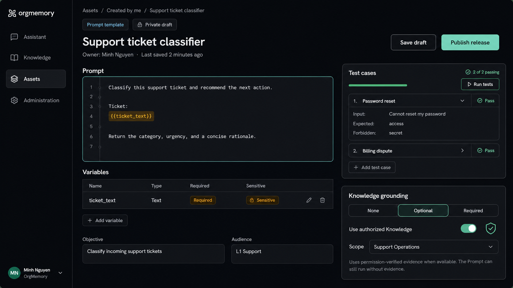

# Prompt Asset Authoring And Exact-Release Use

## Intent

Make Prompt Templates a complete browser-supported Asset profile: an authorized
employee can create a private working copy, author and validate the prompt,
publish an immutable release directly, and use that exact release with bounded
tests and optional permission-aware Knowledge grounding.

This increment exposes the Prompt contracts that already exist. It does not
create a second prompt registry, a separate personal prompt store, or another
publication lifecycle.

## Current facts

- `PROMPT_TEMPLATE` is already an enabled Asset profile. A new Asset starts as a
  private mutable working copy, and its owner can publish directly into an
  immutable Revision and Release with `publicationMode=DIRECT`.
- Prompt schema version 1 supports one text template or ordered messages, typed
  variables, output and data contracts, compatibility, optional Knowledge
  requirements, known limitations, and at most ten evaluation cases.
- Deterministic rendering rejects unknown, missing, and invalid variables before
  provider execution. Variables and retrieved Knowledge remain untrusted data.
- Released Prompt consumption already supports exact-release render, confirmed
  provider execution, bounded release evaluation, release comparison, citations,
  and sanitized execution evidence.
- Optional grounding already crosses the canonical permission-aware
  `knowledge::search` boundary. An empty result does not currently prevent model
  execution.
- The catalog advertises Prompt creation but leaves it disabled. Governance can
  edit generic Draft metadata, while released Prompt detail can render and run a
  Prompt; there is no visual Prompt authoring or test-case editor.

## Product boundary

The first browser delivery is deliberately a governed authoring path over the
existing Asset lifecycle:

```text
Add asset / Prompt
  -> private working copy
  -> edit + local contract validation
  -> direct publish by owner
  -> immutable exact release
  -> share and use through existing Asset permissions
  -> withdraw through existing lifecycle
```

There is no approval step in this flow. Publishing does not make an Asset
company-visible by itself; its audience remains governed by explicit sharing.
Tests help the author catch regressions but do not certify a release or grant it
a higher trust status.

## Authoring experience

### Entry and information hierarchy

`Add asset -> Prompt` opens `/assets/new/prompt`. The primary editor asks for:

1. name and short summary;
2. prompt text, with `{{lower_snake_case}}` variable syntax;
3. variable definitions;
4. bounded test cases; and
5. optional Knowledge grounding.

Namespace and slug remain required by the canonical create command but are
generated from the visible name and placed under Advanced settings. The user can
resolve a collision or intentionally change them before creation. Internal IDs,
package coordinates, raw payload JSON, review controls, and backup-owner health
do not appear in the authoring surface.

The create page serializes the complete schema-v1 Prompt payload into the
existing `CreateAssetRequest.draft` and creates the Asset plus its populated
working copy in one server transaction. It does not create an empty Asset and
follow with a second update, so a failed request leaves no client-created orphan
to recover. Success navigates to the existing Governance route. The same Prompt
editor is reused there. Later Draft writes carry the latest server-provided
`expectedLockVersion`; an optimistic conflict preserves the local text and asks
the user to reload or copy it instead of silently overwriting another edit.

### Prompt and variables

The first slice provides a text-template editor. Ordered system/user messages
remain valid server input but are not visually authored in this increment. When
Governance opens an existing message-based working copy, it identifies that
mode, shows the messages read-only, and disables Prompt-payload save with an
explicit “message editing is not supported yet” explanation. It never initializes
an empty text template or serializes over the message payload. Existing generic
publication may publish that unchanged valid Draft when the served capability
allows it. Placeholder discovery is a convenience only: the browser suggests a
row for every placeholder, while the server schema and deterministic renderer
remain authoritative.

Each variable row supports the existing types (`STRING`, `INTEGER`, `NUMBER`,
`BOOLEAN`, and `STRING_LIST`), required/default behavior, sensitivity, optional
allowed values, and an optional regex for strings. Removing a variable still
used by the prompt is blocked locally and rejected by the server. Variable
definitions describe sensitivity but never require or collect a real value.

Advanced settings expose the existing objective, audience, use-when,
do-not-use-when, output contract, and known limitations without inventing new
server fields. Compatibility defaults to `chat`, and the first slice fixes both
raw-retention data-policy flags to `false`; it does not present an authoring
control that encourages retention of raw Prompt variables or provider output.

### Test cases

Authors can define up to ten evaluation cases in the working copy. Each case has
a name, variable inputs, expected output fragments, and forbidden output
fragments. These fixtures are part of the mutable payload and become immutable
release content when published; they are not transient run inputs. The editor
therefore states “saved in this release; use synthetic data,” never imports
values from a real run, and requires an explicit acknowledgement when a case
supplies a variable marked sensitive. The editor validates case inputs against
the same variable definitions before save. Execution evidence still persists
only the existing bounded result rather than raw case values or provider output.

Because evaluation executes an immutable release, the product distinguishes two
actions:

- **Validate cases** performs deterministic client/server contract checks and
  makes no provider call.
- **Run release tests** appears only on released detail for the release currently
  selected in that page's release selector. It names the version before explicit
  confirmation, calls that exact release's evaluation operation, and shows
  case-level pass/fail plus the aggregate result returned by the server. After
  publication, navigation selects the newly created release; changing or
  republishing a Draft never retargets an already open result silently.

Draft provider execution, semantic/LLM judges, datasets, scheduled evaluation,
test history, automatic promotion, and a release-comparison UI are out of scope.
The existing comparison API remains unchanged.

### Knowledge grounding

The v1 payload has no grounding mode or Knowledge target identifier. The POC
therefore presents a truthful two-state authoring convenience mapped to the
existing `knowledgeRequirements` string list:

- **None** — saves an empty `knowledgeRequirements` list; and
- **Optional** — authors one or more bounded natural-language requirements. At
  run time, an explicit run query takes precedence; otherwise the requirements
  are joined as the fallback search query. The Prompt may still run when no
  evidence is returned.

This increment does not add a Knowledge Space/source selector or store target
IDs in the Prompt. Execution uses the authenticated actor and canonical search
to resolve the authorized scope, then retains the existing citation and
evidence-open checks. A saved requirement is a query hint, never an authorization
grant or evidence guarantee. Retrieved text cannot override system or policy
instructions.

Strict **Required** grounding is not part of this increment. The current schema
and execution path do not express or enforce “fail before provider call when no
usable evidence exists.” Adding it would change retrieval and execution
semantics and requires a separate architecture challenge, contract, tests, and
UX for unavailable evidence. Until then, the product must not label optional
fallback behavior as required grounding.

## Approved layout direction



The prototype establishes the split editor/test layout, restrained density, and
Knowledge placement. Its `Required` segment and `Scope` selector are visual
future-state markers, not implementation requirements; the shipped control
exposes only None and Optional plus requirement text. Final UI must use existing
OrgMemory tokens and shared layout/control primitives rather than reproduce
pixels literally.

## Contract reuse

The browser uses generated clients for the existing canonical operations:

- create the generic Asset and private Draft;
- update the Draft with optimistic locking;
- publish the Draft directly into an immutable release;
- render and run an exact Prompt release; and
- evaluate the bounded cases embedded in that exact release.

No Flyway migration, new OpenFGA relation, publication mode, review state, or
handwritten transport is expected. If implementation discovers that the
committed OpenAPI contract cannot represent an existing operation, contract
repair is a separately reviewed scope change rather than a client-side bypass.

## Authorization and safety invariants

1. The browser never infers ownership, creation targets, editability,
   publishability, visibility, or use permission from the session or URL.
2. Creation, Draft updates, direct publication, released consumption, and
   Knowledge retrieval remain independently authorized server-side.
3. Every run pins the exact release and resolved model route. A mutable Draft or
   floating “latest” alias is never sent to the provider.
4. Unknown or denied Asset, release, Space, and Knowledge identifiers remain
   opaque.
5. Prompt variables and Knowledge are untrusted inputs. Raw sensitive variables,
   provider output, secrets, and unnecessary prompt bodies do not enter traces
   or telemetry.
6. Test execution is explicit, bounded to ten cases, and cannot publish,
   withdraw, share, or mutate a release.

## UX states and accessibility

- Creation and Governance show explicit initial, saving, saved, validation,
  conflict, permission-loss, and server-rejection states.
- Publishing is disabled until the server-valid payload is saved. Success
  navigates to the exact released detail; failure keeps the working copy.
- Keyboard users can reach the editor, variable rows, test cases, grounding,
  save, and publish actions in reading order. Labels and errors are programmatic,
  focus returns to the failing field, and color is not the only pass/fail signal.
- On narrow screens, tests move below the editor. The primary save/publish
  actions remain reachable without a fixed panel covering form content.
- Light and dark themes use the shared design tokens. Motion is limited to state
  transitions and respects reduced-motion preference.

## Scope

### In

- enable Prompt in the existing Add asset menu;
- add the Prompt creation route and reusable working-copy editor;
- serialize the existing schema-v1 text-template payload;
- author typed variables and up to ten evaluation cases;
- expose None and Optional requirement-based, permission-aware Knowledge
  grounding without a target selector;
- publish directly through the existing owner action;
- show exact-release test results and preserve released Prompt use; and
- cover unit, browser, contract, accessibility, and responsive behavior.

### Out

- review/approval, certification, promotion environments, or mutable aliases;
- a personal prompt repository, install/copy-to-my-library, or marketplace
  fork-on-use behavior;
- system/user message visual authoring, visual graph/workflow composition, or
  agent tool orchestration;
- strict Required Knowledge, retrieval retries, evidence grading, or automatic
  fallback policy;
- semantic judges, datasets, schedules, evaluation history, cost dashboards, or
  release comparison UI;
- persistence, authorization model, lifecycle, or provider-routing changes; and
- redesign of the catalog, released detail, or non-Prompt Asset profiles.

## Risks and controls

| Risk | Control |
| --- | --- |
| Visual form drifts from schema-v1 payload | One typed form-to-payload mapper with fixture tests; generated DTOs remain the wire authority. |
| Placeholder rows and prompt text diverge | Discover placeholders locally, block unresolved rows, and retain server validation as final authority. |
| An edit overwrites another author | Use the latest lock version and preserve local content on conflict. |
| Test runs create unexpected cost | Require explicit confirmation, show case count, cap at ten, and never auto-run on save or publish. |
| An author embeds a real secret in a persisted test fixture | State that fixtures ship in the release, require synthetic data, never import run values, and add acknowledgement for a sensitive variable. |
| Optional grounding is mistaken for a guarantee | Use explicit fallback copy and omit Required from the active control. |
| Retrieved or entered content injects instructions | Preserve untrusted-data boundaries and canonical permission/citation checks. |

## Acceptance criteria

1. An authorized user can create a Prompt from the catalog and arrives at one
   private governed working copy; an unauthorized user receives no usable
   creation target or client-side bypass.
2. The author can edit a text template, typed variables, optional grounding
   requirements, and at most ten synthetic evaluation cases without editing raw
   JSON. A message-based Draft cannot be overwritten by the text editor.
3. Client validation and server rejection identify the relevant field without
   losing authored content; optimistic conflicts never silently overwrite.
4. The owner can publish directly, and the UI opens the immutable exact release
   with `DIRECT` provenance. No browser review is created.
5. Released render/run/evaluation pin the visibly selected release, require their
   existing authorization and confirmation gates, and present citations and
   case-level results without retaining raw sensitive values.
6. Optional Knowledge serializes only requirement strings, uses permission-aware
   evidence resolved at execution, and communicates that execution can continue
   without evidence. Required grounding and target selection are absent.
7. The flow passes focused unit tests, generated-contract checks, production
   build, keyboard/responsive checks, and an authenticated real-browser path
   from catalog creation through exact-release use.

## Architecture challenge judgment

No new challenge is required for the accepted scope because it reuses current
Asset persistence, authorization, direct publication, immutable-release,
evaluation, and optional retrieval contracts. Strict Required grounding,
Draft-time provider execution, or any change to those contracts is explicitly
outside this decision and must stop for a separate challenge before
implementation.
