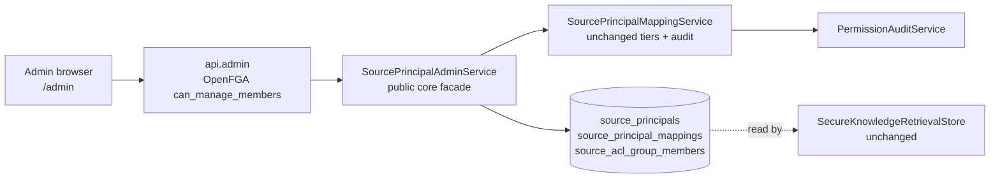

# Permissions Admin Design

## Outcome

An administrator gets a governed admin surface for the identity layer that
already exists in the ledger but has no way in: which internal users exist and
whether they can actually sign in, which external principals a connector
observed, which of those resolve to an internal user and by which tier, and what
membership a source group had when it was sealed. `adminConfirm` and `revoke`
stop being dead code reachable only from a unit test.

The surface answers one question end to end: **why can this person see this
document, and what happens the moment I change that?**

## Boundary

The admin surface writes only through the existing mapping service, so every
tier rule, the one-active-mapping invariant, and the audit trail hold without
duplication. Retrieval is untouched: a confirm or revoke changes what the
existing enforcement SQL resolves on the next query.

## Why this is not Onyx's admin panel

Onyx owns identity inside the app — invite users, register accounts, create
app-managed groups, assign roles from a dropdown. OrgMemory delegates identity
to Keycloak and derives groups from the source. Copying Onyx's screens one for
one would introduce a third authorization model next to OpenFGA and the sealed
ledger and break the single source of truth.

| Onyx screen | OrgMemory equivalent | Why |
| --- | --- | --- |
| Users & Requests, Invite Users | Users (read + role + activation) | Accounts come from Keycloak and must be linked in `external_identities`; there is no in-app registration to invite into. |
| Groups, New Group | Source Groups (read-only) | Groups are sealed per ACL generation from the source. An app-created group would grant access no crawl ever observed. |
| — | **Source Mappings** | The differentiator: the external-principal ledger Onyx has no analog for. |
| SCIM, Regenerate Token | SCIM (placeholder) | The correct path to provisioning, not built in this increment. |

We keep Onyx's *layout* language — a dedicated admin area with a grouped
sidebar, one table per concern, an inline action per row — and drop its
*identity model*.

## Scope

### Ledger

- **`source_connections` (V20)**: one row per observed connection carrying an
  `identity_trust` decision (`UNTRUSTED` by default, `SSO_VERIFIED` when the
  admin attests the source workspace is SSO/SCIM-provisioned). Connections are
  discovered from observed principals; the row is upserted when a decision is
  made, and lowering trust back to the default clears its attribution.

  This increment only **records** the decision. No ingestion path reads it yet:
  `SourcePrincipalMappingService.autoMap` still gates `SSO_EMAIL_JOIN` on the
  principal's own `sso_verified` flag as the crawl reported it. Consuming the
  connection decision — so an administrator attests once instead of an adapter
  guessing per user — belongs to the live adapter and is listed under Deferred.

### Core

- **`SourcePrincipalAdminService`**: the public facade over the package-private
  principal/mapping entities. Lists principals with their mapping and the
  internal user they resolve to, lists connections with counts, lists source
  groups with their latest sealed membership, and delegates confirm/revoke to
  `SourcePrincipalMappingService`.
- **`AppUser.activate()` / `deactivate()` / `changeRole(...)`**: the mutators the
  entity never needed until an admin could act on it.

### API

`/api/admin/**`, every endpoint gated on OpenFGA `can_manage_members` against
the actor's organization:

- `GET /api/admin/users` — internal users with role, activation, whether an
  `external_identities` row exists (can they sign in at all), and how many
  source principals map to them.
- `PATCH /api/admin/users/{id}` — role and activation, refusing self-edits.
- `GET /api/admin/source-connections`, `PUT .../identity-trust` — the trust flag.
- `GET /api/admin/source-principals` — observed principals plus mapping tier.
- `PUT /api/admin/source-principals/{id}/mapping` — `ADMIN_CONFIRMED`.
- `DELETE /api/admin/source-principals/{id}/mapping` — revoke.
- `GET /api/admin/source-groups` — sealed membership evidence.

`SessionResponse` and `MeResponse` gain `role` so the browser can decide whether
to render the admin entry point.

### Web

A dedicated `/admin` area outside the product shell, reached from the account
menu, with a `Permissions` sidebar group: Users, Source Mappings, Source Groups,
SCIM.

## Two gates, deliberately

The API gate is OpenFGA `can_manage_members`, matching every other authorization
decision in the codebase. The browser guard is `role === "ADMIN"` from the
session. These are not the same check and are not meant to be: the role is a
cheap rendering hint so a non-admin never sees a dead menu item, and the OpenFGA
check is the boundary. A user with the role but no tuple reaches the pages and
gets a 403 from every call — visibly wrong, never permissive.

## Exit Criteria

- An admin can confirm an unmapped principal to an internal user and the very
  next retrieval for that user returns the source-gated evidence; a revoke takes
  it away again. Proven by an integration test, not by the UI.
- A non-admin receives 403 from every `/api/admin/**` endpoint.
- Every mutation appends a permission audit event through the existing service.
- `ddl-auto=validate` still passes with V20 applied.
- Web typecheck, lint, and production build pass, and the generated Hey API
  client is in sync with the committed contract.

## Deferred

- SCIM provisioning (the page is a placeholder that states the current model).
- Self-service claim flow for end users; `selfClaim` stays without an API.
- Connector consumption of `identity_trust` — the live Slack adapter reads it in
  [slack-connector-live](../2026-07-23-slack-connector-live/design.md).
- Editing a user's department or creating users; both belong to the IdP.
