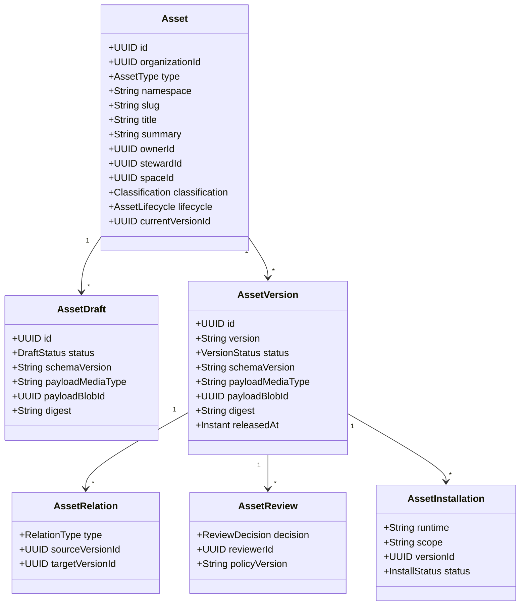

# Unified Organizational Asset Registry Research

Date: 2026-07-25

> **Research history:** The Asset-root decision and source survey remain useful,
> but the common lifecycle, Screenpipe-first sequencing, and SOP/Skill-only POC
> below were superseded by the independent business, package-registry, and
> repository architecture audit in
> [Prompt-First Asset Registry And Role Onboarding POC Research](asset-registry-prompt-first-onboarding-poc-2026-07-25.md).
> Screenpipe is deferred; the active POC uses `PROMPT_TEMPLATE`,
> `WORK_INSTRUCTION`, `CAPABILITY_PACK`, and the existing permission-aware
> `KNOWLEDGE` path.

## Executive Decision

OrgMemory should define **Asset** as its root product concept:

> An Asset is a stable, addressable item with potential or actual organizational
> value that OrgMemory can own, version, govern, relate, discover, release,
> reuse, measure, and retire.

This follows the deliberately broad ISO 55000 asset concept, which includes
intangible items. An asset does not become an asset only after approval.
Approval and publication determine whether a version is official and usable;
they do not create the asset identity.

`SOP`, `SKILL`, `AGENT`, `PROMPT`, and later `TOOL_PACKAGE` or
`CAPABILITY_BUNDLE` are asset types. They share catalog identity, lifecycle,
permissions, provenance, ownership, review, and versioning. Each type keeps its
own payload schema and consumption semantics:

- an SOP is read, taught, acknowledged, followed, exported, or used to derive
  automation;
- a Skill is inspected, downloaded, installed, invoked, updated, or pinned;
- an Agent is deployed or launched in a compatible runtime;
- a Prompt is copied, invoked, composed, or embedded;
- a Capability Bundle composes pinned versions of other assets.

Therefore the primary product is an **Asset Registry**. A Skill Registry is a
type-filtered and install-oriented view of the same registry, not a separate
system with a second identity and governance model.

## Why The Previous Model Was Incomplete

The earlier research separated `KnowledgeAsset`, `CapabilityCandidate`, and
`CapabilityAsset`. That helped distinguish trusted knowledge from reviewed AI
work, but it created three product problems:

1. a useful SOP or Skill appeared not to be an asset until it passed a separate
   capability approval process;
2. candidate identity and asset identity could diverge across review;
3. knowledge and executable packages acquired duplicate ownership, version,
   permission, review, and retirement lifecycles.

The corrected model is:

- **candidate is a lifecycle state**, represented by an Asset draft or an Asset
  version in review;
- **release is a controlled version state**, not the moment an item becomes an
  asset;
- **capability is an organizational outcome or composite**, not the universal
  name for every asset;
- **asset type controls payload and use**, while the registry controls identity,
  governance, discovery, and lifecycle.

This target model does not silently change the shipped `KnowledgeAsset`
runtime. The existing secure ingestion and retrieval aggregate remains current
behavior until a separately approved implementation increment introduces the
shared catalog and migration/adapter contract.

## Research Basis

### Asset management

ISO 55000 defines an asset broadly as an item, thing, or entity with potential
or actual value to an organization. Value may be tangible or intangible and
must be managed over the asset lifecycle. This supports treating an SOP, Skill,
Agent definition, or prompt package as an asset without pretending they have
identical content.

### Controlled procedures

EPA guidance defines an SOP as written instructions for recurring work intended
to produce consistent technical or administrative outcomes. Its administrative
SOP structure includes purpose, scope, definitions, qualifications and
responsibilities, procedure, criteria/checklists, and references. EPA also
requires review, approval, revision control, availability of the current
version, periodic review, and archival when the procedure is no longer used.

WHO guidance adds practical controls that matter to OrgMemory:

- use role or job titles rather than a person's name inside procedure steps;
- write procedures chronologically and in clear active language;
- record release, effective, and review dates;
- allow time for training before a released SOP becomes effective;
- distinguish an SOP from a more detailed work instruction;
- maintain records, archives, change history, and controlled distribution.

ISO 9000 defines a work instruction as a detailed description of how to perform
tasks and permits text, flow charts, templates, pictures, audio, video, and
checklists. OrgMemory should therefore model `WORK_INSTRUCTION` later as either
an SOP subtype or a related asset, not force every captured task into an SOP.

### Agent Skills and registries

The open Agent Skills specification defines a Skill as a directory containing
at minimum `SKILL.md`, with optional `scripts/`, `references/`, and `assets/`.
The required frontmatter contains `name` and `description`; optional standard
fields include `license`, `compatibility`, `metadata`, and experimental
`allowed-tools`.

Agent Skills packages procedural knowledge and organization-specific context
into portable, version-controlled folders. This is direct evidence that a Skill
is an independently distributable digital asset, even when it depends on an MCP
server, binary, environment variable, network service, or runtime.

ClawHub demonstrates the registry behavior users already expect: versioned
Skill bundles, search, rendered files, semver/tags, changelogs, downloads,
stars, moderation, security scans, install/update/pin, and publisher ownership.
Artifact Hub and Backstage reinforce the need for verified ownership, private
repositories, security reports, consistent type/owner/lifecycle metadata, and
relationships between catalog entities.

### Screenpipe

Screenpipe is an evidence source, not the authority that makes a procedure
standard. It exposes screen/accessibility text, OCR, audio transcription, input
events, application/window context, timestamps, frames, and search filters from
a local API. Its documented SOP prompt asks an AI to search a recent period and
produce:

- goal;
- systems used;
- numbered steps;
- decisions or exceptions;
- screenshots or timeline moments to review;
- questions that still require a human answer.

A Screenpipe Pipe is a scheduled agent defined by `pipe.md`; it can query the
local API and take actions. MCP instead lets an external agent query Screenpipe.
Either can supply evidence to OrgMemory. Neither should bypass OrgMemory
privacy, provenance, review, or release controls.

One captured run is enough for an **observed SOP draft**, not enough to assert
that every observed click is required or that all exceptions are known.
OrgMemory should compare multiple runs when available and require a process
owner or subject-matter reviewer before releasing an SOP.

## Target Asset Model



### Stable identity

`Asset` is the stable catalog identity. It survives revisions, keeps
authorization relationships stable, and owns the current released version
pointer. Namespace plus slug is a human-friendly registry coordinate; UUID is
the authorization and internal identity.

### Draft and released content

`AssetDraft` is working content and may be revised during capture, authoring,
and review. Publishing creates an immutable, digest-addressed `AssetVersion`.
Changing released content always creates another version.

A semver tag such as `1.2.0` or a movable label such as `latest` is a reference,
not the content identity. Audit, dependency, citation, and installation records
pin the immutable version ID and digest.

### Type profiles

An `AssetTypeProfile` contributed by code should define:

- payload schema and media type;
- validation and rendering;
- permitted consumption modes;
- risk and review policy;
- supported import/export formats;
- dependency extraction;
- optional installer or deployment adapters;
- search fields and quality/evaluation rules.

This keeps one registry without turning `Asset` into a giant table containing
every SOP, Skill, and Agent field.

### Relationships

Relations pin versions wherever reproducibility matters:

- `DERIVED_FROM`: a Skill was generated from a released SOP;
- `IMPLEMENTS`: a Skill implements all or part of an SOP;
- `AUTOMATES`: an Agent or Skill automates a procedure;
- `REQUIRES`: a Skill requires another Skill, Tool, or knowledge asset;
- `EVIDENCED_BY`: an SOP step is grounded in captured evidence;
- `VALIDATED_AGAINST`: an asset version passed an evaluation set;
- `SUPERSEDES`: a version or asset replaces another;
- `BUNDLES`: a composite Capability pins component asset versions.

## Initial Asset Types

| Type | Canonical payload | Primary consumption |
| --- | --- | --- |
| `KNOWLEDGE` | governed content plus citations | read, search, cite |
| `SOP` | controlled procedure document/schema | follow, teach, acknowledge, export |
| `SKILL` | Agent Skills-compatible folder/archive | inspect, install, invoke, update |
| `AGENT` | runtime-neutral definition plus adapters | deploy, launch, delegate |
| `PROMPT` | parameterized prompt template and examples | invoke, compose, embed |
| `TOOL_PACKAGE` | MCP/plugin manifest and distributable code | install, connect, call |
| `CAPABILITY_BUNDLE` | pinned relations to other asset versions | install or roll out as a set |

The POC implements only `SOP` and `SKILL`. `KNOWLEDGE` remains backed by the
current secure ingestion path until the catalog integration is designed.
Other types establish naming and relationship direction, not implementation
scope.

## SOP Asset Definition

### SOP admission rule

An item qualifies as an SOP Asset when it defines a repeatable organizational
procedure with a bounded purpose, applicability, responsible roles, ordered
actions, decision/exception handling, expected outputs, and a controlled
version lifecycle.

A raw recording, meeting transcript, screenshot sequence, or AI summary is
evidence or a source record. It becomes an SOP Asset draft only after OrgMemory
creates a stable identity and maps the evidence into the SOP schema.

### Required SOP version content

1. **Identity and control**
   - title, asset ID, version, process/domain, owner, author, reviewer;
   - release date, effective date, review date, superseded version;
   - audience, organizational scope, classification, distribution policy.
2. **Purpose and applicability**
   - business goal and intended outcome;
   - start trigger, end condition, in-scope and out-of-scope cases.
3. **Roles and responsibilities**
   - process owner, performer, reviewer/approver, escalation role;
   - required qualifications, training, or access.
4. **Operational context**
   - systems, tools, materials, source policies, prerequisites;
   - required inputs and records or outputs produced.
5. **Procedure**
   - ordered steps;
   - actor/role, action, system, input, expected result for each step;
   - evidence reference and confidence where the step was inferred.
6. **Decisions and exceptions**
   - explicit branch conditions and selection criteria;
   - failure handling, rollback, escalation, and prohibited actions.
7. **Controls and acceptance**
   - safety, privacy, regulatory, or approval gates;
   - quality checks, acceptance criteria, completion evidence.
8. **References and traceability**
   - related policies, forms, work instructions, templates, and assets;
   - Screenpipe timeline/frame references or other evidence;
   - unresolved questions and known limitations.
9. **Change and use history**
   - change summary, approval record, acknowledgements/training;
   - usage, deviations, feedback, incidents, and scheduled review outcome.

### SOP step schema

```yaml
id: step-04
order: 4
title: Verify refund eligibility
actorRole: support-specialist
system: billing-console
instruction: Compare the purchase date and product state with the refund policy.
inputs:
  - transaction-id
expectedOutputs:
  - eligibility-decision
decision:
  condition: purchaseAgeDays > 90
  then: escalate-to-finance
controls:
  - never expose full payment credentials
evidence:
  - sourceRevisionId: "..."
    frameId: 12345
    observedAt: "..."
confidence: 0.91
```

The structured form enables comparison, validation, Skill generation, and
process analytics. Markdown remains an import/export and human-readable
representation, not the only canonical model.

## Learning An SOP From Screenpipe


### Capture contract

The Screenpipe adapter should request a bounded time range and initially search
`content_type=all`, then correlate:

- accessibility text and OCR;
- input events where available;
- app name, window title, browser URL, focus, and timestamps;
- audio transcript and identified speaker where available;
- frame IDs and selected screenshots;
- explicit user markers for the start, end, and best representative run.

PII filtering, ignored-window rules, local-first access, and explicit user
preview apply before evidence leaves the edge device. OrgMemory stores only
approved evidence or redacted derivatives needed for traceability.

### Inference contract

The SOP learner should:

1. segment the selected period into candidate actions;
2. remove idle, navigation noise, and accidental/retried actions while retaining
   them as reviewable evidence;
3. identify systems, inputs, outputs, actors, and completion signals;
4. infer ordered steps and attach evidence to each claim;
5. detect decisions, deviations, retries, exceptions, and missing context;
6. compare multiple runs to separate stable procedure from one-off behavior;
7. assign confidence and surface contradictions;
8. create questions instead of inventing policy, responsibility, or approval;
9. generate an SOP Asset draft, never an automatically approved SOP.

### Human validation contract

The process owner or subject-matter reviewer must verify:

- the captured run represents the intended process;
- observed behavior is permitted rather than merely convenient;
- roles, controls, decision criteria, and exceptions are complete;
- sensitive information is removed;
- another qualified person can perform a walkthrough successfully;
- the effective and next-review dates are appropriate.

## Skill Asset Definition

### Canonical package

The released payload is an archive whose root is an Agent Skills-compatible
directory:

```text
refund-processing/
├── SKILL.md
├── scripts/
├── references/
└── assets/
```

The archive and every file are covered by a content digest. The package remains
portable; OrgMemory governance metadata remains in the registry envelope rather
than polluting `SKILL.md` with platform-only fields.

### Registry metadata

In addition to the Agent Skills manifest, OrgMemory records:

- publisher and verified organization;
- immutable version, digest, changelog, and tags;
- visibility, owner, reviewer, risk, and classification;
- runtime compatibility and installation adapters;
- required MCP servers, tools, binaries, environment variable names, network
  access, and external services;
- dependency versions and license;
- source SOP/evidence versions;
- security scan, policy review, evaluation results, and known limitations;
- download, installation, invocation, update, deprecation, and incident events.

Secret values never belong in an Asset payload or registry metadata. Only the
required secret name and managed retrieval location may be declared.

### Supply-chain controls

Skill instructions and supporting scripts can cause real actions. The first
registry release gate should therefore include:

- authenticated and attributable publisher;
- archive path traversal and symlink rejection;
- manifest/schema validation;
- file allowlist and size limits;
- script, prompt, secret, and dependency scanning;
- declared permissions compared with observed package behavior;
- immutable digest after release;
- visible risk and scan results before installation;
- explicit approval for high-impact tools or side effects;
- revocation/deprecation without silently deleting audit evidence.

Signing, SBOM/provenance attestations, reputation, public federation, and paid
distribution can follow after the private POC.

## Common Lifecycle

The stable Asset lifecycle is:

```text
ACTIVE -> DEPRECATED -> RETIRED
```

The working and release lifecycle is:

```text
DRAFT -> IN_REVIEW -> RELEASED -> WITHDRAWN
```

- `DRAFT`: stable Asset identity exists, but content is not official.
- `IN_REVIEW`: content and evidence are frozen for a review decision.
- `RELEASED`: immutable version may be consumed according to its type.
- `WITHDRAWN`: version remains auditable but may no longer be selected or
  installed.
- `DEPRECATED`: the Asset remains usable with a visible replacement/warning.
- `RETIRED`: no version is available for new use; history is retained according
  to policy.

For an SOP, release can precede its effective date to allow training. For a
Skill, release makes the version installable only where compatibility,
permissions, and risk policy allow it.

## Roles

- **Contributor/observer** supplies evidence or an initial draft.
- **Author** turns evidence into usable typed content.
- **Asset owner** is accountable for value and continued fitness.
- **Steward/process owner** maintains content and coordinates reviews.
- **Subject-matter reviewer** validates operational correctness.
- **Security/compliance reviewer** validates controls for relevant risk levels.
- **Publisher** releases an approved version.
- **Consumer** reads, downloads, installs, invokes, or acknowledges an Asset.
- **Registry administrator** manages type policies, namespaces, and emergency
  withdrawal without becoming the content owner.

## Registry Product Surfaces

1. **Asset catalog** — search/filter by type, owner, lifecycle, process,
   organization, risk, compatibility, and relationship.
2. **Typed detail** — shared identity/version/provenance header plus SOP, Skill,
   or Agent-specific rendering.
3. **Draft and review** — evidence links, diff, comments, decisions, required
   approvals, and unresolved questions.
4. **Release history** — immutable versions, digests, changelogs, dependencies,
   replacements, and withdrawals.
5. **Consumption** — view/export/acknowledge for SOPs; inspect/install/update/pin
   for Skills.
6. **Installed Assets** — runtime, scope, pinned version, policy status,
   available update, and revocation warning.
7. **Portfolio graph** — procedure-to-Skill-to-Agent-to-Tool relationships,
   owners, gaps, and orphaned capabilities.

## MCP Boundary For The POC

MCP should make the permission-aware registry consumable by agents; it should
not be the package storage protocol or the first review UI.

Initial read-only tools:

- `search_assets(type, query, process, compatibility)`;
- `get_asset(asset_id)`;
- `get_asset_version(asset_id, version)`;
- `resolve_asset_relations(asset_id, relation_type)`;
- `get_released_sop(asset_id)`;
- `get_skill_manifest(asset_id, version)`.

Publishing, approval, withdrawal, and installation remain explicit UI/API/CLI
actions for the first POC. Usage reporting can become a narrow mutation after
identity, idempotency, and audit semantics are proven.

## Recommended POC

### Product story

> Capture one repeated work process, create and approve a grounded SOP Asset,
> derive a Skill Asset from that exact SOP version, release it to the private
> Asset Registry, install it into a compatible agent, and prove another user or
> agent can reproduce the result.

### Slice

1. create an Asset catalog foundation with `SOP` and `SKILL` type profiles;
2. import a manually selected Screenpipe time range;
3. create a grounded SOP draft with evidence coverage and open questions;
4. review, compare, and release SOP version `1.0.0`;
5. generate a Skill draft related by `IMPLEMENTS` and `DERIVED_FROM`;
6. validate and security-scan the Agent Skills package;
7. release Skill version `1.0.0`;
8. browse the shared registry using the Skill filter;
9. download/install into one runtime, initially Claude Code or OpenClaw;
10. execute against demo-safe/mock tools and record the result.

### Success evidence

- percentage of SOP steps linked to evidence;
- number and severity of reviewer corrections;
- time from selected run to reviewable SOP draft;
- successful walkthrough by a second person;
- Skill package validation and clean release digest;
- successful clean installation and repeatable invocation;
- handling of at least one explicit decision branch and one exception;
- permission denial and withdrawal behavior;
- trace from execution back to Skill version, SOP version, and evidence.

### Non-goals

- public marketplace, monetization, ratings, or social feed;
- generic workflow/BPM engine;
- automatic approval from one observed run;
- arbitrary Agent and MCP package installation;
- autonomous mutation MCP tools;
- company-wide passive monitoring;
- refactoring the shipped Knowledge Asset runtime in the same slice.

## Sources

- [ISO 55000:2024 overview](https://www.iso.org/standard/83053.html)
- [Institute of Asset Management glossary](https://theiam.org/knowledge-library/glossary/)
- [EPA Guidance for Preparing SOPs](https://www.epa.gov/quality/guidance-preparing-standard-operating-procedures-epa-qag-6-march-2001)
- [WHO SOP management example](https://tdr.who.int/docs/librariesprovider10/good-practices-guidance-handbook-for-national-tb-surveys/tc_1.3.-sop-management-example_21-06-2021.pdf)
- [ISO 9000 definitions, including work instruction](https://www.iso.org/obp/ui/#iso:std:iso:9000:ed-5:v1:en)
- [Agent Skills overview](https://agentskills.io/home)
- [Agent Skills specification](https://agentskills.io/specification)
- [Claude Code Skills](https://code.claude.com/docs/en/skills)
- [OpenClaw ClawHub](https://docs.openclaw.ai/clawhub)
- [ClawHub Skill format](https://github.com/openclaw/clawhub/blob/main/docs/skill-format.md)
- [Artifact Hub repositories and publisher verification](https://artifacthub.io/docs/topics/repositories/)
- [Backstage Software Catalog](https://backstage.io/docs/features/software-catalog/)
- [NIST AI RMF Core](https://airc.nist.gov/airmf-resources/airmf/5-sec-core/)
- [Screenpipe SOP FAQ](https://github.com/screenpipe/screenpipe/blob/main/docs/mintlify/docs-mintlify-mig-tmp/faq.mdx)
- [Screenpipe Pipes](https://github.com/screenpipe/screenpipe/blob/main/docs/mintlify/docs-mintlify-mig-tmp/pipes.mdx)
- [Screenpipe local API reference](https://docs.screenpi.pe/cli-reference)
- [Screenpipe search and privacy model](https://docs.screenpi.pe/search-screen-history)
