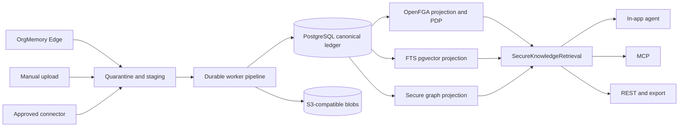

# OrgMemory Vision

## Product Thesis

OrgMemory turns work evidence and enterprise knowledge into governed,
permission-aware, reusable organizational memory. Its wedge is not generic
enterprise search. It owns the lifecycle after secure context is available:

```text
capture/import -> stage -> normalize -> ground -> review -> publish
-> reuse -> measure -> transfer -> retire
```

A Knowledge Asset is trusted, citable knowledge. Reusable workflows, prompts,
and agent procedures may later become governed capability candidates, but that
separate product lifecycle is not implemented in the current repository.

## Product Boundary

Screenpipe-style edge capture, direct upload, and approved enterprise connectors
are evidence sources. Glean-style permission-aware context is a required
foundation. OrgMemory differentiates through governed knowledge and capability
lifecycles, not by rebuilding a broad connector catalog or employee-surveillance
platform.

The default trust model is **passive discovery, active publishing**: a user may
capture work locally and receive a private draft; sharing it with the organization
requires preview, policy checks, and explicit review.

## First Customer And Success Gate

The initial design partner is an enterprise team with repeated AI-assisted
support, operations, finance, or QA work and a concrete handover/onboarding pain.
The first technical pilot is one or two test machines, one repeated workflow,
explicit privacy filters, and a named reviewer. It succeeds when a good run can
become a grounded draft, be reviewed/published, be reused by another person, and
be revoked without data leakage. Expansion to 20-100 users is a later gate after
trust, permission correctness, contribution willingness, and operational recovery
are proven.

Kill risks are employee-surveillance perception, weak source permissions,
low-quality prompt dumping, no reuse by another person, and an operating burden
larger than the handover value. These are product constraints, not marketing
footnotes.

## Target Architecture



PostgreSQL is the canonical ledger for tenant, source revisions, lineage, ACL
evidence/head, lifecycle, provenance, and audit. Blob storage owns binary
evidence. OpenFGA is the production relationship authorization engine, fed from
the ledger through an outbox; it never replaces source ACL history. Search and
graph stores are rebuildable projections and never authorization authorities.

Effective access is an intersection of tenant, ingestion source ACL, current
source ACL, OpenFGA relationship policy, classification, and lifecycle. Every
surface uses one `SecureKnowledgeRetrieval` use case and rechecks citations.

## Target Source Model

- `SourceObject`: stable logical item from upload, edge, or connector.
- `SourceRevision`: immutable source-shaped revision.
- `EvidenceBlob`: object-store binary plus integrity and scan metadata.
- `NormalizedRecord`: parsed and cleaned content.
- `GraphCandidate`: extracted facts awaiting validation/publication.
- `KnowledgeAsset`: stable governed identity for approved knowledge.
- `KnowledgeAssetVersion`: immutable content and security provenance selected
  by the stable asset's current-version pointer.
- `CapabilityCandidate`: possible reusable AI workflow.
- `CapabilityAsset`: possible future approved, versioned reusable capability;
  not part of the current implementation.

Manual upload is a first-class source and follows the same quarantine, scan,
parse, ACL, indexing, review, and audit pipeline as connectors.

## Target Module Boundaries

Keep domain modules as Spring Modulith packages inside `core`; do not create a
Gradle project for every aggregate. Add separate Gradle projects only for a
deployable, reusable engine, or replaceable external adapter:

```text
core
apps/api
apps/worker
apps/mcp
components/graph-rag-core
components/graph-rag-testkit
integrations/ai-openai-compatible
integrations/graph-rag-spring-ai
integrations/graph-rag-postgres
integrations/authorization-openfga
integrations/blob-s3
```

Connector runtimes such as Airbyte remain external infrastructure. A narrow
adapter imports their versioned staging contract; connectors never write domain
memory tables directly. `D:\orgmemory-edge` remains an independent open-source
capture client connected through a versioned ingestion contract.

## AI And Agent Direction

Adopt Northstar's useful pattern, not its product-specific complexity:

- core features identify an `AiTask`/capability and depend on provider-neutral
  chat, embedding, extraction, and reranking ports;
- integration projects implement protocols and provider credentials;
- deployables select adapters and runtime routes;
- the API hosts the first in-app agent over permission-aware domain tools;
- MCP publishes the same safe tool use cases after the in-app path is proven;
- worker owns parsing, chunking, extraction, embedding, and index publication;
- model absence is explicit for production work; local fallback is limited to
  demo-safe, non-authoritative behavior.

Spring AI 2 provides ChatClient/model abstractions, structured output, tool/MCP
support, document ETL, vector stores, and RAG building blocks. OrgMemory still
owns routing policy, evidence trust, permission filtering, provenance, and the
custom graph retriever.

## Knowledge Graph Direction

Implement a LightRAG-inspired secure graph kernel in Java; do not port the
Python server, WebUI, provider bindings, or storage catalog file by file. V1 uses
PostgreSQL graph tables, batched one-hop relational queries, and pgvector behind
ports. A bounded recursive query is reserved for an explicit graph-explorer or
measured multi-hop requirement. Every entity or relation contribution retains
source revision, chunk, asset, ACL generation, extractor/model/prompt version,
confidence, and provenance. Permission filtering occurs before seed ranking and
at every traversal/citation boundary.

The product exposes one stable graph-assisted retrieval API. Its internal
planner can compose chunk-only, entity-only, relation-only, secure-hybrid, and
secure-mix strategies from chunk, entity, and relation channels. `SECURE_MIX`
is the default; strategy selection is not a user-controlled request parameter.
LightRAG's mode names do not become OrgMemory API options.

Neo4j is optional only when measured traversal or algorithm requirements justify
it. It would be a rebuildable projection, not the canonical ledger.

## Web Direction

The current registry UI is disposable prototype evidence. The replacement is an
agent-first workspace centered on search/ask, evidence and citation inspection,
private candidate review, publish/approval, source health, permission status, and
admin device/source visibility. Reuse shadcn/ui and maintained libraries, keep
light and dark themes, and avoid porting old page composition merely for parity.

## Non-Goals For The First Pilot

No broad employee monitoring, connector marketplace, full BPM suite, generic
multi-agent orchestration, Kafka/Airflow by default, or company-wide rollout.
The first pilot is one tenant, one repeated workflow, one or two controlled
sources/devices, explicit privacy filters, and measurable reuse/transfer value.
