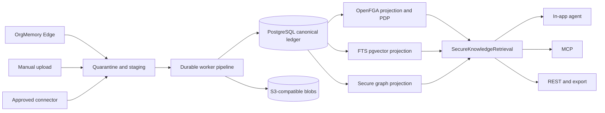

# OrgMemory Vision

This document records product intent and target architecture, not current
implementation status. [ARCHITECTURE.md](../ARCHITECTURE.md) is authoritative
for what exists; the roadmap is authoritative for delivery status.

## Product Thesis

OrgMemory turns work evidence and enterprise knowledge into governed,
permission-aware, reusable organizational memory. Its wedge is not generic
enterprise search. It owns the lifecycle after secure context is available:

```text
capture/import -> stage -> normalize -> ground -> policy check
-> review when required -> publish
-> reuse -> measure -> transfer -> retire
```

An Asset is a stable, addressable item with potential or actual organizational
value that OrgMemory can own, version, govern, relate, discover, release, reuse,
measure, and retire. `KNOWLEDGE`, `PROMPT_TEMPLATE`, `WORK_INSTRUCTION`,
`CAPABILITY_PACK`, `SOP`, `SKILL`, and later executable types have different
payload and consumption semantics without needing separate identity and
governance systems. Manual authoring creates an Asset draft. Passive or
machine-discovered work remains a private proposal until accepted; approval
controls release and never creates the stable identity.

The product direction extends secure Knowledge Assets into a shared Asset
Registry with typed Prompt Template, Work Instruction, Capability Pack, Skill,
and later executable profiles. Each profile retains its own payload and
consumption semantics while reusing the governed lifecycle.

## Product Boundary

Screenpipe-style edge capture, direct upload, and approved enterprise connectors
are evidence sources. Glean-style permission-aware context is a required
foundation. OrgMemory differentiates through governed knowledge and capability
lifecycles, not by rebuilding a broad connector catalog or employee-surveillance
platform.

The default trust model is **passive discovery, active publishing**: a user may
capture work locally and receive a private draft; sharing it with the
organization requires preview, policy checks, and an explicit publication
action. Review is required by the Asset profile and organization policy, not
assumed for every contribution. In the current Skill profile, an accountable
owner-class actor may publish directly with durable `DIRECT` provenance;
reviewed publication remains available for higher-risk use.

## First Customer And Success Gate

The initial design partner is an enterprise team with repeated AI-assisted
support, operations, finance, or QA work and a concrete handover/onboarding pain.
The first product pilot is role capability onboarding for one bounded task: a
named author and reviewer publish a Pack of authorized Knowledge, a Work
Instruction, and an evaluated Prompt Template; a second user discovers that
Pack and completes the task. It succeeds when exact released components are
reused, updated or withdrawn safely, and ownership transfers without permission
leakage. Expansion to 20-100 users is a later gate after trust, permission
correctness, contribution willingness, and operational recovery are proven.

Kill risks are employee-surveillance perception, weak source permissions,
low-quality prompt dumping, no reuse by another person, and an operating burden
larger than the handover value. These are product constraints, not marketing
footnotes.

## Target Architecture


```mermaid
flowchart LR
    EDGE[OrgMemory Edge] --> STAGE[Quarantine and staging]
    UPLOAD[Manual upload] --> STAGE
    CONN[Approved connector] --> STAGE
    STAGE --> WORKER[Durable worker pipeline]
    WORKER --> LEDGER[(PostgreSQL canonical ledger)]
    WORKER --> BLOB[(S3-compatible blobs)]
    LEDGER --> FGA[OpenFGA projection and PDP]
    LEDGER --> INDEX[FTS pgvector projection]
    LEDGER --> GRAPH[Secure graph projection]
    FGA --> RETRIEVE[SecureKnowledgeRetrieval]
    INDEX --> RETRIEVE
    GRAPH --> RETRIEVE
    RETRIEVE --> AGENT[In-app agent]
    RETRIEVE --> MCP[MCP]
    RETRIEVE --> API[REST and export]
```

PostgreSQL is the canonical ledger for tenant, source revisions, lineage, ACL
evidence/head, lifecycle, provenance, and audit. Blob storage owns binary
evidence. OpenFGA is the production relationship authorization engine, fed from
the ledger through an outbox; it never replaces source ACL history. Search and
graph stores are rebuildable projections and never authorization authorities.

Effective access is an intersection of tenant, ingestion source ACL, current
source ACL, OpenFGA relationship policy, classification, and lifecycle. Every
surface uses one `SecureKnowledgeRetrieval` use case and rechecks citations.

## Target Source Model

- `SourceObject`: stable logical item from upload, edge, or connector.
- `SourceRevision`: immutable source-shaped revision.
- `EvidenceBlob`: object-store binary plus integrity and scan metadata.
- `NormalizedRecord`: parsed and cleaned content.
- `GraphCandidate`: extracted facts awaiting validation/publication.
- `KnowledgeAsset`: stable governed identity for approved knowledge.
- `KnowledgeAssetVersion`: immutable content and security provenance selected
  by the stable asset's current-version pointer.
- `Asset`: shared registry identity for organizationally valuable, reusable
  items.
- `AssetDraft`: mutable working content for any Asset type.
- `AssetRevision`: immutable submitted snapshot and digest reviewed by
  an exact policy and reviewer set.
- `AssetRelease`: immutable released payload, digest, provenance, and
  dependency set created from a Revision that satisfies the profile's
  publication policy.
- `AssetTypeProfile`: typed schema, renderer, validation, publication policy,
  and consumption adapters.

The first new types are `PROMPT_TEMPLATE`, `WORK_INSTRUCTION`, and
`CAPABILITY_PACK`. The catalog federates the current Knowledge Asset aggregate
through a read-only adapter; it does not migrate or duplicate its stable
identity, authorization, source lineage, or publication invariants. Later type
profiles may include controlled `SOP`, installable `SKILL`, `PLAYBOOK`,
`WORKFLOW`, `AGENT`, `TOOL_PACKAGE`, `GUARDRAIL_PROFILE`, and reusable
`EVAL_SUITE`.

Manual upload is a first-class source and follows the same quarantine, scan,
parse, ACL, indexing, review, and audit pipeline as connectors.

## Target Module Boundaries

Keep domain modules as Spring Modulith packages inside `core`; do not create a
Gradle project for every aggregate. Add separate Gradle projects only for a
deployable, reusable engine, or replaceable external adapter:

```text
core
apps/api
apps/worker
apps/mcp
components/graph-rag-core
components/graph-rag-testkit
integrations/ai-model-gateways
integrations/graph-rag-spring-ai
integrations/graph-rag-postgres
integrations/authorization-openfga
integrations/blob-s3
```

Connector runtimes such as Airbyte remain external infrastructure. A narrow
adapter imports their versioned staging contract; connectors never write domain
memory tables directly. `D:\orgmemory-edge` remains an independent open-source
capture client connected through a versioned ingestion contract.

## AI And Agent Direction

Adopt Northstar's useful pattern, not its product-specific complexity:

- core features identify an `AiTask`/capability and depend on provider-neutral
  chat, embedding, extraction, and reranking ports;
- integration projects implement protocols and provider credentials;
- deployables select adapters and runtime routes;
- the API hosts the first in-app agent over permission-aware domain tools;
- MCP publishes the same safe tool use cases after the in-app path is proven;
- worker owns parsing, chunking, extraction, embedding, and index publication;
- model absence is explicit for production work; local fallback is limited to
  demo-safe, non-authoritative behavior.

Spring AI 2 provides ChatClient/model abstractions, structured output, tool/MCP
support, document ETL, vector stores, and RAG building blocks. OrgMemory still
owns routing policy, evidence trust, permission filtering, provenance, and the
custom graph retriever.

## Knowledge Graph And LightRAG Direction

Implement a full semantic port of LightRAG `v1.5.4` in Java: parser and chunker
extension points, multimodal analysis, extraction and gleaning, profiling and
merge, incremental update and delete/rebuild, all query strategies, reranking,
context/reference assembly, caching, evaluation, and replaceable storage
families. Port equivalent behavior and contracts rather than Python syntax,
FastAPI, or the upstream WebUI layout.

The framework-neutral core cannot depend on Spring or a database. PostgreSQL,
Spring AI, OpenSearch, Neo4j, parser engines, and model providers are adapters
behind conformance-tested ports. PostgreSQL/FTS/pgvector/AGE is the first
production adapter. OpenSearch implements unified lexical/vector/graph/state
storage and Neo4j implements graph storage without changing core orchestration.

Every entity or relation contribution retains source revision, chunk, asset,
ACL generation, extractor/model/prompt version, confidence, and provenance.
Descriptions, degree, weights, expansion, ranking, context, and citations use
only actor-visible contributions. PostgreSQL remains canonical for source,
evidence, ACL, lifecycle, and audit; every derived store is rebuildable.

The engine implements local, global, hybrid, naive, mix, and trusted bypass
semantics for parity and internal planning. Product delivery exposes one stable
permission-aware API, uses secure mix by default, and never lets a query mode
bypass authorization.

## Web Direction

The intended product experience is an agent-first workspace centered on one
Asset Registry with four generic surfaces: **For you / Asset catalog**,
**Asset detail / use**, **Pack journey**, and **Governance workspace**. Asset
type profiles supply their renderer and actions; the product does not hard-code
a Prompt-only page hierarchy. Search, ask, citations, release history,
provenance, permissions, source health, and Skill installation reuse that
shell. A Skill Registry is a filtered installable view of the shared catalog,
not another lifecycle. The UX may evolve while retaining the same permission
and exact-release contracts.

## Non-Goals For The First Pilot

No Screenpipe capture, broad employee monitoring, public/paid marketplace,
HRIS/LMS, full BPM suite, generic multi-agent orchestration, arbitrary
Agent/MCP package execution, Kafka/Airflow by default, or company-wide rollout.
The first pilot is one tenant, one role onboarding Pack, existing
permission-aware Knowledge, Prompt Template and Work Instruction Asset types,
one realistic task, a named reviewer, and measurable reuse/transfer value.
